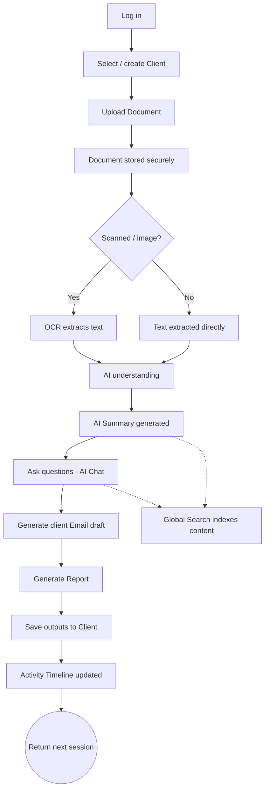
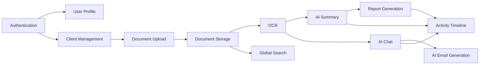

# Product Requirements Document (PRD) — LedgerAI MVP

> **Status:** Draft v1
> **Owner:** Product / Founding Engineer
> **Last updated:** 2026-07-14
> **Release:** V1 (MVP)
> **Related:
> ** [Product Vision](./PRODUCT_VISION.md) · [Product Decisions](./PRODUCT_DECISIONS.md) · [SRS](./SRS.md) · [Architecture](../01-architecture/ARCHITECTURE.md)

---

## 1. Document Overview

### Purpose

This document defines **what** the LedgerAI MVP will do, **why**, **for whom**, and **how success is measured**. It is
detailed enough that product, design, engineering, and QA can begin work from it. It deliberately excludes
implementation detail (schemas, endpoints, provider choices) — those live in the [SRS](./SRS.md), the
[Architecture](../01-architecture/ARCHITECTURE.md) docs, and their ADRs.

### Scope

Covers the **twelve MVP modules** approved in [Product Decisions §6](./PRODUCT_DECISIONS.md#6-mvp-decision-matrix):
Authentication, User Profile, Client Management, Document Upload, Document Storage, OCR, AI Document Summary, AI Chat,
AI Email Generation, Report Generation, Global Search, and Activity Timeline. Anything outside this list is a
[Non-Goal](#5-non-goals).

### Audience

- **Product** — to confirm scope and priorities.
- **Design (UI/UX)** — to derive flows, screens, and states.
- **Engineering** — as the source requirements for the SRS and technical design.
- **QA** — to derive test cases from acceptance criteria and edge cases.

### Related Documents

| Document                                                           | Role                                                     |
|--------------------------------------------------------------------|----------------------------------------------------------|
| [PRODUCT_VISION.md](./PRODUCT_VISION.md)                           | The "why" and long-term positioning                      |
| [PRODUCT_DECISIONS.md](./PRODUCT_DECISIONS.md)                     | Authoritative record of decisions, boundaries, deferrals |
| [SRS.md](./SRS.md)                                                 | Detailed software requirements (next document)           |
| [ARCHITECTURE.md](../01-architecture/ARCHITECTURE.md)              | System design                                            |
| [IMPLEMENTATION_PLAN.md](../03-engineering/IMPLEMENTATION_PLAN.md) | Delivery sequencing                                      |

---

## 2. Executive Summary

**Product.** LedgerAI is an **AI-powered Document Intelligence Platform for accounting professionals**. The MVP delivers
the core loop: **upload a document → have AI understand it → act on that understanding** (summarize, ask, draft, report,
find).

**Target users.** Chartered Accountants, CPAs, auditors, and accounting associates — primarily solo practitioners and
small-to-mid firms who are document-heavy and time-poor.

**Core problem.** Accounting professionals lose hours to reading, extracting from, searching, and drafting around
financial documents. Their existing systems of record manage *data* well but leave the *document productivity layer*
almost entirely manual.

**Core solution.** A lightweight, AI-first workspace that summarizes documents, answers questions about them, drafts
client emails, generates reports, and makes everything searchable — **alongside** (never replacing) Tally, QuickBooks,
Xero, Zoho Books, SAP, Oracle Financials, and Excel.

**Expected outcome.** Measurably fewer hours of repetitive work per professional per week, strong weekly retention among
early users, and validated product-market fit for the document-intelligence wedge.

---

## 3. Background

### The current workflow

A typical accounting professional's document workflow looks like this:

1. Receives documents (statements, invoices, notices, reports) via email, WhatsApp, client portals, or paper scans.
2. Manually reads and interprets each one.
3. Re-keys figures into spreadsheets or working papers.
4. Files documents into client folders (naming and structure vary by person).
5. Drafts client emails and status updates from scratch.
6. Later, hunts across folders and inboxes to re-find a specific document or figure.

### Pain points

- **Reading load.** Long reports and statements consume expert attention on low-judgment reading.
- **Repetitive drafting.** Formal client communication is written again and again from a blank page.
- **Manual extraction.** Figures are transcribed by hand — slow and error-prone.
- **Poor findability.** Documents scatter across drives, email, and chat; retrieval is a chore.
- **Context switching.** Work spans PDFs, spreadsheets, email, and multiple systems.

### Why existing accounting software does not solve this

Accounting systems (Tally, QuickBooks, Xero, etc.) are **systems of record** — they are excellent at storing and
computing structured ledger data. They are **not** built to *read and reason over arbitrary documents*, to *answer
natural-language questions*, or to *draft communication*. The productivity layer *around* documents falls outside their
purpose, so it stays manual. See [Product Decisions §2](./PRODUCT_DECISIONS.md#2-product-boundaries).

### Why LedgerAI exists

Recent advances in LLMs, OCR, and document intelligence make it practical, for the first time, to automate this document
layer at production quality — **without** becoming accounting software. LedgerAI occupies exactly this gap: the
AI-native companion that gives professionals their time back.
See [Vision §3, "Why Now?"](./PRODUCT_VISION.md#3-why-now).

---

## 4. Goals

### Business Goals

| #    | Goal                                                                | Why it matters                                             |
|------|---------------------------------------------------------------------|------------------------------------------------------------|
| BG-1 | **Validate product-market fit** for the document-intelligence wedge | Confirms the core bet before investing in scale.           |
| BG-2 | **Demonstrably reduce repetitive accounting work**                  | Directly ties to our North Star and the value proposition. |
| BG-3 | **Achieve strong weekly retention** among early professional users  | Retention is the truest signal of durable value.           |
| BG-4 | **Establish a defensible, focused product identity**                | Protects the wedge and avoids ERP/bookkeeping drift.       |
| BG-5 | **Keep V1 operating within free/low-cost infrastructure tiers**     | Enables validation without heavy burn.                     |

### User Goals

| #    | Goal                                                                                                 |
|------|------------------------------------------------------------------------------------------------------|
| UG-1 | **Understand documents quickly** — get an accurate summary in seconds instead of reading in full.    |
| UG-2 | **Find information instantly** — locate a document or fact without hunting.                          |
| UG-3 | **Draft client communication faster** — start from a professional AI draft, not a blank page.        |
| UG-4 | **Get answers, not just files** — ask a document questions and receive grounded, referenced answers. |
| UG-5 | **Stay organized by client** — keep documents and activity structured around clients.                |
| UG-6 | **Trust the output** — see sources, and remain in control of what gets used.                         |

---

## 5. Non-Goals

Version 1 will **not** attempt the following. These are inherited directly from
[Product Decisions §4 (Deferred)](./PRODUCT_DECISIONS.md#4-deferred-decisions) and
[§5 (Rejected)](./PRODUCT_DECISIONS.md#5-rejected-ideas):

| Non-Goal                                            | Basis                                          |
|-----------------------------------------------------|------------------------------------------------|
| **ERP functionality**                               | Rejected — boundary violation (RI-001).        |
| **Bookkeeping**                                     | Rejected — boundary violation (RI-002).        |
| **Payroll**                                         | Rejected — boundary violation (RI-004).        |
| **Tax filing**                                      | Rejected — boundary violation (RI-003).        |
| **Becoming a system of record**                     | Rejected — boundary violation (RI-007).        |
| **Bank reconciliation**                             | Excluded from MVP — drifts toward bookkeeping. |
| **Compliance / deadline reminders**                 | Deferred — out of MVP scope (RI-005).          |
| **Third-party integrations** (Tally/QB/Xero/…)      | Deferred (DD-006).                             |
| **Multi-country / multi-jurisdiction support**      | Deferred (DD-005).                             |
| **Multi-document reasoning & statement comparison** | Deferred — future candidate.                   |
| **Team collaboration / multi-user workspaces**      | Deferred — V1 is single-professional.          |

> These features are intentionally excluded from Version 1 not because they lack value, but because they would delay
> validation of LedgerAI's core product hypothesis. The MVP is designed to validate the AI-powered document intelligence
> workflow before expanding into adjacent capabilities.

---

## 6. Target Users

> These personas refine [Vision §6](./PRODUCT_VISION.md#6-target-users) for implementation and testing.

### Persona A — Solo Chartered Accountant ("Priya")

- **Background:** Runs an independent practice serving 30–60 small-business clients. Wears every hat.
- **Goals:** Move faster through client documents; look responsive and professional; reclaim evenings.
- **Pain points:** No support staff; drowns in documents; drafts every email personally; loses time searching.
- **Technical proficiency:** Comfortable with cloud apps and Excel; not technical beyond that.
- **Primary workflows:** Upload → summarize → draft client email; find a past document; produce a quick client report.

### Persona B — Mid-sized CA Firm Associate ("Rahul")

- **Background:** Junior-to-mid associate in a 20–50 person firm; handles a portfolio of client documents under a
  manager.
- **Goals:** Get through assigned documents quickly and accurately; avoid rework; surface the right facts to seniors.
- **Pain points:** High document volume; repetitive extraction and summarization; pressure on turnaround.
- **Technical proficiency:** Fluent with software; fast learner.
- **Primary workflows:** Bulk-ish upload for a client; summarize and Q&A to extract facts; hand structured output
  upward.

### Persona C — Auditor ("Meera")

- **Background:** Reviews large volumes of client documentation during audit cycles.
- **Goals:** Rapidly understand what a document contains; ask targeted questions; trace answers to source.
- **Pain points:** Volume and time pressure; needs traceability and defensibility; low tolerance for unverifiable
  output.
- **Technical proficiency:** Comfortable; values accuracy and evidence over polish.
- **Primary workflows:** Upload → Q&A with source references → export findings into a report.

### Persona D — Accounting Manager ("Sanjay")

- **Background:** Oversees associates and client relationships; less hands-on with individual documents, more on
  outputs.
- **Goals:** Ensure quality and consistency of client communication and reports; keep client work organized.
- **Pain points:** Inconsistent drafts and filing across the team; visibility into what was done and when.
- **Technical proficiency:** Comfortable with business software.
- **Primary workflows:** Review/generate polished emails and reports; scan the activity timeline; search across clients.

> **Note:** V1 is single-professional (no team roles). Manager needs are served at the individual-account level; true
> multi-user collaboration is a [Non-Goal](#5-non-goals) for V1.

---

## 7. User Journey

The end-to-end MVP journey moves a professional from a raw document to a finished action.

**Narrative:** Priya logs in, selects a client, and uploads a bank statement PDF. If it's a scan, OCR extracts the text;
otherwise text is read directly. LedgerAI produces a summary in seconds. She asks, "What's the closing balance and any
unusual large debits?" and gets grounded answers with references. She generates a professional email to the client, then
a short report, and saves both to the client. Every step lands on the activity timeline, and all content becomes
searchable for next time.

---

## 8. Functional Requirements

> Requirements describe **behavior and outcomes only** — no implementation detail. Each module lists Purpose, User
> Stories, Acceptance Criteria (AC), Edge Cases, and Dependencies.

### 8.1 Authentication

- **Purpose:** Securely register and sign in professionals, and protect all client data behind authenticated sessions.
- **User Stories:**
    - As a professional, I want to create an account and sign in, so that my client data is private and secure.
    - As a returning user, I want my session to persist reasonably, so that I'm not re-authenticating constantly.
    - As a user, I want to sign out, so that I can end my session on shared devices.
- **Acceptance Criteria:**
    - AC-1: A new user can register with the required credentials and receives clear validation feedback on errors.
    - AC-2: A registered user can sign in with valid credentials and is denied with a non-revealing message on invalid
      ones.
    - AC-3: Authenticated sessions persist across page reloads and expire after a defined period, with seamless renewal
      while active.
    - AC-4: A user can sign out, immediately ending access to protected areas.
    - AC-5: All application areas except sign-in/registration require authentication.
- **Edge Cases:** duplicate registration; invalid/expired session; repeated failed sign-ins; sign-out with unsaved work.
- **Dependencies:** none (foundational). Gates every other module.

### 8.2 User Profile

- **Purpose:** Let a professional view and manage their basic account identity and preferences.
- **User Stories:**
    - As a user, I want to view and edit my profile (name, professional details), so that my account reflects who I am.
    - As a user, I want to manage basic preferences, so that the app fits my working style.
- **Acceptance Criteria:**
    - AC-1: A user can view their profile information.
    - AC-2: A user can update editable fields with validation and clear success/error feedback.
    - AC-3: Profile changes persist across sessions.
- **Edge Cases:** invalid input; empty required fields; unsaved edits on navigation.
- **Dependencies:** Authentication.

### 8.3 Client Management

- **Purpose:** Organize all work around clients — the professional's natural mental model.
- **User Stories:**
    - As a professional, I want to create, view, edit, and archive clients, so that I can organize documents and
      activity by client.
    - As a professional, I want to see a client's documents, outputs, and activity in one place, so that I have full
      context.
- **Acceptance Criteria:**
    - AC-1: A user can create a client with the required details and validation.
    - AC-2: A user can view a list of their clients and open a single client's workspace.
    - AC-3: A user can edit and archive/deactivate a client.
    - AC-4: A client's associated documents, generated outputs, and activity are visible within that client.
    - AC-5: Clients are scoped to the owning user and never visible to others.
- **Edge Cases:** duplicate client names; archiving a client with existing documents; empty client list (first-run
  state).
- **Dependencies:** Authentication.

### 8.4 Document Upload

- **Purpose:** Bring financial documents into LedgerAI as the entry point of the core loop.
- **User Stories:**
    - As a professional, I want to upload a document and associate it with a client, so that I can act on it with AI.
    - As a professional, I want clear feedback during upload and processing, so that I know the state of my document.
- **Acceptance Criteria:**
    - AC-1: A user can upload a document of a supported type and size and associate it with a client.
    - AC-2: The system validates file type and size and rejects unsupported/oversized files with a clear message.
    - AC-3: Upload progress and post-upload processing status (e.g., processing, ready, failed) are visible to the user.
    - AC-4: A successfully uploaded document appears within its client and is available for AI actions once processed.
- **Edge Cases:** unsupported type; oversized file; corrupt file; interrupted upload; duplicate upload; empty file.
- **Dependencies:** Authentication, Client Management, Document Storage; feeds OCR.

### 8.5 Document Storage

- **Purpose:** Persist uploaded documents securely and make them retrievable.
- **User Stories:**
    - As a professional, I want my uploaded documents stored safely and retrievable later, so that I can revisit them
      anytime.
    - As a professional, I want to delete a document, so that I control what is retained.
- **Acceptance Criteria:**
    - AC-1: An uploaded document is durably stored and retrievable by its owner.
    - AC-2: Stored documents are accessible only to the owning user.
    - AC-3: A user can view and download/open their stored documents.
    - AC-4: A user can delete a document, which removes it from their workspace and associated views.
- **Edge Cases:** retrieval of a deleted document; access attempt by a non-owner; storage unavailable.
- **Dependencies:** Document Upload. (Provider choice deferred — [DD-001](./PRODUCT_DECISIONS.md#4-deferred-decisions).)

### 8.6 OCR

- **Purpose:** Extract machine-readable text from scanned or image-based documents so AI can understand them.
- **User Stories:**
    - As a professional, I want scanned documents to be converted to text automatically, so that AI features work on
      them.
    - As a professional, I want to know when a document's text could not be reliably extracted, so that I can act
      accordingly.
- **Acceptance Criteria:**
    - AC-1: When a document is a scan/image, the system extracts its text automatically as part of processing.
    - AC-2: When a document already contains selectable text, extraction proceeds without unnecessary OCR.
    - AC-3: The user is informed of extraction status, including a clear message when quality is low or extraction
      fails.
    - AC-4: Extracted text becomes the basis for AI Summary, AI Chat, and Search.
- **Edge Cases:** poor scan quality; handwritten content; rotated/skewed pages; non-supported language; empty/blank
  pages; mixed text+image documents.
- **Dependencies:** Document Upload/Storage; feeds AI Summary, AI Chat, Global Search.

### 8.7 AI Document Summary

- **Purpose:** Give the professional an accurate, concise understanding of a document in seconds.
- **User Stories:**
    - As a professional, I want an AI summary of a document, so that I understand it without reading it in full.
    - As a professional, I want the summary to reflect the actual document content, so that I can rely on it.
- **Acceptance Criteria:**
    - AC-1: A user can request/obtain a summary for a processed document.
    - AC-2: The summary is generated from the document's extracted content and reflects its key points.
    - AC-3: Summary generation status is visible, and failures produce a clear, non-technical message.
    - AC-4: The summary is saved with the document and viewable later without regeneration.
    - AC-5: The user understands the output is AI-assisted and subject to their review (human-in-the-loop).
- **Edge Cases:** very long document; document with little/no extractable text; ambiguous content; generation
  timeout/failure.
- **Dependencies:** OCR/extraction; AI service (provider
  deferred — [DD-002](./PRODUCT_DECISIONS.md#4-deferred-decisions)).

### 8.8 AI Chat (Document Q&A)

- **Purpose:** Let professionals ask natural-language questions about a document and get grounded answers.
- **User Stories:**
    - As a professional, I want to ask questions about a document and get answers, so that I can extract specifics
      quickly.
    - As an auditor, I want answers to reference their source in the document, so that I can verify and trust them.
- **Acceptance Criteria:**
    - AC-1: A user can ask a question about a processed document and receive a relevant answer.
    - AC-2: Answers are grounded in the document's content and, where applicable, indicate the basis/source.
    - AC-3: When the document does not contain the answer, the system says so rather than fabricating.
    - AC-4: The conversation for a document is retained within its context for the session/thread.
    - AC-5: Output is clearly AI-assisted and subject to user review.
- **Edge Cases:** question unanswerable from the document; out-of-scope question; ambiguous question; very long
  document; no extractable text.
- **Dependencies:** OCR/extraction; AI service. (RAG strategy
  deferred — [DD-004](./PRODUCT_DECISIONS.md#4-deferred-decisions).)

### 8.9 AI Email Generation

- **Purpose:** Draft professional client emails from a short instruction and/or document context.
- **User Stories:**
    - As a professional, I want to generate a professional email draft, so that I don't start from a blank page.
    - As a professional, I want to review and edit the draft before using it, so that I stay in control of tone and
      facts.
- **Acceptance Criteria:**
    - AC-1: A user can generate an email draft based on an instruction and/or a selected document/client context.
    - AC-2: The draft is professional in tone and editable before use.
    - AC-3: The user can regenerate or refine the draft.
    - AC-4: Generated drafts can be saved/associated with the client.
    - AC-5: The user explicitly reviews and approves before any external use (human-in-the-loop); LedgerAI does not send
      email in V1.
- **Edge Cases:** vague instruction; missing context; generation failure; overly long output.
- **Dependencies:** AI service; optionally Client/Document context.

### 8.10 Report Generation

- **Purpose:** Turn understood documents into a structured, shareable report.
- **User Stories:**
    - As a professional, I want to generate a report from a document or set of understood content, so that I can produce
      a deliverable quickly.
    - As a professional, I want to review and edit the report before finalizing, so that it meets my standards.
- **Acceptance Criteria:**
    - AC-1: A user can generate a report based on a document/client's processed content.
    - AC-2: The report is structured, readable, and reflects the underlying content.
    - AC-3: The user can review, edit, and save the report to the client.
    - AC-4: The user can export/download the report in a common format.
    - AC-5: Output is AI-assisted and subject to user review before use.
- **Edge Cases:** insufficient content to report on; generation failure; very large input; export failure.
- **Dependencies:** AI service; Document/Client content. (V1 is single-document scope; multi-document is a Non-Goal.)

### 8.11 Global Search

- **Purpose:** Let professionals find documents and information across all their clients instantly.
- **User Stories:**
    - As a professional, I want to search across my documents and content, so that I can find what I need without
      hunting.
    - As a professional, I want relevant results ranked sensibly, so that the right item is easy to spot.
- **Acceptance Criteria:**
    - AC-1: A user can search and retrieve matching documents/content scoped to their own account.
    - AC-2: Results indicate the client/document context and allow navigation to the item.
    - AC-3: Search reflects document content (including extracted text) and metadata.
    - AC-4: An empty or no-results query returns a clear, helpful state.
- **Edge Cases:** no results; very broad query; special characters; searching before content is processed.
- **Dependencies:** Document Storage, OCR/extraction; content from AI outputs may be indexed.

### 8.12 Activity Timeline

- **Purpose:** Provide a chronological, trustworthy record of what happened in the workspace.
- **User Stories:**
    - As a professional, I want to see a timeline of my actions (uploads, summaries, emails, reports), so that I have
      traceability and context.
    - As a manager, I want to review recent activity, so that I understand what work was done and when.
- **Acceptance Criteria:**
    - AC-1: Key actions (e.g., document uploaded, summary generated, email/report created) are recorded with a
      timestamp.
    - AC-2: The timeline is viewable at the account level and/or per client, in chronological order.
    - AC-3: Timeline entries are scoped to the owning user and read-only.
- **Edge Cases:** high activity volume; empty timeline (first-run); action that failed (should it appear?).
- **Dependencies:** All action-producing modules feed the timeline.

### Feature Dependency Overview

The MVP modules form a logical dependency chain: identity and organization first, then documents, then understanding,
then the actions built on that understanding.

**Why these dependencies exist.** Each arrow reflects a real prerequisite. Authentication must exist before any user
data (Profile, Clients) can be owned and protected. Clients are the container that documents attach to, so Client
Management precedes Document Upload. A document must be uploaded and stored before it can be processed, and OCR/text
extraction must run before any AI feature can reason over its content. AI Summary and AI Chat both depend on that
extracted understanding; Report Generation builds on what Summary produces, and Email Generation builds on the
question-and-answer context of Chat. Global Search depends only on stored, extracted content. The Activity Timeline sits
downstream of the action-producing modules because it records what they did.

**Why this sequence is recommended for implementation.** Building in dependency order means every module is developed
against prerequisites that already exist and work, avoiding stubs and rework. It also keeps the application in a
working, demonstrable state at each step — from a secure shell, to client organization, to a stored document, to an
understood document, to acting on it — which mirrors the milestone sequencing in
[IMPLEMENTATION_PLAN.md §4](../03-engineering/IMPLEMENTATION_PLAN.md#4-milestones).

**Which modules are foundational.** Authentication, Client Management, Document Upload, and Document Storage are the
foundation. They carry no AI logic but everything else stands on them; they must be robust, secure, and correct first.

**Which modules are built on top of document understanding.** OCR produces the understanding layer, and AI Summary and
AI Chat consume it directly. Report Generation, AI Email Generation, Global Search, and the Activity Timeline are the
value-delivering modules layered on top — they are only as good as the understanding beneath them, which is why the
extraction and AI-input quality (see [Risks §12](#12-risks)) matter so much.

---

## 9. Non-Functional Requirements

| Category                           | Requirement                                                                                                                                                                                              |
|------------------------------------|----------------------------------------------------------------------------------------------------------------------------------------------------------------------------------------------------------|
| **Performance**                    | Interactive actions (navigation, search) should feel responsive (typically sub-second to a couple of seconds). AI/OCR operations are longer-running and must show clear progress and never block the UI. |
| **Scalability**                    | Architecture should support growth in users, clients, and documents without redesign; V1 targets early-adopter volumes within low-cost tiers.                                                            |
| **Availability**                   | Target high availability appropriate for an early product; graceful degradation when AI/OCR/storage dependencies are slow or unavailable.                                                                |
| **Reliability**                    | Uploads, storage, and generated outputs must not be silently lost; failures are surfaced clearly and are recoverable/retryable where possible.                                                           |
| **Accessibility**                  | Follow accessibility best practices (keyboard navigation, sufficient contrast, screen-reader-friendly labels); aim toward WCAG AA for core flows.                                                        |
| **Security**                       | Enforce authentication and per-user authorization on all data; protect documents from cross-user access; secure handling of uploads. Detailed controls in [SECURITY.md](../01-architecture/SECURITY.md). |
| **Privacy**                        | Client documents are confidential by default; users can delete their documents; data is used only to provide the service to that user.                                                                   |
| **Maintainability**                | Clean, modular, documented code per the engineering constitution; changes to one module should not ripple unexpectedly.                                                                                  |
| **Internationalization readiness** | UI text and formats structured to allow future localization; V1 targets a single primary language/jurisdiction (see [Open Questions](#14-open-questions)).                                               |
| **Browser support**                | Modern evergreen browsers (latest Chrome, Edge, Firefox, Safari); responsive to common desktop and tablet sizes.                                                                                         |
| **Logging**                        | Meaningful application and error logging; never log secrets, tokens, or sensitive document content.                                                                                                      |
| **Observability**                  | Basic visibility into system health, errors, and key operations to support debugging and reliability.                                                                                                    |

---

## 10. User Stories

> Consolidated backlog-style view, grouped by module. Detailed acceptance criteria live with each module in §8; key ACs
> repeated where useful.

### Authentication

- As a professional, I want to register and sign in, so that my data is private. *(AC: valid credentials succeed;
  invalid are rejected non-revealingly.)*
- As a user, I want persistent-but-expiring sessions, so that I balance convenience and security.
- As a user, I want to sign out, so that I can secure a shared device.

### User Profile

- As a user, I want to view and edit my profile, so that my account reflects me. *(AC: changes validate and persist.)*
- As a user, I want to manage basic preferences, so that the app fits my workflow.

### Client Management

- As a professional, I want to create/edit/archive clients, so that I organize work by client. *(AC: scoped to me;
  archivable with existing documents.)*
- As a professional, I want a per-client view of documents, outputs, and activity, so that I have context.

### Document Upload

- As a professional, I want to upload a document to a client, so that I can act on it. *(AC: type/size validated; status
  visible.)*

### Document Storage

- As a professional, I want documents stored securely and retrievable, so that I can revisit them. *(AC: owner-only
  access; deletable.)*

### OCR

- As a professional, I want scans auto-converted to text, so that AI works on them. *(AC: status surfaced; low quality
  flagged.)*

### AI Summary

- As a professional, I want an AI summary, so that I understand a document fast. *(AC: grounded in content; saved with
  document.)*

### AI Chat

- As a professional, I want to ask a document questions, so that I extract specifics. *(AC: grounded; says "not found"
  rather than fabricating.)*

### AI Email Generation

- As a professional, I want a professional email draft I can edit, so that I don't start from scratch. *(AC: editable;
  human approves before use; app doesn't send.)*

### Report Generation

- As a professional, I want to generate an editable report, so that I produce a deliverable quickly. *(AC: exportable;
  reflects content.)*

### Global Search

- As a professional, I want to search across my content, so that I find things instantly. *(AC: scoped to me; navigable
  results.)*

### Activity Timeline

- As a professional, I want a timeline of my actions, so that I have traceability. *(AC: timestamped; read-only;
  per-user.)*

---

## 11. Success Metrics

> Refines the North Star from [Vision §11](./PRODUCT_VISION.md#11-success-metrics): *hours of repetitive accounting work
> eliminated per professional per week.*

### Product KPIs

| Metric                    | Definition                                                                                | Why it matters                            |
|---------------------------|-------------------------------------------------------------------------------------------|-------------------------------------------|
| **Activation**            | % of new users who upload a document **and** complete ≥1 AI action in their first session | Proves the core loop is reached quickly.  |
| **Weekly retention**      | % of active professionals returning week over week                                        | Truest signal of durable value (BG-3).    |
| **Document uploads**      | Documents uploaded per active user per week                                               | Measures engagement with the entry point. |
| **AI interactions**       | Summaries + chats + emails + reports per active user per week                             | Measures realized value from AI.          |
| **Task completion**       | % of started AI actions that finish and are accepted/used                                 | Signals quality and trust.                |
| **AI output acceptance**  | % of AI outputs used as-is or lightly edited vs. discarded                                | Direct trust/quality proxy.               |
| **Time saved**            | Estimated/self-reported time saved per task and per week                                  | Ties to the North Star (BG-2).            |
| **Customer satisfaction** | Qualitative satisfaction (e.g., survey/NPS-style) from early users                        | PMF signal (BG-1).                        |

### Technical KPIs

| Metric                       | Definition                                           | Target intent                                              |
|------------------------------|------------------------------------------------------|------------------------------------------------------------|
| **Average AI response time** | Time from request to summary/answer/draft            | Fast enough to feel assistive; show progress for long ops. |
| **OCR success rate**         | % of documents whose text extracts at usable quality | Guards the AI layer's input quality.                       |
| **Upload success rate**      | % of uploads that complete and become ready          | Reliability of the entry point.                            |
| **Error rate**               | Rate of user-facing errors across core flows         | Overall stability.                                         |
| **System availability**      | Uptime of the application and core dependencies      | Reliability.                                               |

---

## 12. Risks

| Risk                       | Impact                                                                    | Mitigation                                                                                                                                                                       |
|----------------------------|---------------------------------------------------------------------------|----------------------------------------------------------------------------------------------------------------------------------------------------------------------------------|
| **AI hallucinations**      | Wrong or fabricated content erodes trust and could mislead professionals. | Ground outputs in document content; indicate sources; say "not found" instead of inventing; enforce human-in-the-loop review; set clear expectations that output is AI-assisted. |
| **OCR quality**            | Poor extraction degrades every downstream AI feature.                     | Detect and flag low-quality/failed extraction; prefer native text when available; communicate status; allow the user to proceed knowingly.                                       |
| **Large file handling**    | Big/complex documents cause slow or failed processing.                    | Enforce size/type limits with clear messaging; show progress; process asynchronously; fail gracefully with retry.                                                                |
| **User trust**             | Professionals won't adopt tools they can't verify.                        | Source references, human-in-the-loop, transparency about AI limits, confidential-by-default handling.                                                                            |
| **Cost of AI**             | AI/OCR usage costs can scale unfavorably.                                 | Provider-agnostic abstraction (PD-010) to optimize/switch; sensible limits; monitor usage; keep V1 within low-cost tiers (BG-5).                                                 |
| **Privacy of client data** | Sensitive financial documents demand strong protection.                   | Per-user isolation, secure storage/transport, deletion controls, no logging of sensitive content; detailed in [SECURITY.md](../01-architecture/SECURITY.md).                     |
| **Vendor lock-in**         | Dependence on a single AI/storage vendor reduces flexibility.             | Abstract AI (PD-010) and storage behind interfaces; record provider choices as reversible ADRs.                                                                                  |
| **Scope creep toward ERP** | Erodes focus and the strategic wedge.                                     | Enforce boundaries via [Product Decisions §2](./PRODUCT_DECISIONS.md#2-product-boundaries) and the decision process (§8 there).                                                  |

---

## 13. Assumptions

- **A-1:** Users already use accounting software; LedgerAI complements, not replaces, it.
- **A-2:** Users are willing and able to upload documents to a cloud application.
- **A-3:** Users accept AI as an **assistant**, not an authority, and will review outputs before relying on them.
- **A-4:** The primary documents are common financial/accounting document types (statements, invoices, reports,
  notices).
- **A-5:** V1 serves a single professional per account (no team collaboration).
- **A-6:** A single primary language/jurisdiction is sufficient to validate the MVP (see Open Questions).
- **A-7:** Early-adopter volumes fit within chosen low-cost infrastructure tiers.
- **A-8:** Users work primarily on desktop/laptop (with responsive support for tablet).

---

## 14. Open Questions

> These are resolved in later documents/ADRs. Cross-referenced to deferred decisions where applicable.

| #    | Question                                                                 | Owner / Where resolved                                                             | Reference                                                                                                    |
|------|--------------------------------------------------------------------------|------------------------------------------------------------------------------------|--------------------------------------------------------------------------------------------------------------|
| OQ-1 | Which **storage provider**? (Cloudinary vs. Supabase vs. other)          | Architecture / [ADR-002](../01-architecture/decisions/ADR-002-Storage-Provider.md) | [DD-001](./PRODUCT_DECISIONS.md#4-deferred-decisions)                                                        |
| OQ-2 | Which **AI/LLM provider(s)** and fallback?                               | [AI_ARCHITECTURE.md](../01-architecture/AI_ARCHITECTURE.md) / ADR                  | [DD-002](./PRODUCT_DECISIONS.md#4-deferred-decisions)                                                        |
| OQ-3 | **RAG strategy** and whether a **vector database** is needed for MVP Q&A | [RAG.md](../04-ai/RAG.md) / Architecture                                           | [DD-003](./PRODUCT_DECISIONS.md#4-deferred-decisions), [DD-004](./PRODUCT_DECISIONS.md#4-deferred-decisions) |
| OQ-4 | **Async processing** approach for long-running OCR/AI                    | Architecture                                                                       | [DD-007](./PRODUCT_DECISIONS.md#4-deferred-decisions)                                                        |
| OQ-5 | **Jurisdiction focus** for V1 (e.g., India CA vs. US CPA)                | Product                                                                            | [DD-005](./PRODUCT_DECISIONS.md#4-deferred-decisions), [Vision §14](./PRODUCT_VISION.md#14-open-questions)   |
| OQ-6 | Supported **document types and size limits** (specifics)                 | SRS                                                                                | [SRS.md](./SRS.md)                                                                                           |

---

## 15. Release Scope (MoSCoW)

Prioritization for V1. "Won't Have (V1)" items are deferred/rejected per [Product Decisions](./PRODUCT_DECISIONS.md).

| Priority            | Items                                                                                                                                                                                                                                     |
|---------------------|-------------------------------------------------------------------------------------------------------------------------------------------------------------------------------------------------------------------------------------------|
| **Must Have**       | Authentication · Client Management · Document Upload · Document Storage · OCR · AI Document Summary · AI Chat (Document Q&A)                                                                                                              |
| **Should Have**     | User Profile · AI Email Generation · Report Generation · Global Search · Activity Timeline                                                                                                                                                |
| **Could Have**      | Basic user preferences/settings refinements · document status/detail niceties · light export options — *only if they do not delay Must/Should Have*                                                                                       |
| **Won't Have (V1)** | ERP · Bookkeeping · Payroll · Tax filing · Bank reconciliation · Compliance reminders · Third-party integrations · Multi-country support · Multi-document reasoning / statement comparison · Team collaboration · Automated email sending |

> **Sequencing note:** "Must Have" corresponds to the P0 core loop; "Should Have" to the P1 modules in
> [Product Decisions §6](./PRODUCT_DECISIONS.md#6-mvp-decision-matrix). All twelve approved MVP modules ship in V1; the
> Must/Should split reflects build order and risk, not exclusion.

---

*This PRD defines requirements, not implementation. Technical specifications follow in the [SRS](./SRS.md) and the
[architecture documents](../01-architecture/). Update this document only when scope or requirements change, and keep
terminology consistent with the Product Vision and Product Decisions.*
