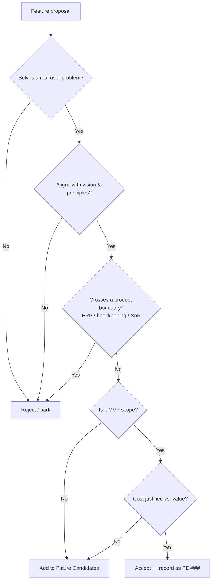

# Product Decisions — LedgerAI

> **Status:** Living document
> **Owner:** Founding Engineer / Product
> **Last updated:** 2026-07-14
> **Related:
** [Product Vision](./PRODUCT_VISION.md) · [PRD](./PRD.md) · [SRS](./SRS.md) · [Roadmap](../03-engineering/ROADMAP.md) · [ADRs](../01-architecture/decisions/)

---

## Introduction

### Why this document exists

This is the **single source of truth for product decisions** across the lifetime of LedgerAI. Every significant product
decision — what we will build, what we will *not* build, and what we are deliberately postponing — is recorded here,
ideally **before** implementation begins.

Its job is to protect three things:

1. **The product vision** — so LedgerAI stays an AI-powered Document Intelligence Platform for accounting professionals
   and does not drift into becoming accounting software.
2. **Focus** — by making feature creep visible and forcing every new idea through an explicit gate.
3. **Institutional memory** — so that six months from now we can answer *"why did we decide that?"* without guessing.

### How this differs from the PRD

| This document (PRODUCT_DECISIONS)                     | The PRD                                                           |
|-------------------------------------------------------|-------------------------------------------------------------------|
| Records **decisions and their rationale** — the *why* | Specifies **requirements** — the *what* and *acceptance criteria* |
| Includes what we **rejected** and **deferred**        | Describes only what is **in scope** to build                      |
| Spans the **entire lifetime** of the product          | Scoped to a **release / milestone**                               |
| Opinionated, argument-driven                          | Precise, testable, implementation-facing                          |

If the PRD says "build X to spec Y," this document says "we chose to build X instead of Z, and here's why."

### How it should be maintained

- **Append, don't overwrite.** Decisions are historical facts. When one changes, add a new decision that supersedes the
  old, mark the old as `Superseded`, and record it in the [Change Log](#9-change-log).
- **Decide before building.** A significant feature should appear here (accepted, deferred, or rejected) before code is
  written.
- **Every decision needs a rationale.** No entry is complete without the reasoning behind it.
- **Cross-reference.** Link to the Product Vision, ADRs, and PRD so decisions stay traceable.
- **Architecture-level decisions** additionally get a formal ADR under [
  `01-architecture/decisions/`](../01-architecture/decisions/);
  this document links to them rather than duplicating them.

---

## 1. Product Principles

Every future decision must satisfy the product principles inherited from
the [Product Vision](./PRODUCT_VISION.md#8-product-principles).
A decision that violates these should be rejected or escalated.

**A feature must serve at least one core value:**

1. **Save accountants time.**
2. **Reduce repetitive work.**
3. **Improve accuracy.**
4. **Simplify complex information.**

**And it must respect how we build:**

- **AI-first.** AI is the primary interaction model, not a bolted-on feature.
- **Lightweight over feature-heavy.** Speed and simplicity beat surface area. When in doubt, ship less.
- **Companion, not replacement.** We complement existing accounting systems; we never try to be the ledger.
- **Human-in-the-loop.** AI outputs assist but never replace professional judgment. The user reviews and approves all
  AI-generated content.
- **Grounded and trustworthy.** AI answers reference their source; accuracy and traceability are non-negotiable in a
  professional context.
- **Confidential by default.** Client data security is a first-class requirement.

> **Rule of thumb:** if a proposed feature cannot be justified against at least one core value *and* it strains a "how
> we
> build" principle, it does not belong in LedgerAI.

---

## 2. Product Boundaries

These boundaries define **what LedgerAI will never become.** They are intentional and strategic, not temporary
limitations.

| LedgerAI will **not** be | Why this boundary matters                                                                                                                                                                                                   |
|--------------------------|-----------------------------------------------------------------------------------------------------------------------------------------------------------------------------------------------------------------------------|
| **An ERP**               | ERPs are heavyweight systems of record with deep, slow integration cycles. Competing there abandons our speed, focus, and AI-first advantage — and puts us against entrenched incumbents on their terms.                    |
| **Bookkeeping software** | Bookkeeping means owning the books. That makes us liable for correctness of records, invites regulatory weight, and duplicates tools professionals already trust.                                                           |
| **Payroll software**     | Payroll is jurisdiction-heavy, compliance-critical, and error-intolerant. It is a specialist product, not a document-intelligence one.                                                                                      |
| **Tax filing software**  | Filing carries legal liability, deadline pressure, and per-jurisdiction certification. It is a fundamentally different business with a different risk profile.                                                              |
| **A system of record**   | The moment we become the source of truth, we inherit migration friction, lock-in expectations, and data-integrity liability — and we lose the "works alongside your existing tools" wedge that makes adoption frictionless. |

**Strategic rationale:** LedgerAI wins by being the *thin, fast, AI-native layer* on top of documents that other systems
produce. Every boundary above protects that wedge. Crossing any of them trades a defensible, focused product for a
crowded, capital-intensive one. When a feature request pushes on a boundary, that is a signal to say no — or to solve
the
underlying need with AI on the document layer instead.

---

## 3. Accepted Product Decisions

Decisions that are **made and in effect.** Architecture-level entries link to their ADR.

| ID     | Decision                                                                                  | Status   | Rationale                                                                                                              | Date       | Related                                                                                                   |
|--------|-------------------------------------------------------------------------------------------|----------|------------------------------------------------------------------------------------------------------------------------|------------|-----------------------------------------------------------------------------------------------------------|
| PD-001 | **Position as an AI-first Document Intelligence Platform** for accounting professionals   | Accepted | This is the core identity and the source of our differentiation and defensibility. Everything else follows from it.    | 2026-07-14 | [Vision §1](./PRODUCT_VISION.md#1-one-line-vision), [§12](./PRODUCT_VISION.md#12-competitive-positioning) |
| PD-002 | **Companion to existing accounting software**, never a replacement                        | Accepted | Frictionless adoption; avoids competing with entrenched systems of record; preserves our focus.                        | 2026-07-14 | [Vision §5](./PRODUCT_VISION.md#5-what-ledgerai-is--and-is-not)                                           |
| PD-003 | **Document-centric workflow** as the primary unit of work                                 | Accepted | Documents are the shared pain point across all target users and the natural surface for AI leverage.                   | 2026-07-14 | [Vision §2](./PRODUCT_VISION.md#2-the-problem)                                                            |
| PD-004 | **MVP scope fixed** to the 12 defined features                                            | Accepted | A tight MVP proves the core loop (upload → understand → act) and prevents scope creep.                                 | 2026-07-14 | [Vision §9](./PRODUCT_VISION.md#9-mvp-scope-version-1), [§6](#6-mvp-decision-matrix)                      |
| PD-005 | **Backend: Java 21 + Spring Boot 3** (Spring Security, Spring Data JPA, Hibernate, Maven) | Accepted | Mature, strongly-typed, enterprise-grade ecosystem; strong security and persistence story; team familiarity.           | 2026-07-14 | [CLAUDE.md](../../CLAUDE.md), ADR (pending)                                                               |
| PD-006 | **Frontend: React + TypeScript + Vite + Material UI** (React Query, Axios)                | Accepted | Type safety, fast DX, mature component library, strong data-fetching ergonomics for an app-heavy UI.                   | 2026-07-14 | [CLAUDE.md](../../CLAUDE.md)                                                                              |
| PD-007 | **Database: PostgreSQL (Neon)**                                                           | Accepted | Reliable relational core, JSON support for semi-structured data, generous serverless free tier.                        | 2026-07-14 | [DATABASE.md](../01-architecture/DATABASE.md)                                                             |
| PD-008 | **Authentication: JWT access + refresh tokens**                                           | Accepted | Stateless, scalable, works cleanly across the Vercel/Render split; standard and well-understood.                       | 2026-07-14 | [ADR-001](../01-architecture/decisions/ADR-001-JWT-Authentication.md)                                     |
| PD-009 | **Hosting: Frontend on Vercel, Backend on Render**                                        | Accepted | Best-fit free tiers for each stack; simple CI/CD; low operational overhead for an early-stage product.                 | 2026-07-14 | [DEPLOYMENT.md](../03-engineering/DEPLOYMENT.md)                                                          |
| PD-010 | **Provider-agnostic AI integration** behind a dedicated service layer                     | Accepted | Avoids lock-in; lets us swap or add LLM providers without touching business logic.                                     | 2026-07-14 | [AI_ARCHITECTURE.md](../01-architecture/AI_ARCHITECTURE.md)                                               |
| PD-011 | **Documentation-first development**                                                       | Accepted | Forces clarity before code; preserves vision; produces durable rationale and onboarding material.                      | 2026-07-14 | [CLAUDE.md](../../CLAUDE.md)                                                                              |
| PD-012 | **Claude Code operates as founding engineer** under an engineering constitution           | Accepted | Consistent standards, opinionated review, and documented decision-making across the codebase.                          | 2026-07-14 | [CLAUDE.md](../../CLAUDE.md)                                                                              |
| PD-013 | **OpenAPI (Swagger)** as the API contract standard                                        | Accepted | Single source of truth for the API; enables generated docs and client typing.                                          | 2026-07-14 | [API_SPEC.md](../01-architecture/API_SPEC.md)                                                             |
| PD-014 | **OCR included in MVP**                                                                   | Accepted | Many accounting documents are scans; without OCR the document-intelligence promise breaks for a large share of inputs. | 2026-07-14 | [Vision §9](./PRODUCT_VISION.md#9-mvp-scope-version-1)                                                    |

> *Note: PD-005, PD-006, PD-008, PD-009 warrant formal ADRs; ADR-001 (JWT) already exists. Others are tracked as
pending.*

---

## 4. Deferred Decisions

Decisions we have **intentionally postponed** — not neglected. Deferring keeps the MVP moving while avoiding premature
commitment.

| ID     | Deferred decision                                                          | Why deferred                                                                                                                                                                      | Revisit when                                                                                                         |
|--------|----------------------------------------------------------------------------|-----------------------------------------------------------------------------------------------------------------------------------------------------------------------------------|----------------------------------------------------------------------------------------------------------------------|
| DD-001 | **Storage provider** (Cloudinary vs. Supabase Storage vs. other free tier) | Needs an evidence-based comparison of free-tier limits, file-handling ergonomics, and security. Low risk to defer briefly; must be resolved before Document Upload is built.      | Before Milestone 3 (Document Upload). Record in [ADR-002](../01-architecture/decisions/ADR-002-Storage-Provider.md). |
| DD-002 | **Primary AI / LLM provider**                                              | We commit to a provider-agnostic abstraction (PD-010) first; the concrete provider choice can follow once we benchmark quality/cost on real accounting documents.                 | Before AI Summary implementation (Milestone 4).                                                                      |
| DD-003 | **Vector database** (pgvector vs. dedicated store)                         | Depends on whether MVP Q&A needs retrieval at scale or can start with simpler context strategies. Avoid adding infra before it earns its place.                                   | When RAG scope is defined.                                                                                           |
| DD-004 | **RAG implementation strategy**                                            | Tightly coupled to DD-002 and DD-003; premature design risks over-engineering the MVP chat feature.                                                                               | During AI Chat design (Milestone 5).                                                                                 |
| DD-005 | **Multi-country / multi-jurisdiction support**                             | Sharpening V1 around one jurisdiction likely produces a better first experience (OCR types, email tone, report formats). Broadening later is cheaper than getting the core wrong. | Post-MVP, once the initial jurisdiction is validated.                                                                |
| DD-006 | **Third-party integrations** (Tally, QuickBooks, Xero, etc.)               | Explicitly out of MVP scope; high effort, each integration is its own project. Value must be proven on the document layer first.                                                  | Post-MVP, driven by user demand.                                                                                     |
| DD-007 | **Background job / async processing framework**                            | OCR and AI calls are long-running and will eventually need async handling, but MVP volumes may not justify the complexity yet.                                                    | When processing latency or throughput becomes a real constraint.                                                     |

---

## 5. Rejected Ideas

Ideas **considered and intentionally rejected.** Recorded so they are not revisited without new information.

| ID     | Rejected idea                                  | Why rejected                                                                                                                                                                           |
|--------|------------------------------------------------|----------------------------------------------------------------------------------------------------------------------------------------------------------------------------------------|
| RI-001 | **Build an ERP**                               | Violates a core product boundary. Heavyweight, capital-intensive, crowded market; destroys our AI-first, lightweight advantage.                                                        | 
| RI-002 | **Build bookkeeping functionality**            | Makes us a system of record with liability for correctness; duplicates trusted incumbent tools; off-strategy.                                                                          |
| RI-003 | **Build tax filing**                           | Legal liability, per-jurisdiction certification, deadline risk — a different business entirely.                                                                                        |
| RI-004 | **Build payroll**                              | Compliance-heavy, error-intolerant specialist domain unrelated to document intelligence.                                                                                               |
| RI-005 | **Compliance / deadline reminders in the MVP** | Valuable idea, but out of MVP scope. Adds calendar/notification surface area that distracts from proving the core document loop. Deferred as a future candidate, not rejected forever. |
| RI-006 | **A heavy, OS-style "everything" application** | Contradicts "lightweight over feature-heavy." Bloat slows the product, raises maintenance cost, and dilutes the AI-first experience.                                                   |
| RI-007 | **Becoming a system of record**                | Inherits migration friction, lock-in expectations, and data-integrity liability; removes the frictionless "works alongside your tools" wedge.                                          |

> *RI-005 is rejected **for the MVP only** and appears in Future Candidate Features. The rest are rejected as permanent
> boundary violations.*

---

## 6. MVP Decision Matrix

The definitive in/out call for each feature considered for V1. Priority: **P0** = core loop, must ship; **P1** = MVP but
sequenced after P0; **—** = not applicable.

| Feature                           | Included? | Reason                                                                              | Priority |
|-----------------------------------|-----------|-------------------------------------------------------------------------------------|----------|
| **Authentication**                | ✅ Yes     | Table stakes; gates all client data.                                                | P0       |
| **User Profile**                  | ✅ Yes     | Basic account identity and settings.                                                | P1       |
| **Client Management**             | ✅ Yes     | Organizing work by client is the professional's mental model.                       | P0       |
| **Document Upload**               | ✅ Yes     | Entry point of the entire product loop.                                             | P0       |
| **Document Storage**              | ✅ Yes     | Required to persist and retrieve uploaded documents.                                | P0       |
| **OCR**                           | ✅ Yes     | Many inputs are scans; without it the AI layer fails on a large share of documents. | P0       |
| **AI Document Summary**           | ✅ Yes     | Highest-leverage, most immediate time-saver.                                        | P0       |
| **AI Chat (Document Q&A)**        | ✅ Yes     | Core AI-native interaction; grounded answers over documents.                        | P0       |
| **AI Email Generation**           | ✅ Yes     | Direct, repetitive-work win with clear time savings.                                | P1       |
| **Report Generation**             | ✅ Yes     | Turns understood documents into deliverables.                                       | P1       |
| **Global Search**                 | ✅ Yes     | Solves the "find that one document" pain across everything.                         | P1       |
| **Activity Timeline**             | ✅ Yes     | Traceability and trust; lightweight to build.                                       | P1       |
| **Integrations** (Tally/QB/Xero…) | ❌ No      | Out of scope (DD-006); high effort, unproven value pre-MVP.                         | —        |
| **Bookkeeping**                   | ❌ No      | Boundary violation (RI-002).                                                        | —        |
| **Payroll**                       | ❌ No      | Boundary violation (RI-004).                                                        | —        |
| **Compliance reminders**          | ❌ No      | Deferred (RI-005); adds surface area outside the core loop.                         | —        |
| **Bank reconciliation**           | ❌ No      | Moves toward system-of-record / bookkeeping territory; out of scope for MVP.        | —        |

---

## 7. Future Candidate Features

**Not commitments** — a prioritized backlog of ideas that align with the vision and could be pursued after the MVP is
validated. Inclusion here is not approval; each must still pass the [Decision Process](#8-decision-process).

### Near-term (next after MVP)

- **Financial Statement Comparison** — compare figures across periods/documents.
- **Multi-document Reasoning** — answer questions spanning several documents.
- **AI Compliance Assistant** — surface relevant obligations and reminders (elevates RI-005 responsibly).

### Mid-term

- **Tally Integration** — highest-demand system-of-record connector for the initial jurisdiction.
- **QuickBooks Integration**
- **Xero Integration**
- **Audit Workpapers** — AI-assisted workpaper preparation.

### Long-term

- **Team Collaboration** — shared workspaces, roles, review flows.
- **Workflow Automation** — chained, repeatable document workflows.
- **Multi-country support** — additional jurisdictions and accounting standards.

> Integrations remain candidates precisely because they *complement* systems of record (reading/writing documents around
> them) rather than replacing them — consistent with our boundaries.

---

## 8. Decision Process

Every new feature proposal must answer the following before it can be approved. If any answer is missing or weak, the
feature is **not** approved.

1. **What user problem does this solve?** (Concrete, named, felt by our target users.)
2. **Does it align with the product vision?** (AI-first document intelligence for accounting professionals.)
3. **Does it save time, reduce repetitive work, improve accuracy, or simplify complexity?** (At least one.)
4. **Is it MVP?** (If not, it is a future candidate, not current work.)
5. **What is the engineering cost?** (Rough size; new infra or dependencies?)
6. **What is the maintenance cost?** (Ongoing burden, not just build cost.)
7. **Does it move LedgerAI closer to becoming an ERP / system of record?** (If yes — challenge hard or reject.)
8. **Can this be solved with AI instead of traditional software?** (Prefer the AI-native solution.)

The outcome of this process is recorded in this document: **Accepted** (§3), **Deferred** (§4), **Rejected** (§5), or
added to **Future Candidates** (§7).

---

## 9. Change Log

Records how product decisions evolve over time. Add a row whenever a decision is added, superseded, or reversed.

| Date       | Change                   | Decisions affected                                | Note                                                                             |
|------------|--------------------------|---------------------------------------------------|----------------------------------------------------------------------------------|
| 2026-07-14 | Initial baseline created | PD-001 – PD-014, DD-001 – DD-007, RI-001 – RI-007 | Captures all decisions made during the initial planning and documentation phase. |

---

*This is a living document. When a decision changes, add a new entry, mark the prior one `Superseded`, and log it
above —
never rewrite history in place. Architecture-level decisions are additionally formalized
as [ADRs](../01-architecture/decisions/).*
