# Product Vision — LedgerAI

> **Status:** Draft v1
> **Owner:** Founding Engineer / Product
> **Last updated:** 2026-07-14
> **Related:
** [PRD](./PRD.md) · [SRS](./SRS.md) · [Product Decisions](./PRODUCT_DECISIONS.md)

---

## 1. One-Line Vision

**LedgerAI is the AI workspace that helps accounting professionals understand documents, automate repetitive work, and
spend more time on advisory instead of administration.**

At its core, LedgerAI is an **AI-powered Document Intelligence Platform for Accounting Professionals**.

---

## 2. The Problem

Chartered Accountants, CPAs, auditors, and accounting professionals spend a disproportionate share of their day on
high-effort, low-leverage work:

- **Reading** long financial statements, audit reports, bank statements, invoices, and tax notices.
- **Extracting** figures and facts manually into spreadsheets and working papers.
- **Searching** across scattered client folders, emails, and drives to find "that one document."
- **Drafting** repetitive, formal client communications from scratch.
- **Re-explaining** the same information to clients and colleagues.

These tasks are essential but repetitive. They consume the professional's most scarce resource — expert attention — and
leave less time for judgment, advisory, and client relationships, which is where their value actually lies.

Critically, professionals already have systems of record (Tally, QuickBooks, Xero, Zoho Books, SAP, Oracle Financials,
Excel). The pain is **not** a missing ledger. The pain is the **cognitive and clerical layer on top of documents** those
systems produce and consume.

---

## 3. Why Now?

The timing for an **AI-powered Document Intelligence Platform for Accounting Professionals** is right for the first
time:

- **The technology finally works.** Recent advances in Large Language Models (LLMs), OCR, and document intelligence have
  made AI-powered document workflows practical — accurate summarization, grounded question answering, and structured
  extraction are now achievable at production quality.
- **The manual effort has not gone away.** Accounting professionals still spend significant time working across PDFs,
  spreadsheets, emails, and multiple systems to read, extract, and communicate.
- **Existing software solves the wrong half.** Accounting systems manage records well, but the productivity layer
  *around*
  documents — the reading, understanding, and drafting — remains largely manual.
- **The opportunity is additive, not disruptive.** LedgerAI exists because AI can now meaningfully reduce this manual
  effort *without* replacing the accounting software professionals already rely on.

---

## 4. The Vision

LedgerAI sits *alongside* existing accounting systems as an **AI-first productivity layer** for the documents
accountants work with every day.

A professional can:

- Upload a document and get an accurate, structured **summary** in seconds.
- **Ask questions** in plain language and get grounded answers with references back to the source.
- **Extract** structured information without manual retyping.
- **Draft professional emails** to clients from a short instruction.
- **Generate reports** from what LedgerAI has understood.
- **Organize** client documents and **search globally** across everything.
- See a clear **activity timeline** of what happened and when.

The experience should feel **lightweight, fast, and AI-native** — closer to a smart assistant than to enterprise
software.

```mermaid
graph LR
    subgraph SoR["Systems of Record (unchanged)"]
        Tally[Tally]
        QB[QuickBooks]
        Xero[Xero]
        Zoho[Zoho Books]
        SAP[SAP / Oracle]
        Excel[Excel]
    end

    Docs[Financial Documents<br/>PDFs · Scans · Statements] --> LedgerAI

subgraph LedgerAI["LedgerAI — AI Productivity Layer"]
OCR[OCR & Understanding]
Summ[Summarization]
QA[Document Q&A]
Email[Email Drafting]
Report[Report Generation]
Search[Global Search]
end

SoR -. exports .-> Docs
LedgerAI --> Prof[Accounting Professional<br/>saves hours → focuses on judgment]

style LedgerAI fill: #1f6feb22, stroke: #1f6feb
style SoR fill: #8b949e22, stroke: #8b949e
```

---

## 5. What LedgerAI Is — and Is Not

| LedgerAI **IS**                                       | LedgerAI is **NOT**  |
|-------------------------------------------------------|----------------------|
| An AI productivity layer for accounting professionals | Accounting software  |
| A document understanding and drafting assistant       | An ERP               |
| A companion to existing systems of record             | Bookkeeping software |
| A time-saver for repetitive clerical work             | Payroll software     |
| A lightweight, AI-first workspace                     | Tax filing software  |

**Guardrail:** LedgerAI never becomes the ledger. It does not replace Tally, QuickBooks, Xero, Zoho Books, SAP, Oracle
Financials, or Excel — it works *alongside* them. Any feature proposal that pulls the product toward being a system of
record should be challenged.

---

## 6. Target Users

**Primary users:**

- **Chartered Accountants (CA)** and **CPAs** in practice — solo practitioners and small-to-mid firms.
- **Auditors** reviewing large volumes of client documentation.
- **Accounting professionals and associates** handling client documents day-to-day.

**Their shared characteristics:**

- Document-heavy workflows.
- High standards for accuracy and professionalism.
- Sensitivity around client confidentiality and data security.
- Comfortable with software, but time-poor — they will not tolerate friction or slowness.

**Not the target (for MVP):** end-consumers doing personal finance, large enterprise finance departments needing deep
ERP integration, or non-accounting document use cases.

---

## 7. Value Proposition

> **From hours to minutes.**

For each core action, LedgerAI compresses time and reduces error:

| Task today                              | With LedgerAI                         |
|-----------------------------------------|---------------------------------------|
| Read a 40-page report to brief a client | Summary + Q&A in under a minute       |
| Hunt through folders for a document     | One global search                     |
| Retype figures into a working sheet     | Structured extraction                 |
| Draft a formal client email             | AI draft, professional tone, editable |
| Compile a status report                 | Generated from understood documents   |

Every feature must earn its place by answering **at least one** of the Product Principles below.

---

## 8. Product Principles

Every feature we build should answer **yes** to at least one:

1. **Does it save accountants time?**
2. **Does it reduce repetitive work?**
3. **Does it improve accuracy?**
4. **Does it simplify complex information?**

If a proposed feature answers "no" to all four, it should be challenged before implementation.

Supporting principles that shape *how* we build:

- **AI-first, not AI-bolted-on.** AI is the core interaction model, not a side panel.
- **Lightweight over heavy.** Speed and simplicity beat feature sprawl.
- **Grounded and trustworthy.** AI answers reference their source; accuracy and traceability matter in a professional
  context.
- **Confidential by default.** Client data security is a first-class requirement, not an afterthought.
- **Companion, not replacement.** We complement existing tools; we never try to be the ledger.
- **Human in the loop.** AI-generated outputs assist accounting professionals but never replace professional judgment.
  Users remain responsible for reviewing and approving all AI-generated content.

---

## 9. MVP Scope (Version 1)

The MVP proves the core loop: **upload → understand → act.**

- Authentication
- User Profile
- Client Management
- Document Upload
- Document Storage
- OCR
- AI Document Summary
- AI Chat (document Q&A)
- AI Email Generation
- Report Generation
- Global Search
- Activity Timeline

Anything outside this list is **out of scope for V1** and should be proposed, documented, and approved before any work
begins.

---

## 10. Explicitly Out of Scope (V1)

Deferred to future versions (captured here so they are proposed, not silently built):

- Direct integrations with Tally / QuickBooks / Xero / Zoho / SAP / Oracle
- Compliance and deadline reminders
- Multi-document reasoning and cross-document comparison
- Bank statement analysis and financial statement comparison
- AI audit workpapers
- Multi-country / multi-jurisdiction accounting support
- Workflow automation and team collaboration features

These represent the long-term direction but must not distort the MVP.

---

## 11. Success Metrics

**North Star:** *Hours of repetitive accounting work eliminated per professional per week.*

Supporting indicators for V1:

| Dimension            | Signal                                                                                 |
|----------------------|----------------------------------------------------------------------------------------|
| **Activation**       | % of new users who upload a document and complete one AI action in their first session |
| **Core value**       | Avg. AI actions (summary / chat / email / report) per active user per week             |
| **Accuracy / trust** | Rate of AI outputs accepted or lightly edited vs. discarded                            |
| **Retention**        | Weekly active professionals returning week over week                                   |
| **Efficiency**       | Self-reported / measured time saved per task                                           |

These are directional for the vision; precise targets belong in the [PRD](./PRD.md).

---

## 12. Competitive Positioning

LedgerAI is positioned as an **AI-powered Document Intelligence Platform for Accounting Professionals** — not as another
accounting system.

- **We complement systems of record; we do not replace them.** LedgerAI works alongside the tools professionals already
  trust — Tally, QuickBooks, Xero, Zoho Books, SAP, Oracle Financials, and Excel — rather than competing with them.
- **Our focus is the productivity layer around accounting work.** We own the AI-powered document intelligence surface:
  understanding, summarizing, questioning, extracting, drafting, organizing, and searching the documents that flow in
  and
  out of those systems.
- **This is a deliberate boundary.** Any future feature that moves LedgerAI toward becoming an ERP or bookkeeping
  platform
  should be carefully evaluated against this product vision before it is pursued. Staying in our lane is a strategic
  advantage, not a limitation.

---

## 13. Long-Term Vision

Beyond V1, LedgerAI aims to become the indispensable AI workspace that surrounds an accounting professional's entire
document workflow:

- Deep integrations with the systems of record accountants already use.
- Multi-document, cross-client reasoning.
- Proactive assistance — reminders, anomaly flags, and drafting suggestions.
- Support across jurisdictions and accounting standards.

The through-line never changes: **give expert professionals their time back, so they can spend it on judgment and
clients instead of clerical work.**

---

## 14. Open Questions

- Storage provider selection (free-tier) — to be resolved and recorded
  in [ADR-002](../01-architecture/decisions/ADR-002-Storage-Provider.md).
- Primary AI provider(s) and fallback strategy — see [AI Architecture](../01-architecture/AI_ARCHITECTURE.md)
  and [AI Providers](../04-ai/AI_PROVIDERS.md).
- Whether V1 targets a single jurisdiction first (e.g., India CA vs. US CPA) to sharpen the initial experience.

---

*This is a living document. It defines the "why" and the "what," not the "how." Architectural and implementation detail
live under [`01-architecture/`](../01-architecture/).*
