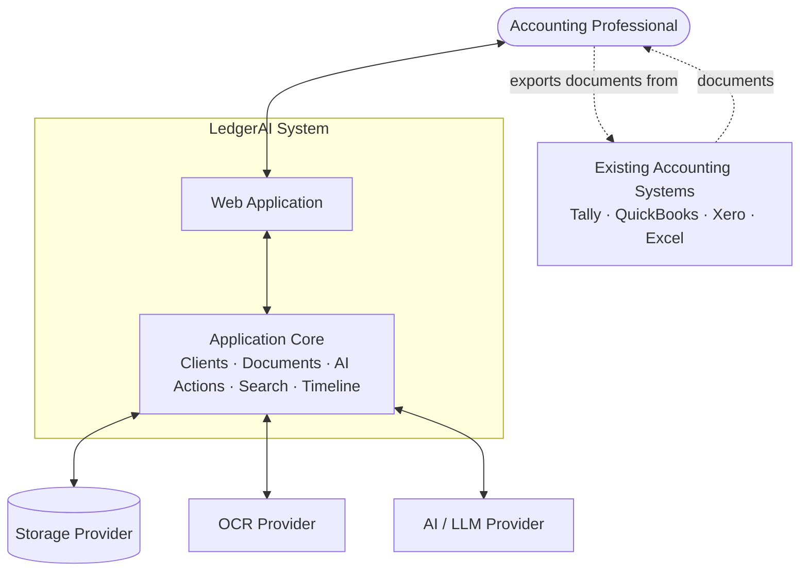
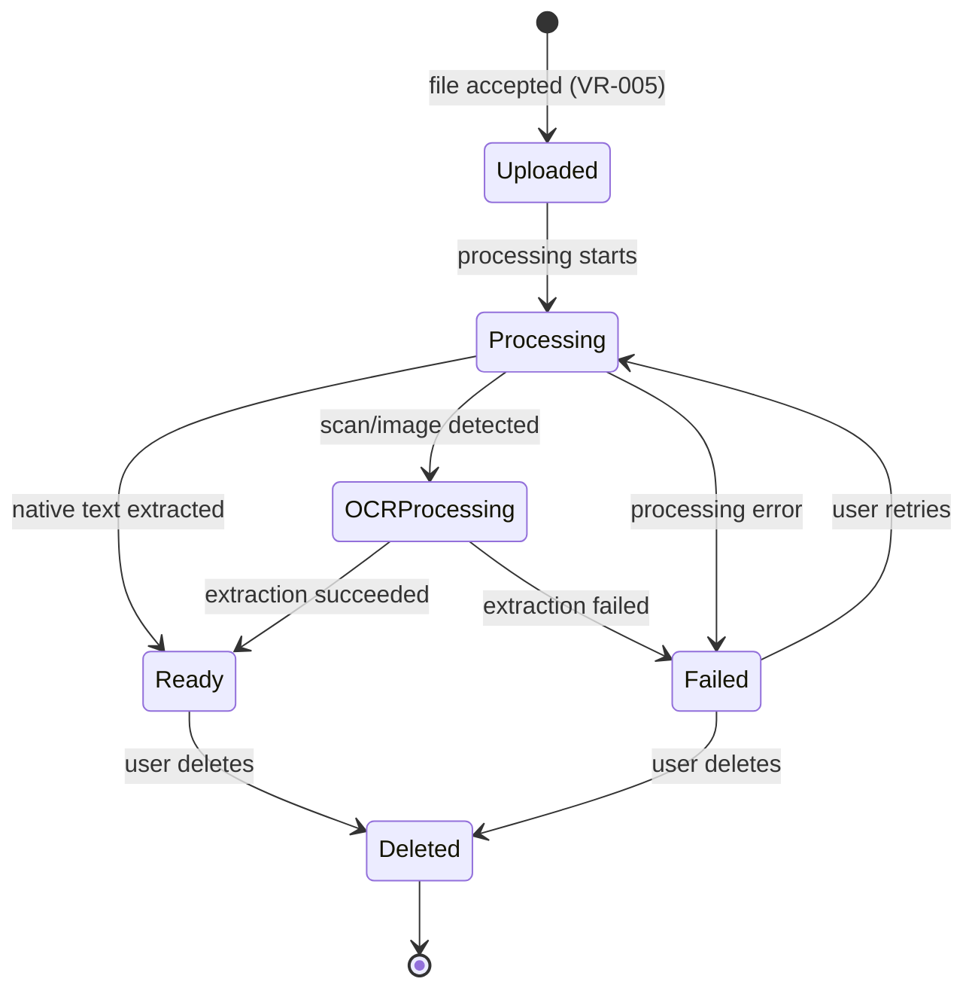
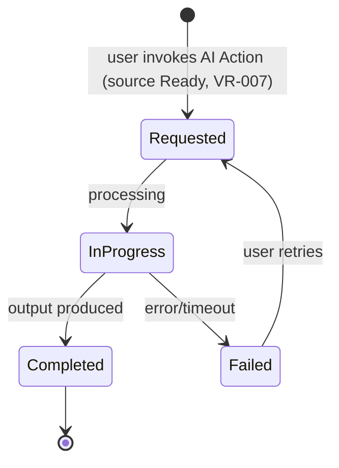
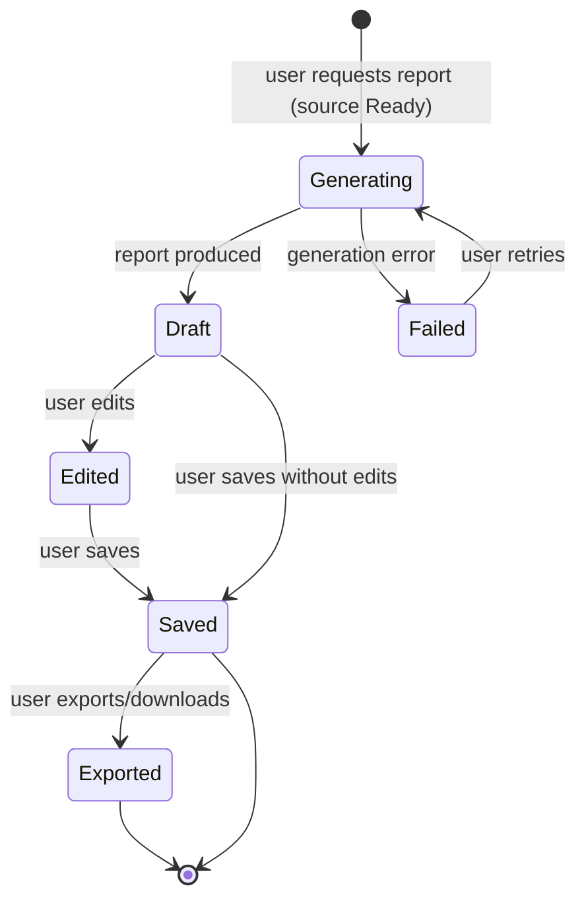

# Software Requirements Specification (SRS) — LedgerAI MVP

> **Status:** Draft v1
> **Owner:** Founding Engineer / Product
> **Last updated:** 2026-07-14
> **Release:** V1 (MVP)
> **Related (frozen):
** [Product Vision](./PRODUCT_VISION.md) · [Product Decisions](./PRODUCT_DECISIONS.md) · [PRD](./PRD.md)
> **Downstream:
** [Architecture](../01-architecture/ARCHITECTURE.md) · [Security](../01-architecture/SECURITY.md) · [AI Architecture](../01-architecture/AI_ARCHITECTURE.md)

---

## 1. Introduction

### 1.1 Purpose

This SRS translates the approved [PRD](./PRD.md) into precise, testable software behavior. It defines **what the
software
MUST do**, **how it MUST behave**, the **business rules**, **validation rules**, **state transitions**, and
**constraints** — while remaining **implementation-independent**. It is the contract from which senior software
engineers
and QA engineers can independently build and verify the LedgerAI MVP.

### 1.2 Scope

This SRS covers the twelve MVP modules approved in
[Product Decisions §6](./PRODUCT_DECISIONS.md#6-mvp-decision-matrix): Authentication, User Profile, Client Management,
Document Upload, Document Storage, OCR, AI Summary, AI Chat, AI Email Generation, Report Generation, Global Search, and
Activity Timeline. Anything listed as a [PRD Non-Goal §5](./PRD.md#5-non-goals) is **out of scope**.

This document **does not** specify database schemas, REST APIs, framework specifics (Spring Boot / React), package
structure, code, deployment, or infrastructure. Those belong to the architecture documents.

### 1.3 Audience

Software engineers, QA engineers, technical leads, and architects who will design, implement, and verify the MVP.

### 1.4 Definitions

| Term                  | Definition                                                                                                                                      |
|-----------------------|-------------------------------------------------------------------------------------------------------------------------------------------------|
| **User**              | An authenticated accounting professional using LedgerAI (the account owner).                                                                    |
| **Client**            | A record representing an accounting professional's customer; the container for documents and activity.                                          |
| **Document**          | A file uploaded by a User and associated with exactly one Client.                                                                               |
| **Extracted Text**    | The machine-readable text obtained from a Document (via native extraction or OCR).                                                              |
| **Processing**        | The pipeline that prepares an uploaded Document (extraction/OCR) so AI features can use it.                                                     |
| **AI Action**         | A Summary, Chat answer, Email draft, or Report produced with AI assistance.                                                                     |
| **AI Request**        | A single invocation of an AI Action, with its own lifecycle.                                                                                    |
| **System of Record**  | The authoritative source of financial data. LedgerAI is explicitly **not** one (see [Boundaries](./PRODUCT_DECISIONS.md#2-product-boundaries)). |
| **Human-in-the-loop** | The requirement that a User reviews and approves AI output before relying on it.                                                                |

### 1.5 Glossary

| Abbreviation | Meaning                             |
|--------------|-------------------------------------|
| **SRS**      | Software Requirements Specification |
| **FR**       | Functional Requirement              |
| **BR**       | Business Rule                       |
| **VR**       | Validation Rule                     |
| **NFR**      | Non-Functional Requirement          |
| **OCR**      | Optical Character Recognition       |
| **LLM**      | Large Language Model                |
| **PII**      | Personally Identifiable Information |

### 1.6 Requirement Keywords (RFC 2119)

The keywords **MUST**, **MUST NOT**, **SHOULD**, **SHOULD NOT**, and **MAY** are used per RFC 2119 to indicate
requirement levels. Every requirement carries a stable identifier (e.g., `FR-AUTH-001`, `BR-001`, `VR-001`, `NFR-001`)
that MUST remain stable across revisions; superseded requirements are marked, not renumbered.

### 1.7 References

- [PRODUCT_VISION.md](./PRODUCT_VISION.md) — product vision (frozen)
- [PRODUCT_DECISIONS.md](./PRODUCT_DECISIONS.md) — authoritative decisions, boundaries, deferrals (frozen)
- [PRD.md](./PRD.md) — product requirements (frozen)
- RFC 2119 — Key words for requirement levels

---

## 2. System Overview

### 2.1 System Context

LedgerAI is a web application used by a single accounting professional per account. It ingests documents, prepares them
for understanding, and lets the User act on that understanding. It depends on three external service categories — AI,
OCR, and Storage — whose concrete providers are **deferred decisions**
([DD-001](./PRODUCT_DECISIONS.md#4-deferred-decisions), DD-002) and therefore referenced abstractly here.

> LedgerAI works **alongside** existing accounting systems and does not integrate with them in V1
> ([DD-006](./PRODUCT_DECISIONS.md#4-deferred-decisions)).

### 2.2 Product Scope

The software MUST deliver the core loop — **upload → understand → act** — across the twelve MVP modules, for a single
authenticated professional managing their own Clients and Documents. It MUST NOT implement any
[Non-Goal](./PRD.md#5-non-goals) or cross any [Product Boundary](./PRODUCT_DECISIONS.md#2-product-boundaries).

### 2.3 High-Level Behavior

1. A User authenticates.
2. The User organizes work under Clients.
3. The User uploads Documents to a Client; the system stores and processes them (extraction/OCR).
4. Once a Document is Ready, the User may Summarize it, Chat with it, and generate Emails and Reports from it.
5. All content is searchable; all significant actions are recorded on the Activity Timeline.
6. All AI output is editable and subject to human review (human-in-the-loop).

### 2.4 External Dependencies

| Dependency            | Role                                         | Notes                                                                                 |
|-----------------------|----------------------------------------------|---------------------------------------------------------------------------------------|
| **Storage Provider**  | Durable document storage and retrieval       | Provider deferred (DD-001).                                                           |
| **OCR Provider**      | Text extraction from scanned/image documents | Provider deferred; MAY be combined with AI provider.                                  |
| **AI / LLM Provider** | Summaries, Q&A, email/report generation      | Accessed behind a provider-agnostic abstraction (PD-010); provider deferred (DD-002). |

### 2.5 Assumptions

Software-level assumptions are catalogued in [§11](#11-assumptions).

### 2.6 Constraints

Business and technical constraints are catalogued in [§12](#12-constraints).

---

## 3. Actors

| Actor                 | Type                | Responsibilities                                                                                      | Permissions                                                                 | Interactions                                                        |
|-----------------------|---------------------|-------------------------------------------------------------------------------------------------------|-----------------------------------------------------------------------------|---------------------------------------------------------------------|
| **Accountant / User** | Human (primary)     | Manage own profile, clients, documents; invoke AI actions; review/edit outputs; search; view timeline | Full CRUD over **their own** data only; no access to other users' data      | All application flows via the web app                               |
| **Future Admin**      | Human (placeholder) | *Not implemented in V1.* Reserved for future administration/oversight                                 | None in V1                                                                  | None in V1                                                          |
| **AI / LLM Provider** | External system     | Produce summaries, answers, drafts, and reports from provided content                                 | Receives only the content necessary for a request; holds no standing access | Invoked by the system per AI Request behind an abstraction (PD-010) |
| **OCR Provider**      | External system     | Extract text from scanned/image documents                                                             | Receives only the document/content necessary for extraction                 | Invoked by the system during Processing                             |
| **Storage Provider**  | External system     | Durably store and return documents                                                                    | Stores document content on the system's behalf                              | Invoked on upload, retrieval, and deletion                          |

> **AR-1:** The Future Admin actor is a **placeholder only**. The system MUST NOT expose administrative capabilities in
> V1. Its mention here reserves conceptual space and MUST NOT be interpreted as a requirement to build it.

---

## 4. Functional Requirements

> **ID scheme:** `FR-<MODULE>-nnn` (module-scoped, stable). Each module lists Purpose, FRs, Preconditions, Trigger, Main
> Flow, Alternate Flows, Exception Flows, Postconditions, and the BR/VR referenced. All FRs are testable.

### 4.1 Authentication (`AUTH`)

**Purpose:** Securely register and authenticate Users and protect all data behind authenticated sessions.

**Functional Requirements**

- **FR-AUTH-001:** The system MUST allow a new User to register with the required credentials (
  see [VR-001](#6-validation-rules)).
- **FR-AUTH-002:** The system MUST authenticate a User presenting valid credentials and MUST establish a session.
- **FR-AUTH-003:** The system MUST reject invalid credentials with a non-revealing message (
  see [BR-020](#5-business-rules)).
- **FR-AUTH-004:** The system MUST expire sessions after a defined period of inactivity/validity and MUST allow seamless
  renewal while the User is active.
- **FR-AUTH-005:** The system MUST allow a User to sign out, immediately terminating access to protected areas.
- **FR-AUTH-006:** The system MUST require authentication for every area except registration and sign-in.
- **FR-AUTH-007:** The system MUST NOT store User passwords in recoverable form.
- **FR-AUTH-008:** The system SHOULD limit repeated failed authentication attempts to deter brute-force attempts.

**Preconditions:** None for registration; a registered account for sign-in.
**Trigger:** User submits registration or sign-in.
**Main Flow:** User submits valid data → system validates → account created (register) or session established (
sign-in) → User reaches an authenticated area.
**Alternate Flows:** Already-authenticated User navigating to sign-in SHOULD be routed to an authenticated area.
**Exception Flows:** Invalid input → validation error ([VR-001](#6-validation-rules)/[VR-002](#6-validation-rules));
duplicate registration → rejection ([BR-021](#5-business-rules)); expired session → User is returned to sign-in.
**Postconditions:** On success, an authenticated session exists (or an account is created).
**Business Rules:** BR-020, BR-021, BR-022. **Validation:** VR-001, VR-002.

### 4.2 User Profile (`PROF`)

**Purpose:** Let a User view and manage basic account identity and preferences.

**Functional Requirements**

- **FR-PROF-001:** The system MUST allow a User to view their profile.
- **FR-PROF-002:** The system MUST allow a User to update editable profile fields subject
  to [VR-003](#6-validation-rules).
- **FR-PROF-003:** The system MUST persist profile changes and reflect them across sessions.
- **FR-PROF-004:** The system MUST NOT allow a User to view or edit another User's profile.
- **FR-PROF-005:** The system SHOULD allow a User to manage basic preferences.

**Preconditions:** Authenticated User.
**Trigger:** User opens or edits their profile.
**Main Flow:** User edits fields → system validates → changes persist → confirmation shown.
**Alternate Flows:** User cancels edit → no changes persist.
**Exception Flows:** Invalid input → validation error; navigation with unsaved edits → system SHOULD warn.
**Postconditions:** Profile reflects the latest valid values.
**Business Rules:** BR-023. **Validation:** VR-003.

### 4.3 Client Management (`CLNT`)

**Purpose:** Organize all work around Clients.

**Functional Requirements**

- **FR-CLNT-001:** The system MUST allow a User to create a Client with required details (
  see [VR-004](#6-validation-rules)).
- **FR-CLNT-002:** The system MUST allow a User to view a list of their Clients and open a single Client workspace.
- **FR-CLNT-003:** The system MUST allow a User to edit a Client.
- **FR-CLNT-004:** The system MUST allow a User to archive/deactivate a Client, including one that has associated
  Documents (see [BR-002](#5-business-rules)).
- **FR-CLNT-005:** The system MUST scope every Client to exactly one owning User (
  see [BR-001](#5-business-rules), [BR-003](#5-business-rules)).
- **FR-CLNT-006:** The system MUST present a Client's Documents, generated outputs, and activity within that Client.
- **FR-CLNT-007:** The system MUST NOT permanently delete a Client's Documents solely as a side effect of archiving the
  Client, unless the User explicitly requests deletion.

**Preconditions:** Authenticated User.
**Trigger:** User creates/edits/archives a Client or opens a Client workspace.
**Main Flow:** User submits Client data → system validates → Client persists and appears in the list.
**Alternate Flows:** Archiving a Client → Client is hidden from active lists but its data is retained.
**Exception Flows:** Invalid input → validation error ([VR-004](#6-validation-rules)); duplicate-name → system SHOULD
warn but MAY allow ([BR-024](#5-business-rules)).
**Postconditions:** Client state reflects the User's action; ownership scoping is preserved.
**Business Rules:** BR-001, BR-002, BR-003, BR-024. **Validation:** VR-004.

### 4.4 Document Upload (`UPLD`)

**Purpose:** Bring Documents into LedgerAI as the entry point of the core loop.

**Functional Requirements**

- **FR-UPLD-001:** The system MUST allow a User to upload a Document and associate it with exactly one of their
  Clients (see [BR-001](#5-business-rules)).
- **FR-UPLD-002:** The system MUST validate file type and size before accepting a Document (
  see [VR-005](#6-validation-rules)).
- **FR-UPLD-003:** The system MUST reject unsupported or oversized files with a clear, actionable message.
- **FR-UPLD-004:** The system MUST make upload progress and post-upload Processing status visible to the User (
  see [§7.1](#71-document-lifecycle)).
- **FR-UPLD-005:** The system MUST initiate Processing for each successfully uploaded Document.
- **FR-UPLD-006:** The system MUST NOT make a Document available for AI Actions until it reaches the **Ready** state (
  see [BR-010](#5-business-rules)).
- **FR-UPLD-007:** The system SHOULD detect and warn on an apparently duplicate upload within the same Client but MAY
  allow it.

**Preconditions:** Authenticated User; at least one Client exists.
**Trigger:** User submits a file for upload.
**Main Flow:** User selects file + Client → system validates → file is stored → Document enters **Uploaded → Processing
**.
**Alternate Flows:** File already contains selectable text → OCR MAY be skipped (see [§4.6](#46-ocr-ocr)).
**Exception Flows:** Unsupported/oversized/corrupt/empty file → rejection ([VR-005](#6-validation-rules)); interrupted
upload → Document MUST NOT appear as Ready; storage failure → **Failed** with a clear message.
**Postconditions:** A valid Document is stored and progressing through its lifecycle.
**Business Rules:** BR-001, BR-010, BR-011. **Validation:** VR-005.

### 4.5 Document Storage (`STOR`)

**Purpose:** Persist Documents securely and make them retrievable.

**Functional Requirements**

- **FR-STOR-001:** The system MUST durably store each uploaded Document and make it retrievable by its owner.
- **FR-STOR-002:** The system MUST restrict Document access to the owning User (see [BR-004](#5-business-rules)).
- **FR-STOR-003:** The system MUST allow a User to view/open and download their Documents.
- **FR-STOR-004:** The system MUST allow a User to delete a Document; a deleted Document MUST transition to **Deleted**
  and MUST NOT appear in listings, search, or AI Actions (see [BR-012](#5-business-rules), [BR-013](#5-business-rules)).
- **FR-STOR-005:** The system MUST NOT return a Deleted Document through any retrieval path.

**Preconditions:** Document exists and is owned by the requesting User.
**Trigger:** User views, downloads, or deletes a Document.
**Main Flow:** User requests a Document → system verifies ownership → Document is returned or deleted.
**Alternate Flows:** None.
**Exception Flows:** Non-owner access attempt → authorization error ([BR-004](#5-business-rules)); storage unavailable →
clear error, retrievable later; retrieval of a Deleted Document → not-found behavior.
**Postconditions:** Document is retrieved, or removed from all User-visible surfaces.
**Business Rules:** BR-004, BR-012, BR-013. **Validation:** —.

### 4.6 OCR (`OCR`)

**Purpose:** Produce Extracted Text from scanned/image Documents so AI features can operate on them.

**Functional Requirements**

- **FR-OCR-001:** The system MUST extract text automatically as part of Processing when a Document is a scan/image.
- **FR-OCR-002:** The system SHOULD use native text extraction and skip OCR when a Document already contains selectable
  text (see [BR-014](#5-business-rules)).
- **FR-OCR-003:** The system MUST surface extraction status, including a clear message when quality is low or extraction
  fails.
- **FR-OCR-004:** The system MUST make Extracted Text the basis for AI Summary, AI Chat, and Global Search.
- **FR-OCR-005:** If extraction fails, the system MUST transition the Document to **Failed** and MUST NOT present it as
  Ready.
- **FR-OCR-006:** The system SHOULD indicate a low-confidence extraction so the User can judge reliability.

**Preconditions:** A stored Document in Processing.
**Trigger:** Processing reaches the extraction step.
**Main Flow:** System determines document nature → extracts text (native or OCR) → on success, Document becomes **Ready
**.
**Alternate Flows:** Native text available → OCR skipped.
**Exception Flows:** Poor scan/blank/unsupported-language/handwritten content → low-quality warning or **Failed**;
extraction service unavailable → **Failed**/retryable.
**Postconditions:** Extracted Text exists for a Ready Document, or the Document is Failed.
**Business Rules:** BR-010, BR-014, BR-015. **Validation:** —.

### 4.7 AI Summary (`SUMM`)

**Purpose:** Provide an accurate, concise understanding of a Document in seconds.

**Functional Requirements**

- **FR-SUMM-001:** The system MUST allow a User to obtain a summary for a **Ready** Document (
  see [BR-010](#5-business-rules)).
- **FR-SUMM-002:** The summary MUST be generated from the Document's Extracted Text and reflect its key content (
  see [BR-030](#5-business-rules)).
- **FR-SUMM-003:** The system MUST make summary generation status visible and MUST present failures as clear,
  non-technical messages.
- **FR-SUMM-004:** The system MUST persist a generated summary with its Document and make it viewable later without
  regeneration.
- **FR-SUMM-005:** The generated summary MUST be editable by the User (see [BR-031](#5-business-rules)).
- **FR-SUMM-006:** The system MUST indicate that the summary is AI-assisted and subject to User review (
  see [BR-032](#5-business-rules)).
- **FR-SUMM-007:** The system MUST NOT summarize a Document that is not Ready.

**Preconditions:** A Ready Document with Extracted Text.
**Trigger:** User requests a summary (or the system offers one on reaching Ready).
**Main Flow:** User requests summary → AI Request created → summary produced → saved and displayed.
**Alternate Flows:** Summary already exists → system SHOULD show the saved summary and offer regeneration.
**Exception Flows:** Little/no extractable text → system MUST inform the User; generation timeout/failure → **Failed**
AI Request with a clear message and retry option (see [§7.2](#72-ai-request-lifecycle)).
**Postconditions:** A saved, editable summary exists, or the AI Request is Failed.
**Business Rules:** BR-010, BR-030, BR-031, BR-032. **Validation:** VR-007.

### 4.8 AI Chat (`CHAT`)

**Purpose:** Let Users ask natural-language questions about a Document and receive grounded answers.

**Functional Requirements**

- **FR-CHAT-001:** The system MUST allow a User to ask a question about a **Ready** Document and MUST return a relevant
  answer.
- **FR-CHAT-002:** Answers MUST be grounded in the Document's content and SHOULD indicate the basis/source where
  applicable (see [BR-030](#5-business-rules), [BR-033](#5-business-rules)).
- **FR-CHAT-003:** When the Document does not contain the answer, the system MUST state that rather than fabricating a
  response (see [BR-033](#5-business-rules)).
- **FR-CHAT-004:** The system MUST retain the conversation within the Document's context for the session/thread.
- **FR-CHAT-005:** The system MUST indicate that answers are AI-assisted and subject to review (
  see [BR-032](#5-business-rules)).
- **FR-CHAT-006:** The system MUST validate the User's question input (see [VR-007](#6-validation-rules)).
- **FR-CHAT-007:** The system MUST NOT answer questions against a Document that is not Ready.

**Preconditions:** A Ready Document with Extracted Text.
**Trigger:** User submits a question.
**Main Flow:** User asks → AI Request created → grounded answer returned and appended to the thread.
**Alternate Flows:** Follow-up question → answered within the same Document context.
**Exception Flows:** Unanswerable-from-document / out-of-scope question → honest "not found/out of scope" response;
empty/invalid question → validation error ([VR-007](#6-validation-rules)); generation failure → Failed AI Request with
retry.
**Postconditions:** The thread contains the question and a grounded answer.
**Business Rules:** BR-010, BR-030, BR-032, BR-033. **Validation:** VR-007.

### 4.9 AI Email Generation (`EMAIL`)

**Purpose:** Draft professional client emails from an instruction and/or Document/Client context.

**Functional Requirements**

- **FR-EMAIL-001:** The system MUST allow a User to generate an email draft from an instruction and/or a selected
  Document/Client context.
- **FR-EMAIL-002:** The generated draft MUST be professional in tone and MUST be editable before use (
  see [BR-031](#5-business-rules)).
- **FR-EMAIL-003:** The system MUST allow the User to regenerate or refine a draft.
- **FR-EMAIL-004:** The system MUST allow a draft to be saved/associated with the Client.
- **FR-EMAIL-005:** The system MUST require explicit User review before any external use and MUST NOT send email on the
  User's behalf in V1 (see [BR-034](#5-business-rules)).
- **FR-EMAIL-006:** The system MUST validate the generation instruction input (see [VR-007](#6-validation-rules)).

**Preconditions:** Authenticated User; optional Document/Client context (Document, if used, MUST be Ready).
**Trigger:** User requests an email draft.
**Main Flow:** User provides instruction/context → AI Request created → draft produced → User reviews/edits → optionally
saves.
**Alternate Flows:** User regenerates/refines → new draft produced.
**Exception Flows:** Vague instruction/missing context → system SHOULD produce a best-effort draft and MAY prompt for
clarification; generation failure → Failed AI Request with retry.
**Postconditions:** An editable email draft exists; nothing is sent by the system.
**Business Rules:** BR-031, BR-032, BR-034. **Validation:** VR-007.

### 4.10 Report Generation (`RPT`)

**Purpose:** Turn understood Document content into a structured, shareable report.

**Functional Requirements**

- **FR-RPT-001:** The system MUST allow a User to generate a report from a **Ready** Document's content (V1 scope is
  single-document; see [BR-035](#5-business-rules)).
- **FR-RPT-002:** The report MUST be structured, readable, and reflect the underlying content (
  see [BR-030](#5-business-rules)).
- **FR-RPT-003:** The system MUST allow the User to review, edit, and save the report to the Client (
  see [BR-031](#5-business-rules)).
- **FR-RPT-004:** The system MUST allow the User to export/download the report in a common document format.
- **FR-RPT-005:** The system MUST indicate that the report is AI-assisted and subject to review (
  see [BR-032](#5-business-rules)).
- **FR-RPT-006:** The system MUST validate any User-supplied report generation input (
  see [VR-008](#6-validation-rules)).

**Preconditions:** A Ready Document with Extracted Text.
**Trigger:** User requests report generation.
**Main Flow:** User requests → AI Request created → report produced → User reviews/edits → saves and/or exports.
**Alternate Flows:** User regenerates → new report produced.
**Exception Flows:** Insufficient content → system MUST inform the User; generation failure → Failed AI Request with
retry; export failure → clear error, retry (see [§7.3](#73-report-lifecycle)).
**Postconditions:** A saved and/or exported, editable report exists.
**Business Rules:** BR-030, BR-031, BR-032, BR-035. **Validation:** VR-008.

### 4.11 Global Search (`SRCH`)

**Purpose:** Let Users find Documents and content across all their Clients.

**Functional Requirements**

- **FR-SRCH-001:** The system MUST allow a User to search and retrieve matching Documents/content scoped to their own
  account only (see [BR-005](#5-business-rules)).
- **FR-SRCH-002:** Results MUST indicate the Client/Document context and MUST allow navigation to the item.
- **FR-SRCH-003:** Search MUST reflect Document content (including Extracted Text) and metadata.
- **FR-SRCH-004:** Search MUST NOT return Deleted Documents (see [BR-013](#5-business-rules)).
- **FR-SRCH-005:** Search SHOULD only reflect content of Documents that have reached Ready.
- **FR-SRCH-006:** An empty or no-results query MUST return a clear, helpful state.
- **FR-SRCH-007:** The system MUST validate the search query input (see [VR-006](#6-validation-rules)).

**Preconditions:** Authenticated User.
**Trigger:** User submits a search query.
**Main Flow:** User queries → system returns owner-scoped, ranked results → User navigates to an item.
**Alternate Flows:** No results → helpful empty state.
**Exception Flows:** Invalid/oversized query → validation error ([VR-006](#6-validation-rules)); querying before content
is processed → such content simply does not appear.
**Postconditions:** The User sees relevant, owner-scoped results.
**Business Rules:** BR-005, BR-013. **Validation:** VR-006.

### 4.12 Activity Timeline (`TMLN`)

**Purpose:** Provide a chronological, trustworthy record of workspace actions.

**Functional Requirements**

- **FR-TMLN-001:** The system MUST record key actions (e.g., Document uploaded, summary generated, email/report created)
  with an accurate timestamp.
- **FR-TMLN-002:** The system MUST allow a User to view the timeline at the account level and/or per Client, in
  chronological order.
- **FR-TMLN-003:** Timeline entries MUST be scoped to the owning User and MUST be read-only (
  see [BR-006](#5-business-rules), [BR-016](#5-business-rules)).
- **FR-TMLN-004:** The system MUST NOT allow a User to edit or delete individual timeline entries.
- **FR-TMLN-005:** The system SHOULD record notable failed actions so the record is complete and honest.

**Preconditions:** Authenticated User; recorded activity exists.
**Trigger:** An action completes, or the User opens the timeline.
**Main Flow:** Action occurs → entry recorded → entry visible in chronological order.
**Alternate Flows:** Empty timeline (first-run) → helpful empty state.
**Exception Flows:** High activity volume → the timeline MUST remain readable (e.g., via paging/lazy loading — behavior,
not implementation).
**Postconditions:** The timeline reflects the User's actions accurately.
**Business Rules:** BR-006, BR-016. **Validation:** —.

---

## 5. Business Rules

> Business rules are cross-cutting truths the system MUST enforce. IDs are stable. Rationale is given where useful.

### 5.1 Ownership & Data Boundaries

| ID         | Rule                                                                                    | Rationale                                                                |
|------------|-----------------------------------------------------------------------------------------|--------------------------------------------------------------------------|
| **BR-001** | Every Document MUST belong to exactly one Client.                                       | Documents are meaningless without client context; enforces organization. |
| **BR-002** | A Client MAY have zero or more Documents; archiving a Client MUST retain its Documents. | Preserves history; avoids accidental data loss.                          |
| **BR-003** | Every Client MUST belong to exactly one User.                                           | Single-professional model (V1); enforces isolation.                      |
| **BR-004** | A User MUST access only their own Clients, Documents, outputs, and activity.            | Confidentiality by default; per-user isolation.                          |
| **BR-005** | Search results MUST be scoped to the requesting User only.                              | Prevents cross-user data exposure.                                       |
| **BR-006** | Activity records MUST be scoped to the owning User.                                     | Isolation and traceability.                                              |

### 5.2 Document & Processing

| ID         | Rule                                                                                                                     | Rationale                                   |
|------------|--------------------------------------------------------------------------------------------------------------------------|---------------------------------------------|
| **BR-010** | Only a **Ready** Document MAY be summarized, queried, or used to generate reports/emails.                                | Guarantees AI operates on prepared content. |
| **BR-011** | A Document MUST NOT be presented as Ready unless text extraction has succeeded (natively or via OCR).                    | Prevents AI Actions on empty/garbage input. |
| **BR-012** | A deleted Document MUST transition to **Deleted** and MUST NOT be retrievable thereafter.                                | User control over retention; privacy.       |
| **BR-013** | A Deleted Document MUST NOT appear in listings, search results, or AI Actions.                                           | Consistency of deletion across the system.  |
| **BR-014** | Native text extraction SHOULD be preferred over OCR when selectable text is present.                                     | Higher accuracy and lower cost.             |
| **BR-015** | A failed extraction MUST NOT silently discard the Document; it MUST be marked **Failed** and remain visible to the User. | Transparency; recoverability.               |
| **BR-016** | Activity Timeline entries MUST be immutable (read-only) to Users.                                                        | Trust and auditability.                     |

### 5.3 Authentication & Accounts

| ID         | Rule                                                                        | Rationale                                         |
|------------|-----------------------------------------------------------------------------|---------------------------------------------------|
| **BR-020** | Authentication failures MUST NOT reveal whether the account exists.         | Reduces account-enumeration risk.                 |
| **BR-021** | A given identifier (e.g., email) MUST be unique across Users.               | Prevents ambiguous accounts.                      |
| **BR-022** | Passwords MUST NOT be stored in recoverable form.                           | Security baseline.                                |
| **BR-023** | A User MUST NOT view or modify another User's profile.                      | Isolation.                                        |
| **BR-024** | Duplicate Client names within one User SHOULD be warned but MAY be allowed. | Real clients can share names; avoid false blocks. |

### 5.4 AI & Trust (Human-in-the-loop)

| ID         | Rule                                                                                                    | Rationale                                                                            |
|------------|---------------------------------------------------------------------------------------------------------|--------------------------------------------------------------------------------------|
| **BR-030** | AI outputs MUST be grounded in the provided Document content.                                           | Accuracy; reduces hallucination ([PRD Risks §12](./PRD.md#12-risks)).                |
| **BR-031** | All AI-generated content (summary, answer, email, report) MUST remain editable by the User.             | Human-in-the-loop; User control.                                                     |
| **BR-032** | AI-generated content MUST NOT be treated as a system of record; it is assistive and subject to review.  | Boundary enforcement ([Boundaries §2](./PRODUCT_DECISIONS.md#2-product-boundaries)). |
| **BR-033** | When an answer is not supported by the Document, the system MUST decline/qualify rather than fabricate. | Trust; auditability.                                                                 |
| **BR-034** | The system MUST NOT send emails on the User's behalf in V1; drafts require explicit human use.          | Scope ([PRD §15 Won't-Have](./PRD.md#15-release-scope-moscow)).                      |
| **BR-035** | Report/summary generation in V1 MUST operate on a single Document (no multi-document reasoning).        | Scope ([Non-Goals §5](./PRD.md#5-non-goals)).                                        |

---

## 6. Validation Rules

> Validation defines acceptable input and expected behavior on violation. Specific numeric limits not fixed by the
> approved documents are flagged as **[Assumption]** and finalized in the SRS/architecture; they MUST NOT be treated as
> product commitments here.

| ID         | Applies to                                               | Required / Constraints                                                                                                                       | Invalid scenarios                                                   | Expected behavior                                                                                |
|------------|----------------------------------------------------------|----------------------------------------------------------------------------------------------------------------------------------------------|---------------------------------------------------------------------|--------------------------------------------------------------------------------------------------|
| **VR-001** | Registration                                             | Required: identifier (e.g., email) in valid format; password meeting a defined strength policy **[Assumption]**; any required profile fields | Missing field; malformed email; weak password; duplicate identifier | Reject with field-level messages; do not create account; enforce [BR-021](#5-business-rules)     |
| **VR-002** | Login                                                    | Required: identifier + password                                                                                                              | Missing field; malformed input                                      | Reject with a generic, non-revealing message ([BR-020](#5-business-rules))                       |
| **VR-003** | User Profile                                             | Editable fields within defined length limits **[Assumption]**; required fields non-empty                                                     | Empty required field; over-length value; invalid format             | Reject with field-level messages; retain prior valid values                                      |
| **VR-004** | Client                                                   | Required: Client name (non-empty, within length limit **[Assumption]**); optional fields validated if present                                | Empty name; over-length; invalid optional value                     | Reject with messages; warn on duplicate name ([BR-024](#5-business-rules))                       |
| **VR-005** | Document Upload                                          | Allowed file types and maximum size **[Assumption, to be fixed in SRS/architecture]**; non-empty file; associated Client required            | Unsupported type; oversized; empty/corrupt file; no Client selected | Reject before storage with a clear, actionable message ([FR-UPLD-003](#44-document-upload-upld)) |
| **VR-006** | Search query                                             | Query within a maximum length **[Assumption]**; MAY be empty (returns empty state)                                                           | Over-length; disallowed control characters                          | Reject over-length with a message; empty query yields a helpful empty state                      |
| **VR-007** | AI Prompt (Chat question / Email or Summary instruction) | Non-empty where required; within a maximum length **[Assumption]**                                                                           | Empty required prompt; over-length                                  | Reject with a message; do not create an AI Request                                               |
| **VR-008** | Report Generation                                        | Valid source (a Ready Document); any User-supplied parameters within limits **[Assumption]**                                                 | Non-Ready source; invalid parameters                                | Reject with a message; enforce [BR-010](#5-business-rules)                                       |

---

## 7. State Models

### 7.1 Document Lifecycle

| State             | Entry condition                                        | Exit condition                  | Allowed transitions                | Failure paths               |
|-------------------|--------------------------------------------------------|---------------------------------|------------------------------------|-----------------------------|
| **Uploaded**      | File passes validation and is stored                   | Processing begins               | → Processing                       | Storage failure → Failed    |
| **Processing**    | Preparation pipeline starts                            | Text extracted or routed to OCR | → OCRProcessing, → Ready, → Failed | Processing error → Failed   |
| **OCRProcessing** | Document is a scan/image                               | OCR completes                   | → Ready, → Failed                  | Extraction failure → Failed |
| **Ready**         | Extracted Text available ([BR-011](#5-business-rules)) | User deletes                    | → Deleted                          | —                           |
| **Failed**        | Processing/OCR error ([BR-015](#5-business-rules))     | User retries or deletes         | → Processing, → Deleted            | —                           |
| **Deleted**       | User deletes ([BR-012](#5-business-rules))             | Terminal                        | → [*]                              | —                           |

### 7.2 AI Request Lifecycle

Applies to Summary, Chat answer, Email draft, and Report generation.

| State          | Entry condition                                                      | Exit condition           | Allowed transitions   | Failure paths                        |
|----------------|----------------------------------------------------------------------|--------------------------|-----------------------|--------------------------------------|
| **Requested**  | Valid AI Action on a Ready source                                    | Processing begins        | → InProgress          | Invalid input → not created (VR-007) |
| **InProgress** | Provider invoked                                                     | Output or error returned | → Completed, → Failed | Timeout/provider error → Failed      |
| **Completed**  | Output produced and saved (editable per [BR-031](#5-business-rules)) | Terminal                 | → [*]                 | —                                    |
| **Failed**     | Error/timeout                                                        | User retries             | → Requested           | —                                    |

### 7.3 Report Lifecycle

| State          | Entry condition                                         | Exit condition       | Allowed transitions | Failure paths                        |
|----------------|---------------------------------------------------------|----------------------|---------------------|--------------------------------------|
| **Generating** | User requests report on a Ready Document                | Report produced      | → Draft, → Failed   | Generation error → Failed            |
| **Draft**      | Report produced (editable, [BR-031](#5-business-rules)) | User edits/saves     | → Edited, → Saved   | —                                    |
| **Edited**     | User modifies content                                   | User saves           | → Saved             | —                                    |
| **Saved**      | User persists the report to the Client                  | User exports or ends | → Exported, → [*]   | —                                    |
| **Exported**   | User downloads/exports                                  | Terminal             | → [*]               | Export failure → remain Saved, retry |
| **Failed**     | Generation error                                        | User retries         | → Generating        | —                                    |

---

## 8. Error Handling

> Behavioral expectations only — no HTTP status codes or implementation. Every error MUST be surfaced to the User in
> clear, non-technical language and MUST NOT expose stack traces or sensitive internals.

| Category                  | Typical cause                                                      | User-visible behavior                                                           | Recovery expectation                                                                                        |
|---------------------------|--------------------------------------------------------------------|---------------------------------------------------------------------------------|-------------------------------------------------------------------------------------------------------------|
| **Validation Errors**     | Input violates a VR                                                | Field-level, actionable message; action not performed                           | User corrects input and retries                                                                             |
| **Authentication Errors** | Invalid credentials / expired session                              | Generic, non-revealing message ([BR-020](#5-business-rules)); routed to sign-in | User re-authenticates                                                                                       |
| **Authorization Errors**  | Access to data the User does not own ([BR-004](#5-business-rules)) | Access denied / not-found style message; no data leaked                         | User cannot proceed; no retry against others' data                                                          |
| **Upload Errors**         | Unsupported/oversized/corrupt file; interrupted upload             | Clear rejection with the reason; Document not marked Ready                      | User fixes the file and re-uploads                                                                          |
| **OCR Errors**            | Poor scan, blank page, unsupported language, provider failure      | Low-quality warning or **Failed** state with explanation                        | User re-uploads a better source or retries                                                                  |
| **AI Errors**             | Provider timeout/failure; ungroundable request                     | Clear failure message; AI Request marked **Failed**; retry offered              | User retries; system MUST NOT fabricate output ([BR-033](#5-business-rules))                                |
| **Storage Errors**        | Storage unavailable during store/retrieve/delete                   | Clear error; no partial success presented as complete                           | Retry later; data integrity preserved                                                                       |
| **Unknown Errors**        | Unanticipated failure                                              | Generic, apologetic message without internals                                   | User may retry; system logs for diagnosis (no sensitive content, [NFR-018](#9-non-functional-requirements)) |

---

## 9. Non-Functional Requirements

> Measurable, implementation-independent. Targets marked **[Assumption]** are provisional and refined in architecture.

| ID          | Category                       | Requirement                                                                                                                                                      |
|-------------|--------------------------------|------------------------------------------------------------------------------------------------------------------------------------------------------------------|
| **NFR-001** | Performance                    | Interactive actions (navigation, search, form submission) SHOULD complete responsively, typically within ~2 seconds under normal conditions **[Assumption]**.    |
| **NFR-002** | Performance                    | Long-running operations (OCR, AI Actions) MUST display progress/status and MUST NOT block the interface.                                                         |
| **NFR-003** | Scalability                    | The system MUST support growth in Users, Clients, and Documents without architectural redesign; V1 targets early-adopter volumes.                                |
| **NFR-004** | Availability                   | The system SHOULD target high availability appropriate for an early product and MUST degrade gracefully when a provider (AI/OCR/Storage) is slow or unavailable. |
| **NFR-005** | Reliability                    | Uploaded Documents and saved outputs MUST NOT be silently lost; failures MUST be surfaced and recoverable/retryable where feasible.                              |
| **NFR-006** | Reliability                    | State transitions ([§7](#7-state-models)) MUST be consistent; a Document/AI Request/Report MUST always be in exactly one defined state.                          |
| **NFR-007** | Security                       | All non-public functionality MUST require authentication; all data access MUST be authorized against ownership ([BR-004](#5-business-rules)).                    |
| **NFR-008** | Security                       | Credentials MUST be protected in transit and at rest; passwords MUST NOT be stored in recoverable form ([BR-022](#5-business-rules)).                            |
| **NFR-009** | Security                       | Uploaded files MUST be handled safely; the system MUST guard against malicious file content and unauthorized access paths.                                       |
| **NFR-010** | Privacy                        | Client Documents are confidential by default; a User MUST be able to delete their Documents; data MUST be used only to provide the service to that User.         |
| **NFR-011** | Accessibility                  | Core flows SHOULD meet WCAG 2.1 AA (keyboard navigation, sufficient contrast, screen-reader-friendly labels) **[Assumption/target]**.                            |
| **NFR-012** | Auditability                   | Significant actions MUST be recorded on the Activity Timeline with accurate timestamps and MUST be immutable to Users ([BR-016](#5-business-rules)).             |
| **NFR-013** | Logging                        | The system MUST log errors and key operations meaningfully and MUST NOT log secrets, tokens, or sensitive Document content.                                      |
| **NFR-014** | Observability                  | The system SHOULD provide visibility into health, error rates, and key operations sufficient to diagnose failures.                                               |
| **NFR-015** | Maintainability                | The system MUST be modular per module boundaries; a change in one module SHOULD NOT force changes across unrelated modules.                                      |
| **NFR-016** | Internationalization readiness | User-facing text and formats SHOULD be structured to permit future localization; V1 targets a single primary language/jurisdiction ([OQ-5](#13-open-questions)). |
| **NFR-017** | Browser compatibility          | The web app MUST function on current versions of major evergreen browsers (Chrome, Edge, Firefox, Safari) and SHOULD be responsive on desktop and tablet.        |
| **NFR-018** | Privacy (data-in-AI)           | Only the content necessary for a given AI/OCR Request MUST be sent to the relevant provider; providers MUST NOT be granted standing access to User data.         |

---

## 10. Traceability Matrix

Maps every major requirement back through the approved chain: **Product Vision → PRD → SRS**.

| Capability                        | Product Vision                                                           | PRD                                        | SRS                                         |
|-----------------------------------|--------------------------------------------------------------------------|--------------------------------------------|---------------------------------------------|
| Authentication & account security | [§8 Principles (Confidential)](./PRODUCT_VISION.md#8-product-principles) | [§8.1](./PRD.md#8-functional-requirements) | FR-AUTH-001…008; BR-020…022; VR-001/002     |
| User Profile                      | [§6 Target Users](./PRODUCT_VISION.md#6-target-users)                    | §8.2                                       | FR-PROF-001…005; BR-023; VR-003             |
| Client organization               | UG-5 ([§7 Value Prop](./PRODUCT_VISION.md#7-value-proposition))          | §8.3                                       | FR-CLNT-001…007; BR-001/002/003/024; VR-004 |
| Document upload                   | Core loop "upload" ([§4 Vision](./PRODUCT_VISION.md#4-the-vision))       | §8.4                                       | FR-UPLD-001…007; BR-001/010/011; VR-005     |
| Document storage & deletion       | Confidential-by-default                                                  | §8.5                                       | FR-STOR-001…005; BR-004/012/013             |
| OCR / understanding               | Core loop "understand"                                                   | §8.6                                       | FR-OCR-001…006; BR-010/014/015              |
| AI Summary                        | UG-1 "understand quickly"                                                | §8.7                                       | FR-SUMM-001…007; BR-030…032; VR-007         |
| AI Chat (Q&A)                     | UG-4 "answers, not just files"                                           | §8.8                                       | FR-CHAT-001…007; BR-030/032/033; VR-007     |
| AI Email Generation               | UG-3 "draft faster"                                                      | §8.9                                       | FR-EMAIL-001…006; BR-031/032/034; VR-007    |
| Report Generation                 | "report generation" ([§4 Vision](./PRODUCT_VISION.md#4-the-vision))      | §8.10                                      | FR-RPT-001…006; BR-030/031/032/035; VR-008  |
| Global Search                     | UG-2 "find instantly"                                                    | §8.11                                      | FR-SRCH-001…007; BR-005/013; VR-006         |
| Activity Timeline                 | "activity timeline" (MVP scope)                                          | §8.12                                      | FR-TMLN-001…005; BR-006/016                 |
| Human-in-the-loop / trust         | [§8 Human-in-the-loop](./PRODUCT_VISION.md#8-product-principles)         | [§12 Risks](./PRD.md#12-risks)             | BR-030…035; NFR-012/018                     |
| Companion, not system of record   | [§12 Positioning](./PRODUCT_VISION.md#12-competitive-positioning)        | [§5 Non-Goals](./PRD.md#5-non-goals)       | BR-032/034/035; §2.2                        |

---

## 11. Assumptions

> Carried forward from [PRD §13](./PRD.md#13-assumptions), scoped to software behavior.

| ID         | Assumption                                                                                                                                                                                                                                 |
|------------|--------------------------------------------------------------------------------------------------------------------------------------------------------------------------------------------------------------------------------------------|
| **AS-001** | Users already use accounting software; LedgerAI complements, not replaces, it.                                                                                                                                                             |
| **AS-002** | Users are willing and able to upload documents to a cloud application.                                                                                                                                                                     |
| **AS-003** | Users accept AI as an assistant, not an authority, and will review outputs (human-in-the-loop).                                                                                                                                            |
| **AS-004** | Primary inputs are common financial/accounting document types (statements, invoices, reports, notices).                                                                                                                                    |
| **AS-005** | V1 serves a single professional per account (no team collaboration).                                                                                                                                                                       |
| **AS-006** | A single primary language/jurisdiction is sufficient for the MVP (see [OQ-5](#13-open-questions)).                                                                                                                                         |
| **AS-007** | Early-adopter volumes fit within chosen low-cost infrastructure tiers.                                                                                                                                                                     |
| **AS-008** | Users work primarily on desktop/laptop, with responsive support for tablet.                                                                                                                                                                |
| **AS-009** | Concrete numeric limits (file size/types, prompt/field lengths) flagged **[Assumption]** in [§6](#6-validation-rules)/[§9](#9-non-functional-requirements) are provisional and finalized in the SRS/architecture, not product commitments. |

---

## 12. Constraints

### 12.1 Business Constraints

| ID         | Constraint                                                                                                                                                                        |
|------------|-----------------------------------------------------------------------------------------------------------------------------------------------------------------------------------|
| **BC-001** | Users remain responsible for professional judgment; AI output is assistive only ([BR-031](#5-business-rules), [BR-032](#5-business-rules)).                                       |
| **BC-002** | LedgerAI MUST NOT act as or become a system of record ([Boundaries §2](./PRODUCT_DECISIONS.md#2-product-boundaries)).                                                             |
| **BC-003** | V1 MUST NOT implement any [PRD Non-Goal](./PRD.md#5-non-goals) (ERP, bookkeeping, payroll, tax filing, integrations, multi-country, team collaboration, automated email sending). |
| **BC-004** | The system SHOULD operate within free/low-cost infrastructure tiers for V1 (BG-5).                                                                                                |

### 12.2 Technical Constraints

| ID         | Constraint                                                                                                                                                       |
|------------|------------------------------------------------------------------------------------------------------------------------------------------------------------------|
| **TC-001** | AI responses are probabilistic and may vary or err; the system MUST ground outputs and enable review ([BR-030](#5-business-rules), [BR-033](#5-business-rules)). |
| **TC-002** | OCR quality depends on the uploaded document's quality; low-quality inputs may not extract reliably.                                                             |
| **TC-003** | External AI/OCR/Storage providers MAY be unavailable or slow; the system MUST degrade gracefully ([NFR-004](#9-non-functional-requirements)).                    |
| **TC-004** | Concrete providers for AI, OCR, and Storage are deferred decisions; the system MUST remain provider-agnostic (PD-010, DD-001, DD-002).                           |

---

## 13. Open Questions

> Carried forward, not resolved here. Cross-referenced to deferred decisions.

| ID       | Question                                                                                       | Reference                                                                                                                   |
|----------|------------------------------------------------------------------------------------------------|-----------------------------------------------------------------------------------------------------------------------------|
| **OQ-1** | Which **storage provider**?                                                                    | [DD-001](./PRODUCT_DECISIONS.md#4-deferred-decisions) / [ADR-002](../01-architecture/decisions/ADR-002-Storage-Provider.md) |
| **OQ-2** | Which **AI/LLM provider(s)** and fallback strategy?                                            | [DD-002](./PRODUCT_DECISIONS.md#4-deferred-decisions) / [AI_ARCHITECTURE.md](../01-architecture/AI_ARCHITECTURE.md)         |
| **OQ-3** | **RAG strategy** and whether a **vector database** is needed for MVP Q&A?                      | [DD-003](./PRODUCT_DECISIONS.md#4-deferred-decisions), [DD-004](./PRODUCT_DECISIONS.md#4-deferred-decisions)                |
| **OQ-4** | **Async processing** approach for long-running OCR/AI?                                         | [DD-007](./PRODUCT_DECISIONS.md#4-deferred-decisions)                                                                       |
| **OQ-5** | **Jurisdiction focus** for V1 (e.g., India CA vs. US CPA)?                                     | [DD-005](./PRODUCT_DECISIONS.md#4-deferred-decisions)                                                                       |
| **OQ-6** | Exact **supported document types and size limits**, and concrete **length limits** for inputs? | [PRD OQ-6](./PRD.md#14-open-questions); finalized in SRS/architecture                                                       |

---

*This SRS specifies behavior, rules, and constraints — not implementation. It MUST remain consistent with the frozen
Product Vision, Product Decisions, and PRD. Architecture, database, and API design follow in
[`01-architecture/`](../01-architecture/).*

---

## 14. Requirement Versioning

This section governs how the requirements in this SRS evolve over time. Its purpose is to protect traceability and
institutional memory: a requirement's identity MUST remain stable so that architecture, tests, and downstream documents
can rely on it indefinitely.

### 14.1 Requirement IDs

- Requirement identifiers (`FR`, `BR`, `VR`, `NFR`, `AS`, `BC`, `TC`, `OQ`, and any future prefixes) are **permanent**.
- IDs **MUST NOT** be renumbered.
- IDs **MUST NOT** be reused, even after a requirement is removed or superseded.
- New requirements **MUST** receive new, previously unused identifiers.

> This makes every ID a durable anchor: a reference to `FR-CHAT-003` means the same thing across every revision, and in
> every downstream document that cites it.

### 14.2 Requirement Lifecycle

Every requirement carries one of the following statuses:

| Status         | Meaning                                                                                                                                                                   |
|----------------|---------------------------------------------------------------------------------------------------------------------------------------------------------------------------|
| **Draft**      | Proposed but not yet approved. The requirement MAY change freely and MUST NOT be implemented against until approved.                                                      |
| **Approved**   | Reviewed and accepted. The requirement is authoritative and is the basis for design, implementation, and testing.                                                         |
| **Deprecated** | Still present for traceability but no longer intended for new work. It SHOULD NOT drive new implementation and is scheduled for removal at an appropriate major revision. |
| **Superseded** | Replaced by a newer requirement. The entry remains for history and MUST reference the requirement that supersedes it.                                                     |

> Unless annotated otherwise, all requirements in this SRS are considered **Approved** as of the version recorded in
> [§14.5](#145-version-history).

### 14.3 Updating Requirements

- An existing requirement **SHOULD** be updated in place **only** when its intended behavior genuinely changes — not for
  wording, formatting, or clarification that leaves behavior unchanged.
- A **breaking change** MUST be introduced as a **new** requirement (with a new ID) that marks the old one **Superseded
  **
  and references it explicitly (e.g., "supersedes `FR-XXX-000`").
- **Deprecated** and **Superseded** requirements **MUST** remain in the document (or its history) for traceability until
  an appropriate major revision removes them.
- Every significant requirement change **SHOULD** reference the related **Product Decision (PD/DD/RI)** or **ADR** that
  motivated it, so the rationale is always recoverable.
- Because the upstream Product Vision, Product Decisions, and PRD are **frozen**, any requirement change that would
  contradict them MUST NOT be made here; it requires a corresponding change to the upstream document first.

### 14.4 Traceability

Every software requirement **MUST** remain traceable in both directions:

**Backward — to intent:**

- [Product Vision](./PRODUCT_VISION.md)
- [Product Decisions](./PRODUCT_DECISIONS.md)
- [PRD](./PRD.md)

**Forward — to realization:**

- [Architecture](../01-architecture/ARCHITECTURE.md)
- [Database Design](../01-architecture/DATABASE.md)
- [API Specification](../01-architecture/API_SPEC.md)
- Test Cases (QA)

The [Traceability Matrix (§10)](#10-traceability-matrix) maintains the backward links; downstream documents and test
suites are expected to cite SRS IDs to maintain the forward links.

### 14.5 Version History

| Version | Date       | Summary          |
|---------|------------|------------------|
| 1.0     | 2026-07-14 | Initial MVP SRS. |
