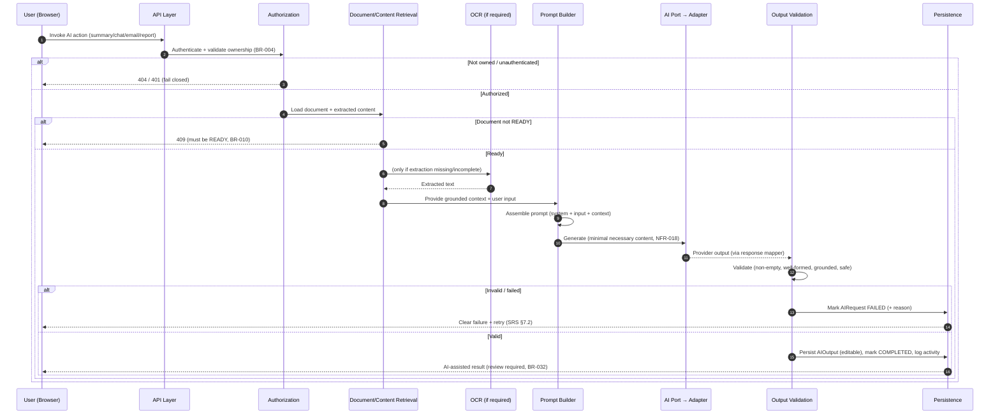
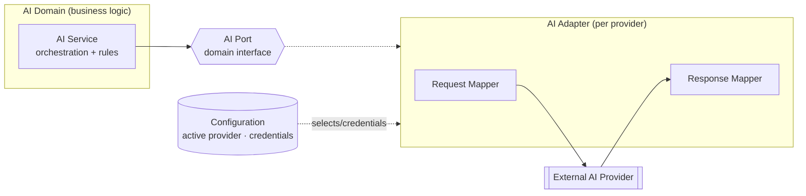

# AI Architecture — LedgerAI MVP

> **Status:** Draft v1
> **Owner:** Founding Engineer / Principal AI Architect
> **Last updated:** 2026-07-14
> **Upstream (frozen):
** [Product Vision](../00-product/PRODUCT_VISION.md) · [Product Decisions](../00-product/PRODUCT_DECISIONS.md) · [PRD](../00-product/PRD.md) · [SRS](../00-product/SRS.md) · [Architecture](./ARCHITECTURE.md) · [Database](./DATABASE.md) · [API Spec](./API_SPEC.md) · [Security](./SECURITY.md)
> **Related:** [AI docs](../04-ai/) · [ADRs](./decisions/)

---

## AI Design Principles

AI is the **core interaction model** of LedgerAI, not a feature bolted onto a CRUD app. Because the product serves
accounting professionals working with confidential financial documents, the AI must be **trustworthy, grounded, and
controllable** above all. The principles below govern every AI capability; the rest of this document applies them.

| Principle                       | What it means                                                                                                                                                              | Why it exists                                                                                                                                                              |
|---------------------------------|----------------------------------------------------------------------------------------------------------------------------------------------------------------------------|----------------------------------------------------------------------------------------------------------------------------------------------------------------------------|
| **AI-first, not AI-bolted-on**  | AI is the primary way users get value (understand, ask, draft), designed into the core flow.                                                                               | The product's differentiation ([Vision §1](../00-product/PRODUCT_VISION.md#1-one-line-vision)); a bolt-on would be a worse version of what exists.                         |
| **Human-in-the-loop**           | Every AI output is assistive, editable, and review-required; the professional decides.                                                                                     | Trust and accountability in a professional context ([BR-031/032](../00-product/SRS.md#5-business-rules)).                                                                  |
| **Grounded over Generative**    | Answers derive from the user's document content, not free invention.                                                                                                       | Accuracy and defensibility; hallucination is the primary AI risk ([BR-030](../00-product/SRS.md#5-business-rules)).                                                        |
| **Explainable over Clever**     | Prefer outputs a professional can verify (with a basis) over impressive but opaque ones.                                                                                   | Auditors and CAs must be able to trust and check the output.                                                                                                               |
| **Deterministic orchestration** | The *pipeline* around the model (retrieval, prompt assembly, validation, persistence, state) is deterministic and testable, even though the model itself is probabilistic. | Isolates non-determinism to one boundary; everything else is reliable and debuggable.                                                                                      |
| **Provider Independence**       | Business logic depends on an AI *port*, never a vendor SDK.                                                                                                                | Reversible provider choice ([PD-010](../00-product/PRODUCT_DECISIONS.md#3-accepted-product-decisions), [DD-002](../00-product/PRODUCT_DECISIONS.md#4-deferred-decisions)). |
| **Privacy by Design**           | Only the minimum content needed is sent to a provider; nothing sensitive is logged.                                                                                        | Confidentiality is the product promise ([NFR-018](../00-product/SRS.md#9-non-functional-requirements), [SECURITY §10](./SECURITY.md#10-ai-security)).                      |
| **Cost Awareness**              | Minimize tokens/context and choose the right model for each task.                                                                                                          | AI cost scales with usage; efficiency preserves the free/low-cost goal ([BG-5](../00-product/PRD.md#4-goals)).                                                             |
| **Graceful Degradation**        | When the provider fails, the system fails safely with a clear, retryable state.                                                                                            | AI/OCR are external dependencies ([NFR-004](../00-product/SRS.md#9-non-functional-requirements)).                                                                          |
| **Observable AI**               | Every AI request is measurable (latency, tokens, success/failure) without logging sensitive content.                                                                       | Operability, cost control, and quality tracking ([NFR-014](../00-product/SRS.md#9-non-functional-requirements)).                                                           |

> This document is **not** a prompt library and **not** implementation code. It defines *how* AI is designed,
> orchestrated, governed, secured, observed, and evolved. It is provider-neutral: no vendor is named.

---

## AI Quality Principles

Where the [AI Design Principles](#ai-design-principles) define *how* AI is built, these principles define the **quality
bar** every current and future AI capability MUST strive to meet. They are the standard against which AI output is
judged.

### Accuracy

- AI SHOULD prioritize **factual accuracy over fluent wording** — a correct, plain answer beats an eloquent, wrong one.
- AI MUST remain **faithful to the grounded source material
  ** ([§9](#9-grounding-strategy), [BR-030](../00-product/SRS.md#5-business-rules)).
- AI MUST clearly **distinguish facts from inferences** whenever appropriate, so professionals know what is stated
  versus derived.

### Reliability

- Similar inputs SHOULD produce **reasonably consistent outputs**.
- AI behavior SHOULD remain **predictable across releases**.
- AI quality SHOULD **improve without requiring users to relearn** their workflows.

### Transparency

- Users SHOULD understand **when content is AI-generated** ([BR-032](../00-product/SRS.md#5-business-rules)).
- AI SHOULD **communicate uncertainty** when the available information is
  insufficient ([BR-033](../00-product/SRS.md#5-business-rules)).
- AI MUST **never imply confidence that exceeds the available evidence**.

### Professional Quality

- Responses SHOULD be **concise and appropriate for accounting professionals**.
- Tone SHOULD remain **professional, neutral, and business-appropriate**.
- Generated outputs SHOULD be **immediately editable** ([BR-031](../00-product/SRS.md#5-business-rules)).

### Continuous Improvement

- AI quality SHOULD improve through **evaluation and user feedback
  ** ([AI Evaluation Strategy](#ai-evaluation-strategy)).
- Quality improvements SHOULD **preserve existing user expectations** whenever practical.
- Provider or model changes SHOULD **not reduce established quality without explicit review
  ** ([AI Review Process](#ai-review-process)).

These principles define the **expected quality bar for every AI capability**. Meeting them is what keeps LedgerAI a
**trustworthy assistant** for accounting professionals — accuracy, predictability, honesty about uncertainty, and
professional polish are not extras here; they are the product.

---

## 1. Purpose

### 1.1 Scope

The complete **AI architecture** for the LedgerAI MVP: capabilities, request lifecycle, processing pipeline, provider
abstraction, model strategy, prompt architecture, grounding, hallucination mitigation, output validation, failure
handling, cost, observability, privacy, governance, and evolution. It is the authoritative reference for every AI
capability. It is **implementation-independent** and **provider-neutral**.

### 1.2 Audience

Backend engineers building AI features, reviewers, QA, and anyone extending LedgerAI's AI capabilities.

### 1.3 Related Documents

| Document                                                   | Relevance                                                                                                                                                                                                      |
|------------------------------------------------------------|----------------------------------------------------------------------------------------------------------------------------------------------------------------------------------------------------------------|
| [ARCHITECTURE.md](./ARCHITECTURE.md)                       | Ports/adapters, AI request lifecycle ([§7.2](./ARCHITECTURE.md#72-ai-request-lifecycle)), external-service isolation ([§10](./ARCHITECTURE.md#10-external-services)).                                          |
| [SECURITY.md](./SECURITY.md)                               | AI security ([§10](./SECURITY.md#10-ai-security)), data minimization, prompt-logging philosophy.                                                                                                               |
| [SRS.md](../00-product/SRS.md)                             | AI functional requirements ([§4.6–4.10](../00-product/SRS.md#46-ocr-ocr)), AI Request state model ([§7.2](../00-product/SRS.md#72-ai-request-lifecycle)), rules ([§5](../00-product/SRS.md#5-business-rules)). |
| [DATABASE.md](./DATABASE.md)                               | `AIRequest`/`AIOutput`/`DocumentContent` persistence ([§5](./DATABASE.md#5-entity-specifications)).                                                                                                            |
| [API_SPEC.md](./API_SPEC.md)                               | AI endpoints, async-ready behavior ([§2.11](./API_SPEC.md#211-async-ready-behavior)).                                                                                                                          |
| [PRODUCT_DECISIONS.md](../00-product/PRODUCT_DECISIONS.md) | PD-010 (provider-agnostic), DD-002/003/004 (deferred provider/vector/RAG).                                                                                                                                     |

---

## 2. AI Goals

| ID         | Goal                                                                         | Basis                                                                                                       |
|------------|------------------------------------------------------------------------------|-------------------------------------------------------------------------------------------------------------|
| **AG-001** | **Save accountants time** on document-centric work.                          | [Vision §2](../00-product/PRODUCT_VISION.md#2-the-problem), [BG-2](../00-product/PRD.md#4-goals)            |
| **AG-002** | **Produce trustworthy outputs** professionals can verify and rely on.        | [BR-030/033](../00-product/SRS.md#5-business-rules)                                                         |
| **AG-003** | **Reduce repetitive work** (summaries, drafts, reports).                     | [Product Principles](../00-product/PRODUCT_VISION.md#8-product-principles)                                  |
| **AG-004** | **Keep professionals in control** — assistive, editable, review-required.    | [BR-031/032](../00-product/SRS.md#5-business-rules)                                                         |
| **AG-005** | **Minimize hallucinations** through grounding and honest "unknown" behavior. | [BR-030/033](../00-product/SRS.md#5-business-rules)                                                         |
| **AG-006** | **Remain provider independent.**                                             | [PD-010](../00-product/PRODUCT_DECISIONS.md#3-accepted-product-decisions)                                   |
| **AG-007** | **Optimize cost without sacrificing quality.**                               | [BG-5](../00-product/PRD.md#4-goals)                                                                        |
| **AG-008** | **Protect confidentiality** of all AI-processed content.                     | [NFR-018](../00-product/SRS.md#9-non-functional-requirements), [SECURITY §10](./SECURITY.md#10-ai-security) |
| **AG-009** | **Be observable and operable** at every AI step.                             | [NFR-014](../00-product/SRS.md#9-non-functional-requirements)                                               |

---

## AI Design Rules

Non-negotiable rules binding every current and future AI capability. They operationalize the principles above.

- AI **MUST assist, never replace** professional judgment ([BR-032](../00-product/SRS.md#5-business-rules)).
- AI **MUST remain grounded** in user-provided content ([BR-030](../00-product/SRS.md#5-business-rules)).
- AI **MUST never fabricate certainty** — confidence is never asserted beyond what the content supports.
- AI **MUST fail safely** when confidence is insufficient (prefer "not found"/decline over
  guessing, [BR-033](../00-product/SRS.md#5-business-rules)).
- AI **MUST remain provider independent** — business logic depends only on the AI port ([§6](#6-provider-architecture)).
- AI requests **MUST be auditable** (recorded as `AIRequest` records with
  lifecycle, [DATABASE §5.5](./DATABASE.md#55-airequest)).
- AI outputs **MUST be editable** by the user ([BR-031](../00-product/SRS.md#5-business-rules)).
- Prompt architecture **MUST remain centralized** ([§8](#8-prompt-architecture)) — not scattered across features.
- New AI capabilities **SHOULD** undergo architectural review ([AI Review Process](#ai-review-process)).
- Provider changes **SHOULD** require an ADR.

> These rules exist to preserve **trust, consistency, and long-term maintainability** of the AI platform. AI is the
> product's core and its biggest risk surface; binding every capability to the same rules keeps behavior predictable and
> defensible as the platform grows.

---

## 3. AI Capability Map

The MVP AI capabilities. Each maps to an SRS functional area and produces an editable, review-required output (except
OCR,
which is a preparatory step).

| Capability                 | Purpose                                                                                          | Input                                                                              | Output                                         | Dependencies                         | User interaction                                                                                       |
|----------------------------|--------------------------------------------------------------------------------------------------|------------------------------------------------------------------------------------|------------------------------------------------|--------------------------------------|--------------------------------------------------------------------------------------------------------|
| **OCR Processing**         | Extract machine-readable text from scans/images ([§4.6](../00-product/SRS.md#46-ocr-ocr)).       | Uploaded document (scan/image or native).                                          | `DocumentContent` (extracted text + quality).  | OCR provider (or native extraction). | Implicit — runs during processing; user sees status.                                                   |
| **Document Understanding** | Turn extracted text into model-ready, grounded context.                                          | Extracted text + document metadata.                                                | Cleaned/prepared context for AI actions.       | OCR output.                          | None directly — internal preparation stage.                                                            |
| **AI Summary**             | Concise, accurate understanding of a document ([§4.7](../00-product/SRS.md#47-ai-summary-summ)). | Ready document's content.                                                          | Editable summary (`AIOutput`, type `SUMMARY`). | Understanding, AI port.              | User requests/views/edits.                                                                             |
| **AI Chat**                | Grounded Q&A over a document ([§4.8](../00-product/SRS.md#48-ai-chat-chat)).                     | Ready document's content + user question.                                          | Grounded answer (`AIOutput`, type `CHAT`).     | Understanding, AI port.              | User asks; thread retained per document.                                                               |
| **AI Email Generation**    | Draft a professional client email ([§4.9](../00-product/SRS.md#49-ai-email-generation-email)).   | Instruction + optional client/document context.                                    | Editable draft (`AIOutput`, type `EMAIL`).     | AI port; optional document context.  | User instructs, reviews, edits; **never auto-sent** ([BR-034](../00-product/SRS.md#5-business-rules)). |
| **Report Generation**      | Structured report from a document ([§4.10](../00-product/SRS.md#410-report-generation-rpt)).     | Single ready document's content ([BR-035](../00-product/SRS.md#5-business-rules)). | Editable report (`Report`).                    | Understanding, AI port.              | User generates, reviews, edits, exports.                                                               |

> All generative capabilities operate only on a **Ready** document ([BR-010](../00-product/SRS.md#5-business-rules)) and
> are **single-document** in the MVP ([BR-035](../00-product/SRS.md#5-business-rules)); multi-document reasoning is
> [future](#16-future-ai-evolution).

---

## 4. AI Request Lifecycle

**Step-by-step:**

1. **User → API.** The user invokes an AI action via an approved
   endpoint ([API_SPEC §10–13](./API_SPEC.md#10-ai-summary-module)).
2. **Authorization.** Authenticate, then validate the user owns the target document/resource; fail closed
   otherwise ([SECURITY §5](./SECURITY.md#5-authorization)).
3. **Document retrieval.** Load the document and its `DocumentContent`; enforce the **Ready**
   precondition ([BR-010](../00-product/SRS.md#5-business-rules)).
4. **OCR (conditional).** If extracted text is missing/incomplete, ensure extraction has run (native or OCR) — normally
   already done during upload processing ([§5](#5-ai-pipeline)).
5. **Prompt Builder.** Deterministically assemble the prompt from separated channels ([§8](#8-prompt-architecture))
   using only the minimal necessary content.
6. **AI Provider (via port).** Call the provider through the **AI port**; the adapter maps
   request/response ([§6](#6-provider-architecture)).
7. **Output validation.** Check the response for emptiness, malformation, groundedness, and
   safety ([§11](#11-ai-output-validation)); retry within limits or fail.
8. **Persistence.** On success, persist the editable `AIOutput`, transition the `AIRequest` to `COMPLETED`, and record
   activity; on failure, mark `FAILED` with a reason ([DATABASE §11](./DATABASE.md#11-transaction-boundaries)).
9. **Response.** Return the AI-assisted, editable result (or a clear, retryable failure). Long-running work MAY return
   `202` + poll ([API_SPEC §2.11](./API_SPEC.md#211-async-ready-behavior)).

The orchestration (steps 2–9) is **deterministic**; only step 6 is probabilistic — the core of the *Deterministic
orchestration* principle.

---

## 5. AI Pipeline

The end-to-end data pipeline from upload to user-visible AI output.

| Stage                        | Responsibility                                                                                                                                                                           |
|------------------------------|------------------------------------------------------------------------------------------------------------------------------------------------------------------------------------------|
| **Upload**                   | Accept and store the document; begin processing ([API_SPEC §8.1](./API_SPEC.md#81-upload-document)). Binary goes to external storage; DB holds a reference.                              |
| **OCR / Native Extraction**  | Produce text: native extraction where selectable text exists, OCR for scans/images ([BR-014](../00-product/SRS.md#5-business-rules)). Sets Ready/Failed.                                 |
| **Extracted Text**           | The grounded source of truth for all AI actions, persisted as `DocumentContent` ([DATABASE §5.4](./DATABASE.md#54-documentcontent)).                                                     |
| **Cleaning / Normalization** | Normalize whitespace/encoding/artifacts so the model receives clean, faithful text — without altering meaning.                                                                           |
| **Chunking (if needed)**     | Split large content to fit the model context window ([§7](#7-model-strategy)); MVP is single-document and MAY not require sophisticated chunking. Deterministic and traceable to source. |
| **Prompt Construction**      | Assemble the prompt from separated channels ([§8](#8-prompt-architecture)); include only what the action needs.                                                                          |
| **AI Provider (via port)**   | Invoke the model through the AI port/adapter ([§6](#6-provider-architecture)).                                                                                                           |
| **Output Validation**        | Enforce validity, grounding, and safety before the output is trusted ([§11](#11-ai-output-validation)).                                                                                  |
| **Storage**                  | Persist the editable output and request lifecycle state ([DATABASE §5.5–5.6](./DATABASE.md#55-airequest)).                                                                               |
| **User (review & edit)**     | The professional reviews, edits, and decides — the human-in-the-loop closing stage ([BR-031](../00-product/SRS.md#5-business-rules)).                                                    |

---

## 6. Provider Architecture

AI is reached exclusively through a **domain-owned port**, with each provider implemented as an **adapter** — the
hexagonal isolation established in [ARCHITECTURE §10](./ARCHITECTURE.md#10-external-services).

| Component            | Responsibility                                                                                                                                                       |
|----------------------|----------------------------------------------------------------------------------------------------------------------------------------------------------------------|
| **AI Port**          | A domain-expressed interface ("summarize this text", "answer this question about this text"). Business logic depends only on this.                                   |
| **Provider Adapter** | Implements the port for one provider; the only place aware of provider specifics.                                                                                    |
| **Request Mapper**   | Translates the domain request (assembled prompt + parameters) into the provider's request shape.                                                                     |
| **Response Mapper**  | Translates the provider's response back into domain terms, mapping provider errors into the domain error taxonomy ([SRS §8](../00-product/SRS.md#8-error-handling)). |
| **Configuration**    | Selects the active adapter and supplies credentials via environment/config ([SECURITY §13](./SECURITY.md#13-secrets-management)); no secrets in code.                |

**Why the domain MUST NOT depend on provider SDKs:** binding business logic to a vendor SDK would make the provider
choice irreversible, leak vendor concepts into the domain, and
violate [PD-010](../00-product/PRODUCT_DECISIONS.md#3-accepted-product-decisions)
and the [Guiding Architectural Rules](./ARCHITECTURE.md#guiding-architectural-rules). Isolation behind the port keeps
the
deferred provider decision ([DD-002](../00-product/PRODUCT_DECISIONS.md#4-deferred-decisions)) genuinely reversible and
lets a fallback/second provider be added as another adapter with no change to services.

---

## 7. Model Strategy

Provider-neutral, no vendors named ([DD-002](../00-product/PRODUCT_DECISIONS.md#4-deferred-decisions) is deferred):

- **Multiple models may exist.** The architecture assumes more than one model could be available (across or within
  providers); nothing binds LedgerAI to a single model.
- **Capability-specific selection.** Different AI capabilities (summary vs. chat vs. email vs. report) MAY warrant
  different models; the port allows a capability to request an appropriate model class without the domain knowing vendor
  specifics.
- **Cost vs. quality.** Model choice balances output quality against token/latency cost ([§13](#13-ai-cost-management));
  a cheaper model MAY serve simpler tasks while higher-capability models serve harder ones.
- **Context window.** Model selection and [chunking](#5-ai-pipeline) must respect the chosen model's context limits;
  content is sized to fit with margin.
- **Future upgrades.** Because selection lives behind the port/adapter and configuration, upgrading or swapping models
  is
  additive ([§16](#16-future-ai-evolution)) and does not touch business logic.

Concrete model routing is a **future** capability ([§16](#16-future-ai-evolution)); the MVP MAY use a single default
model, chosen at implementation time behind the port.

---

## 8. Prompt Architecture

Prompts are **composed from separated, clearly delimited channels**, centrally, never ad hoc in feature code. (No actual
prompt text appears in this document.)

| Channel                     | Role                                                                                    | Why it exists                                                                                                                    |
|-----------------------------|-----------------------------------------------------------------------------------------|----------------------------------------------------------------------------------------------------------------------------------|
| **System Instructions**     | Fixed guidance defining the assistant's role, constraints, grounding, and safety rules. | Establishes non-negotiable behavior independent of user input; the anchor for the *Grounded* and *Human-in-the-loop* principles. |
| **User Prompt**             | The user's question or instruction.                                                     | The task to perform; treated as **untrusted input** ([SECURITY §10](./SECURITY.md#10-ai-security)).                              |
| **Document Context**        | The grounded extracted text (or relevant portion).                                      | The source of truth answers must be grounded in ([§9](#9-grounding-strategy)); treated as **data, not instructions**.            |
| **Retrieved Metadata**      | Non-sensitive context (e.g., document type/title) that aids interpretation.             | Improves relevance without expanding sensitive payload; kept minimal.                                                            |
| **Formatting Instructions** | Desired output shape (e.g., structured summary, email format).                          | Produces predictable, validatable output ([§11](#11-ai-output-validation)).                                                      |

**Separation is a security control, not just tidiness:** keeping system instructions, untrusted user input, and
untrusted
document content in distinct channels is what lets the system treat document/user text as *data* and resist **prompt
injection** ([SECURITY §10](./SECURITY.md#10-ai-security)). Centralizing prompt
composition ([AI Design Rules](#ai-design-rules))
ensures every capability applies the same guardrails.

---

## 9. Grounding Strategy

| Aspect                        | Requirement                                                                                                                                                                                                                 |
|-------------------------------|-----------------------------------------------------------------------------------------------------------------------------------------------------------------------------------------------------------------------------|
| **Single-document grounding** | MVP AI actions are grounded in **one** document's extracted content ([BR-035](../00-product/SRS.md#5-business-rules)); no cross-document synthesis.                                                                         |
| **Source fidelity**           | Outputs MUST reflect the actual content; the model MUST NOT introduce facts not supported by the provided text ([BR-030](../00-product/SRS.md#5-business-rules)).                                                           |
| **Citation philosophy**       | Where applicable, answers SHOULD indicate their basis in the document ([FR-CHAT-002](../00-product/SRS.md#48-ai-chat-chat)), so professionals can verify. Full inline citation is a quality goal that may deepen over time. |
| **Unknown answers**           | When the document does not support an answer, the system MUST say so rather than answer anyway ([BR-033](../00-product/SRS.md#5-business-rules)).                                                                           |
| **No fabricated information** | Fabrication is prohibited; "unknown" is always preferable to invention.                                                                                                                                                     |

Grounding is the direct architectural expression of
the [product principle](../00-product/PRODUCT_VISION.md#8-product-principles)
that AI must be trustworthy and accurate in a professional setting.

---

## 10. Hallucination Mitigation

Layered defenses — no single mechanism is trusted alone (defense in depth applied to AI):

| Strategy               | How it reduces hallucination                                                                                                     |
|------------------------|----------------------------------------------------------------------------------------------------------------------------------|
| **Grounding**          | Anchors output to provided content ([§9](#9-grounding-strategy)).                                                                |
| **Context isolation**  | Only the relevant, owner-scoped document is in context; no bleed from other data ([SECURITY §10](./SECURITY.md#10-ai-security)). |
| **Unknown > Guessing** | The system prefers an honest "not found" to a confident guess ([BR-033](../00-product/SRS.md#5-business-rules)).                 |
| **Human review**       | The professional verifies and edits before relying on output ([BR-031/032](../00-product/SRS.md#5-business-rules)).              |
| **Structured outputs** | Requesting a predictable shape narrows the space for invention and enables validation ([§11](#11-ai-output-validation)).         |
| **Validation**         | Post-generation checks catch empty, malformed, or unsupported output before it is trusted.                                       |

---

## 11. AI Output Validation

Before an output is persisted and shown as `COMPLETED`, it passes validation layers. Failure routes the `AIRequest` to
`FAILED` with a reason, or triggers a bounded retry.

| Check                  | Requirement                                                                                                                                                                |
|------------------------|----------------------------------------------------------------------------------------------------------------------------------------------------------------------------|
| **Empty responses**    | An empty/blank output MUST NOT be treated as success; it is a failure/retry.                                                                                               |
| **Malformed output**   | Output that violates the requested structure/format is rejected or repaired within limits.                                                                                 |
| **Unsupported claims** | Output that appears ungrounded SHOULD be flagged; grounding expectations are enforced per [§9](#9-grounding-strategy).                                                     |
| **Formatting**         | Output MUST conform to the expected shape for its capability (summary/email/report) so the UI and user can rely on it.                                                     |
| **Safety**             | Output MUST NOT contain unsafe or policy-violating content; unsafe output is rejected.                                                                                     |
| **Retry policy**       | Transient failures MAY be retried a **bounded** number of times ([§13](#13-ai-cost-management)); retries MUST be capped to control cost and latency, then fail gracefully. |

Validation is part of the **deterministic** pipeline; it is the guardrail between a probabilistic model and trusted,
persisted output.

---

## 12. AI Failure Handling

AI and OCR are external dependencies; failures MUST be handled with **graceful degradation** and clear, retryable states
([NFR-004](../00-product/SRS.md#9-non-functional-requirements), [SRS §7.2](../00-product/SRS.md#72-ai-request-lifecycle)).

| Failure                  | Behavior                                                                                                                                                                                                                                     |
|--------------------------|----------------------------------------------------------------------------------------------------------------------------------------------------------------------------------------------------------------------------------------------|
| **Timeout**              | The `AIRequest` transitions to `FAILED` (or remains in progress with visible status if async); the user gets a clear message and can retry. Never hangs the UI ([NFR-002](../00-product/SRS.md#9-non-functional-requirements)).              |
| **Provider unavailable** | Surfaced as a clear, non-technical failure (`503`-class, [API_SPEC §2.4](./API_SPEC.md#24-status-codes)); the port allows a future fallback adapter; system stays usable for non-AI actions.                                                 |
| **Rate limit**           | Backpressure/retry within limits; the user is informed if capacity is temporarily exhausted (`429`).                                                                                                                                         |
| **Invalid response**     | Caught by [output validation](#11-ai-output-validation); retried within limits, else failed with a reason — **never** shown as a fabricated success.                                                                                         |
| **OCR failure**          | The document goes to `FAILED` with a quality/reason signal ([BR-015](../00-product/SRS.md#5-business-rules)); AI actions are blocked until content is Ready ([BR-010](../00-product/SRS.md#5-business-rules)); the user may re-upload/retry. |

**Degradation principle:** an AI failure degrades to a clear, recoverable state — never to a wrong answer presented as
right, and never to silent data loss.

---

## 13. AI Cost Management

Cost scales with usage; the architecture keeps it controllable (no pricing figures here):

| Lever                    | Approach                                                                                                                                                                                                                                |
|--------------------------|-----------------------------------------------------------------------------------------------------------------------------------------------------------------------------------------------------------------------------------------|
| **Prompt minimization**  | Keep system/formatting instructions tight; avoid redundant tokens.                                                                                                                                                                      |
| **Context minimization** | Send only the content the action needs ([NFR-018](../00-product/SRS.md#9-non-functional-requirements)); chunk/select rather than dumping whole large documents when unnecessary.                                                        |
| **Model selection**      | Use the least-expensive model that meets quality for the task ([§7](#7-model-strategy)).                                                                                                                                                |
| **Caching philosophy**   | Persisted outputs (e.g., a saved summary) are reused rather than regenerated ([FR-SUMM-004](../00-product/SRS.md#47-ai-summary-summ)); regeneration is explicit. Deeper caching is a future option and MUST respect per-user isolation. |
| **Retry limits**         | Retries are **bounded** ([§11](#11-ai-output-validation)) so failures cannot multiply cost.                                                                                                                                             |

Cost-aware model routing is a **future** capability ([§16](#16-future-ai-evolution)); the MVP applies the minimization
levers above.

---

## 14. AI Observability

Every AI request MUST be measurable to support operability, cost control, and quality — **without** exposing sensitive
content.

| Signal            | Purpose                                                                                                                                                      |
|-------------------|--------------------------------------------------------------------------------------------------------------------------------------------------------------|
| **Request IDs**   | Correlate an AI request across logs, `AIRequest` records, and the API `traceId` ([API_SPEC §2.12](./API_SPEC.md#212-error-model--rfc-7807-problem-details)). |
| **Latency**       | Track responsiveness against [NFR-001/002](../00-product/SRS.md#9-non-functional-requirements).                                                              |
| **Token usage**   | Monitor tokens per request for cost and context-budget management.                                                                                           |
| **Cost tracking** | Aggregate usage to watch spend against the low-cost goal ([BG-5](../00-product/PRD.md#4-goals)).                                                             |
| **Error rates**   | Detect provider/pipeline problems early.                                                                                                                     |
| **Success rates** | Track completion and acceptance as quality signals ([PRD §11](../00-product/PRD.md#11-success-metrics)).                                                     |

**What MUST NOT be logged
** ([NFR-013](../00-product/SRS.md#9-non-functional-requirements), [SECURITY §16](./SECURITY.md#16-logging-and-audit)):
prompt or response **content**, extracted document text, PII, and provider credentials. Observability is built from
**metadata and metrics**, not content. The `AIRequest` domain record captures lifecycle for audit; sensitive content is
never emitted to operational logs.

---

## 15. AI Data Privacy

Applies [SECURITY §10](./SECURITY.md#10-ai-security) to the AI pipeline:

| Aspect                        | Requirement                                                                                                                                                |
|-------------------------------|------------------------------------------------------------------------------------------------------------------------------------------------------------|
| **Data minimization**         | Only the minimum content required for a request is sent to the provider ([NFR-018](../00-product/SRS.md#9-non-functional-requirements)).                   |
| **Temporary provider access** | Providers receive content **per request** to perform the action; they hold **no standing access** to user data.                                            |
| **PII handling**              | Financial documents may contain PII; it is transmitted only as needed, never logged, and governed by the same confidentiality controls as all client data. |
| **User isolation**            | AI context is strictly scoped to the owning user's document(s); no cross-user context ([BR-004](../00-product/SRS.md#5-business-rules)).                   |
| **Provider trust boundaries** | The provider is an untrusted external boundary reached through the port; only necessary data crosses it, and only outbound for the request.                |

---

## 16. Future AI Evolution

**Non-MVP.** Recorded so each can be added **additively** behind the existing port/pipeline, without re-architecture.
None are built now ([boundaries](../00-product/PRODUCT_DECISIONS.md#2-product-boundaries)).

| Future capability                        | Note                                                                                                                |
|------------------------------------------|---------------------------------------------------------------------------------------------------------------------|
| **Multi-document reasoning**             | Grounding across several documents ([Non-Goal](../00-product/PRD.md#5-non-goals) for V1).                           |
| **RAG (retrieval-augmented generation)** | Retrieval inside the AI module behind the port ([DD-004](../00-product/PRODUCT_DECISIONS.md#4-deferred-decisions)). |
| **Vector databases**                     | Embedding storage for semantic retrieval ([DD-003](../00-product/PRODUCT_DECISIONS.md#4-deferred-decisions)).       |
| **Semantic search**                      | Meaning-based search complementing full-text ([DATABASE §13](./DATABASE.md#13-future-database-evolution)).          |
| **Agent workflows**                      | Multi-step, orchestrated AI tasks.                                                                                  |
| **Tool calling**                         | Letting the model invoke defined, safe tools.                                                                       |
| **Model routing**                        | Dynamic per-request model selection on cost/quality ([§7](#7-model-strategy), [§13](#13-ai-cost-management)).       |
| **Local models**                         | On-prem/self-hosted inference for privacy/cost.                                                                     |
| **Fine-tuning**                          | Domain-adapted models.                                                                                              |
| **Enterprise knowledge**                 | Org-wide grounded knowledge bases.                                                                                  |

---

## AI Review Process

Because AI is the core and the highest-risk surface, defined changes **trigger an AI architecture review** before they
ship. This complements the [Security Review Process](./SECURITY.md#security-review-process).

**Review triggers:**

- New AI capabilities.
- New providers.
- Prompt architecture changes.
- Model selection changes.
- Context retrieval changes.
- Cost strategy changes.
- AI safety changes.

**Review outcomes** SHOULD include:

- **Threat assessment** — new abuse/injection vectors introduced by the change.
- **Hallucination risk assessment** — impact on grounding and output trustworthiness.
- **Privacy review** — what data now reaches the provider; data-minimization compliance ([§15](#15-ai-data-privacy)).
- **Cost impact analysis** — token/latency/spend implications ([§13](#13-ai-cost-management)).
- **Performance analysis** — effect on latency and success rates ([§14](#14-ai-observability)).
- **ADR creation** — when an architectural AI decision changes.

AI architecture is expected to **evolve continuously**, but only through **deliberate, reviewed, and documented**
decisions — never by ad hoc changes to prompts, providers, or context handling.

---

## AI Evaluation Strategy

AI quality is not assumed — it is **measured**, continuously, throughout the product's lifetime. Evaluation turns the
[AI Quality Principles](#ai-quality-principles) into observable signals and is the evidence base for the
[AI Review Process](#ai-review-process). (This section defines the *strategy*; it introduces no benchmark datasets,
prompt text, or vendor specifics.)

**Evaluation dimensions:**

| Dimension                                   | What it assesses                                                                                                                                         |
|---------------------------------------------|----------------------------------------------------------------------------------------------------------------------------------------------------------|
| **Grounding accuracy**                      | How faithfully outputs reflect the source content ([§9](#9-grounding-strategy)).                                                                         |
| **Hallucination rate**                      | How often outputs assert unsupported information ([§10](#10-hallucination-mitigation)).                                                                  |
| **User acceptance and edit rate**           | How often outputs are used as-is vs. heavily edited or discarded ([PRD §11](../00-product/PRD.md#11-success-metrics)).                                   |
| **Latency**                                 | Time to produce output, against responsiveness targets ([§14](#14-ai-observability), [NFR-001/002](../00-product/SRS.md#9-non-functional-requirements)). |
| **Failure rate**                            | Frequency of failed/invalid AI requests ([§12](#12-ai-failure-handling)).                                                                                |
| **Cost efficiency**                         | Token/context spend per successful, accepted output ([§13](#13-ai-cost-management)).                                                                     |
| **Consistency across repeated evaluations** | Stability of quality for similar inputs across runs and releases.                                                                                        |
| **Prompt regression testing**               | Whether prompt-architecture changes preserve prior quality ([§8](#8-prompt-architecture)).                                                               |

### Evaluation Philosophy

- Evaluations SHOULD be **repeatable** — the same assessment can be re-run to compare over time.
- Quality SHOULD be **monitored continuously**, not measured once.
- Provider or model changes SHOULD be **benchmarked before rollout**, never swapped blind.
- Prompt architecture changes SHOULD undergo **regression evaluation**.
- Evaluation datasets SHOULD **evolve alongside the product** as capabilities and document types grow.

### Review Outcomes

Evaluations SHOULD help determine:

- Whether **AI quality improved**.
- Whether **hallucination risk changed**.
- Whether **latency or cost regressed**.
- Whether **additional architectural changes or ADRs** are required.

AI evaluation is an **ongoing engineering practice**, not a one-time gate. Its purpose is to **preserve user trust** as
models, providers, and prompts evolve — so that change in the AI stack is always a measured improvement, never an unseen
regression.

---

## 17. AI Decision Summary

| Decision                        | Chosen Approach                                        | Alternatives                 | Rationale                                                                                                                      | Related ADR                 |
|---------------------------------|--------------------------------------------------------|------------------------------|--------------------------------------------------------------------------------------------------------------------------------|-----------------------------|
| **Provider abstraction**        | AI **port + adapter**; config-selected                 | Direct SDK calls in services | Provider independence; reversible choice ([§6](#6-provider-architecture), PD-010).                                             | ADR (pending) — AI Provider |
| **Human review**                | All AI output **assistive, editable, review-required** | AI as authority / auto-act   | Trust, accountability, boundary preservation ([BR-031/032](../00-product/SRS.md#5-business-rules)).                            | —                           |
| **Grounded responses**          | Ground in document content; decline over fabricate     | Free generation              | Accuracy; hallucination mitigation ([§9](#9-grounding-strategy), [BR-030/033](../00-product/SRS.md#5-business-rules)).         | —                           |
| **Single-document context**     | One document per AI action in MVP                      | Multi-document synthesis     | Scope, simplicity, quality ([BR-035](../00-product/SRS.md#5-business-rules)); multi-doc is future.                             | —                           |
| **Prompt composition**          | **Centralized**, channel-separated                     | Ad hoc prompts in features   | Consistency + injection resistance ([§8](#8-prompt-architecture)).                                                             | —                           |
| **Provider independence**       | Domain never depends on vendor SDKs                    | Vendor lock-in               | PD-010; reversible DD-002 ([§6](#6-provider-architecture)).                                                                    | ADR (pending)               |
| **Cost-aware routing**          | Minimization now; routing later                        | Always use largest model     | Cost control without quality loss ([§13](#13-ai-cost-management)); routing is future.                                          | —                           |
| **Structured validation**       | Validate before persist/trust                          | Trust raw output             | Guardrail on probabilistic output ([§11](#11-ai-output-validation)).                                                           | —                           |
| **Observable AI**               | Metadata/metrics only; no content logs                 | Log full prompts/responses   | Operability with confidentiality ([§14](#14-ai-observability), [NFR-013](../00-product/SRS.md#9-non-functional-requirements)). | —                           |
| **Deterministic orchestration** | Deterministic pipeline; isolate model non-determinism  | Ad hoc, model-entangled flow | Testability, reliability, debuggability ([§4](#4-ai-request-lifecycle)).                                                       | —                           |

---

*This is the authoritative AI reference for the LedgerAI MVP — architecture and governance, not prompts or code, and
provider-neutral. It MUST remain consistent with the frozen Product Vision, Product Decisions, PRD, SRS, Architecture,
Database, API Spec, and Security. Major decisions are summarized in [§17](#17-ai-decision-summary) and formalized as
ADRs;
AI content specifics (prompt templates, provider configuration, evaluation) live under [`../04-ai/`](../04-ai/).*
