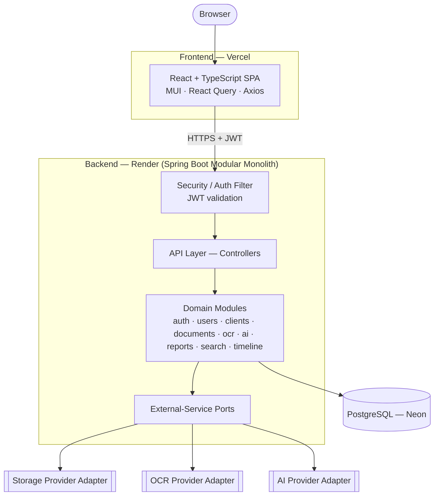
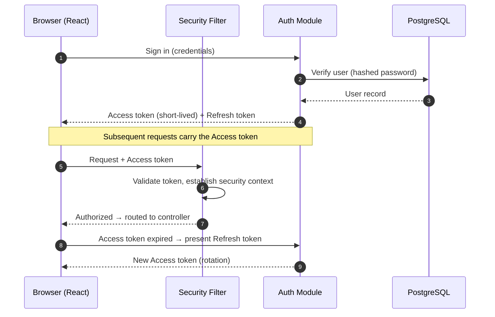
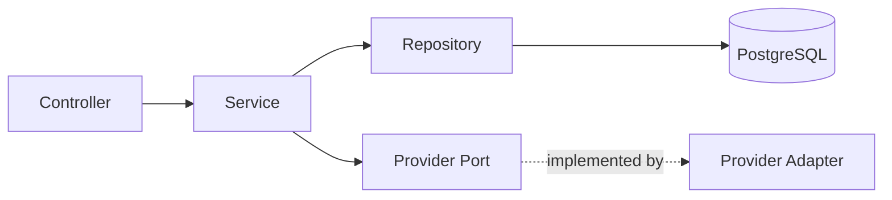
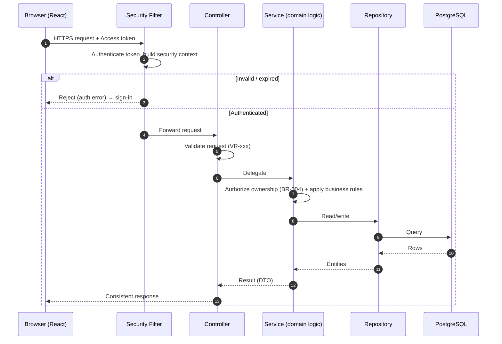
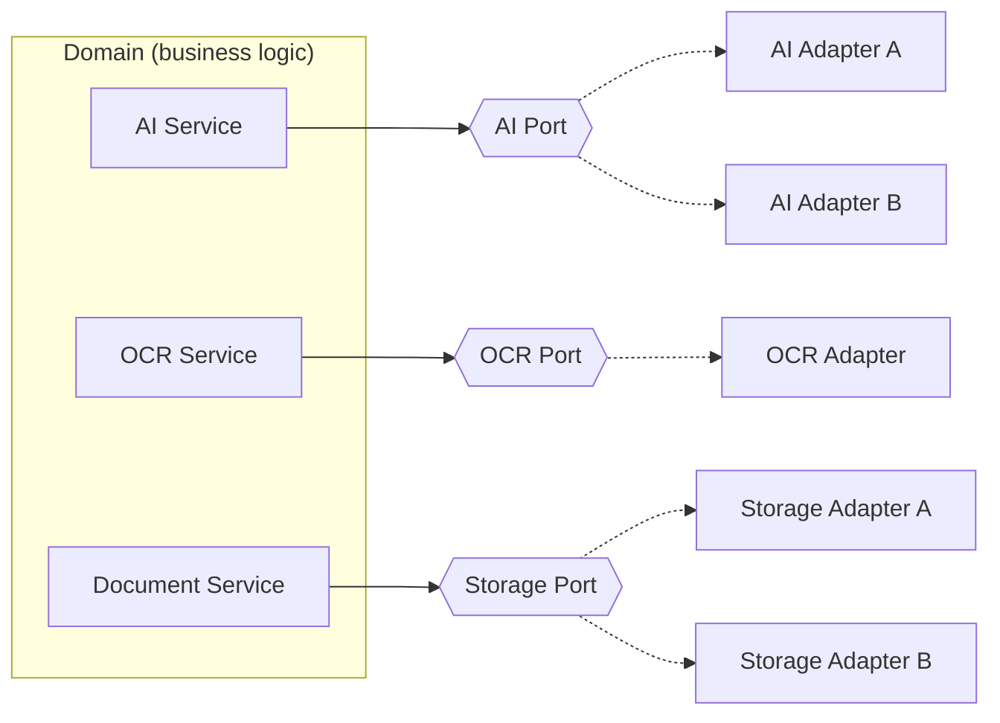
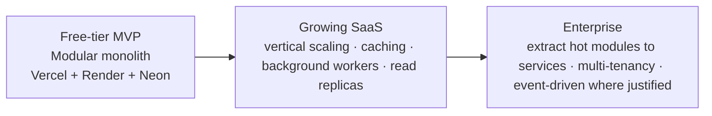

# System Architecture — LedgerAI MVP

> **Status:** Draft v1
> **Owner:** Founding Engineer / Principal Architect
> **Last updated:** 2026-07-14
> **Upstream (frozen):
** [Product Vision](../00-product/PRODUCT_VISION.md) · [Product Decisions](../00-product/PRODUCT_DECISIONS.md) · [PRD](../00-product/PRD.md) · [SRS](../00-product/SRS.md)
> **Downstream:
** [Database](./DATABASE.md) · [API Spec](./API_SPEC.md) · [Security](./SECURITY.md) · [AI Architecture](./AI_ARCHITECTURE.md) · [ADRs](./decisions/)

---

## 1. Purpose

### 1.1 Scope

This document defines the **overall technical architecture** of the LedgerAI MVP. It is the highest-level engineering
design artifact and the blueprint from which every downstream technical document (`DATABASE.md`, `API_SPEC.md`,
`SECURITY.md`, `AI_ARCHITECTURE.md`) and the source code are derived. It explains **why** each architectural decision
was
made, not only **what** it is.

It stays **implementation-independent**: it defines boundaries, responsibilities, flows, and principles. It does **not**
define database schemas, endpoint contracts, package names, or framework-specific code — those belong to the downstream
documents.

### 1.2 Audience

Backend and frontend engineers, QA engineers, technical leads, and future contributors who need to understand how
LedgerAI is structured and why.

### 1.3 References

| Document                                                   | Role                                                                |
|------------------------------------------------------------|---------------------------------------------------------------------|
| [PRODUCT_VISION.md](../00-product/PRODUCT_VISION.md)       | Product "why" and positioning (frozen)                              |
| [PRODUCT_DECISIONS.md](../00-product/PRODUCT_DECISIONS.md) | Authoritative decisions (PD/DD/RI), boundaries (frozen)             |
| [PRD.md](../00-product/PRD.md)                             | Product requirements (frozen)                                       |
| [SRS.md](../00-product/SRS.md)                             | Software behavior, business/validation rules, state models (frozen) |
| [CLAUDE.md](../../CLAUDE.md)                               | Engineering constitution                                            |

The **approved technology stack** (React/TypeScript/Vite/MUI; Java 21/Spring Boot 3/Spring Security/Spring Data
JPA/Hibernate/Maven; PostgreSQL; Vercel + Render; JWT + refresh tokens; OpenAPI) is fixed by
[Product Decisions §3](../00-product/PRODUCT_DECISIONS.md#3-accepted-product-decisions) (PD-005…PD-009, PD-013) and is
treated here as a constraint, not a choice to relitigate.

---

## 2. Architectural Goals

The architecture is optimized, in priority order, for the following engineering goals — each traceable to an approved
product goal.

| Goal                          | What it means here                                                                                     | Traces to                                                                                                                |
|-------------------------------|--------------------------------------------------------------------------------------------------------|--------------------------------------------------------------------------------------------------------------------------|
| **Fast MVP**                  | Ship the twelve modules quickly without premature infrastructure.                                      | [PRD BG-1](../00-product/PRD.md#4-goals)                                                                                 |
| **Clean, maintainable code**  | Clear boundaries and separation of concerns so the codebase stays legible as it grows.                 | [CLAUDE.md](../../CLAUDE.md)                                                                                             |
| **Low operational cost**      | Runs comfortably on free/low-cost tiers (Vercel, Render, Neon).                                        | [PRD BG-5](../00-product/PRD.md#4-goals), [NFR-003](../00-product/SRS.md#9-non-functional-requirements)                  |
| **Provider independence**     | AI, OCR, and Storage sit behind abstractions; providers are swappable without touching business logic. | [PD-010](../00-product/PRODUCT_DECISIONS.md#3-accepted-product-decisions), [TC-004](../00-product/SRS.md#12-constraints) |
| **Easy onboarding**           | A new engineer can locate a feature by name and understand its layering in minutes.                    | [CLAUDE.md](../../CLAUDE.md)                                                                                             |
| **Long-term maintainability** | Grows by adding modules, not by rewrites; complexity is added only when justified.                     | [Vision §11](../00-product/PRODUCT_VISION.md#11-success-metrics)                                                         |
| **Testability**               | Business logic is isolated from I/O so it can be unit-tested without infrastructure.                   | [SRS §14.4](../00-product/SRS.md#144-traceability)                                                                       |
| **Security by default**       | Authn/authz and per-user isolation are structural, not bolted on.                                      | [SRS §9 NFR-007…010](../00-product/SRS.md#9-non-functional-requirements)                                                 |

**Guiding constraint:** the MVP MUST run on free-tier infrastructure while allowing future growth **without major
rewrites**. Every decision below is weighed against that constraint.

---

## Guiding Architectural Rules

These rules are the **architectural constitution** of LedgerAI. They are binding on every module and every contributor;
the sections that follow elaborate *how* they are realized, but the rules themselves are non-negotiable.

- Business logic **MUST** remain independent of external providers (AI, OCR, Storage).
- Every domain module **MUST** own its own business rules.
- Cross-module communication **MUST** occur only through published services — never by reaching into another module's
  internals.
- External services (AI, OCR, Storage) **MUST** be accessed only through domain-owned ports.
- Controllers **MUST** remain thin and orchestration-free.
- Services **MUST** contain the business logic.
- Repositories **MUST** contain persistence logic only.
- Domain services **MUST NOT** depend directly on provider SDKs.
- DTOs **MUST** be used across application boundaries; persistence entities **MUST NOT** leak outward.
- Architectural boundaries **MUST** be preserved even when a shortcut appears easier.
- Any change affecting module boundaries, dependency direction, or architectural style **MUST** result in a new ADR.

These rules exist to preserve **long-term maintainability** and to prevent **architectural erosion** as LedgerAI grows.
Individually, each shortcut they forbid looks harmless; collectively, such shortcuts are exactly how a clean modular
system decays into an unmaintainable one. Holding the line here is what keeps the architecture's growth *additive*
rather
than a future rewrite.

---

## 3. Architecture Style

### 3.1 Alternatives evaluated

| Style                            | Summary                                                                                   | Pros                                                                                                  | Cons for LedgerAI                                                                                                   |
|----------------------------------|-------------------------------------------------------------------------------------------|-------------------------------------------------------------------------------------------------------|---------------------------------------------------------------------------------------------------------------------|
| **Layered (n-tier)**             | Controller → Service → Repository layers, organized by technical role.                    | Familiar; trivial in Spring; fast to start.                                                           | Organizing by *layer* scatters a feature across packages; risks anemic services and blurred boundaries as it grows. |
| **Clean Architecture**           | Concentric layers; domain at the center, dependencies point inward via ports.             | Excellent testability and provider independence; framework-agnostic core.                             | Ceremony (many interfaces/mappers) can over-engineer a 12-module MVP; slower to start.                              |
| **Hexagonal (Ports & Adapters)** | Domain core with explicit ports; adapters for web, persistence, and external services.    | Strong isolation of external providers — a natural fit for our AI/OCR/Storage swappability.           | Full formalism across every module is heavier than the MVP needs.                                                   |
| **Modular Monolith**             | One deployable unit, internally partitioned into domain modules with enforced boundaries. | One simple deployment (fits Render free tier); strong module boundaries; can later peel off services. | Requires discipline to keep module boundaries from eroding.                                                         |

### 3.2 Recommendation

> **Decision (see [ADS-001](#16-architecture-decision-summary)):** LedgerAI adopts a **Modular Monolith** with a
> **pragmatic layered structure inside each module**, and **ports-and-adapters isolation specifically at the external-
> service boundary** (AI, OCR, Storage).

This is a deliberate blend rather than a single doctrine:

- **Modular Monolith** as the macro-structure — one Spring Boot deployable (ideal for the Render free tier and a small
  team) partitioned into domain modules (`auth`, `users`, `clients`, `documents`, `ai`, …) with owned business logic.
  This matches the domain-oriented package philosophy already accepted in
  [CLAUDE.md](../../CLAUDE.md) and keeps a future extraction into services *possible* without committing to it now.
- **Pragmatic layering inside each module** — Controller → Service → Repository — because it is idiomatic in Spring and
  keeps controllers thin, logic in services, and persistence isolated (per SRS and the engineering constitution) without
  Clean Architecture's full interface ceremony.
- **Ports & Adapters only where it pays for itself** — the external providers. Here we take the hexagonal idea
  seriously: business logic depends on a **port** (interface); each provider is an **adapter**. This is exactly what
  [PD-010](../00-product/PRODUCT_DECISIONS.md#3-accepted-product-decisions)
  and [TC-004](../00-product/SRS.md#12-constraints)
  require, and it is where the isolation cost is clearly worth it.

**Why this over the pure alternatives:** a pure layered app would erode boundaries as modules multiply; full Clean/
Hexagonal across every module would over-engineer a free-tier MVP and slow delivery (violating the *Fast MVP* goal). The
blend gives us module boundaries and provider independence where they matter, at the lowest complexity cost — directly
serving Simplicity, Maintainability, and Provider Independence simultaneously.

---

## Quality Attributes and Trade-offs

Every architectural decision buys a quality attribute at a price. The table below makes those prices explicit — no
decision here is free, and naming the trade-off is how we keep the choice honest.

| Quality Attribute     | Architectural Decision                        | Trade-off Accepted                                               |
|-----------------------|-----------------------------------------------|------------------------------------------------------------------|
| Simplicity            | Modular Monolith                              | Fewer deployment units but simpler operations                    |
| Maintainability       | Domain-oriented modules                       | Slightly more upfront organization                               |
| Provider Independence | Ports & Adapters for external services        | Additional abstraction layer                                     |
| Fast Delivery         | Pragmatic layering                            | Less architectural purity than full Clean/Hexagonal Architecture |
| Scalability           | Modular Monolith with future extraction paths | Vertical scaling before distributed architecture                 |
| Cost Efficiency       | Free-tier friendly deployment                 | Cold starts and resource limits accepted during MVP              |

These trade-offs are **intentional** and aligned with the approved [Product Vision](../00-product/PRODUCT_VISION.md) and
[Product Decisions](../00-product/PRODUCT_DECISIONS.md) — in particular the priorities of simplicity, low cost, and
provider independence. They are the *right* trade-offs for a free-tier MVP, and they should be revisited only if the
product's scale or business requirements change significantly; any such revision **MUST** be recorded as a new ADR.

---

## 4. High-Level System Architecture



### 4.1 Authentication flow (high level)



> Token specifics (lifetimes, storage, rotation, revocation) are defined in [SECURITY.md](./SECURITY.md) and
> [ADR-001](./decisions/ADR-001-JWT-Authentication.md); this document fixes only the shape of the flow.

---

## 5. Backend Architecture

### 5.1 Module boundaries

The backend is partitioned into **domain modules**, each owning a slice of the product (Authentication, Users, Clients,
Documents, OCR, AI, Reports, Search, Timeline) plus shared infrastructure concerns. A module owns its own business
logic, data access, and rules; it exposes behavior to other modules through **services**, never by reaching into another
module's internals. Modules map one-to-one to SRS functional
areas ([SRS §4](../00-product/SRS.md#4-functional-requirements)),
which keeps traceability direct.

> Concrete package names are intentionally **not** fixed here (that is a downstream decision recorded in
> [ADR-003](./decisions/ADR-003-Package-Structure.md)). This document fixes only the *philosophy*: organize by **domain
> first**, by technical layer **second**.

### 5.2 Layer responsibilities

Within each module, responsibilities are separated into layers with a strict inward dependency direction:

| Layer                        | Responsibility                                                                                                          | MUST NOT                                              |
|------------------------------|-------------------------------------------------------------------------------------------------------------------------|-------------------------------------------------------|
| **Controller (API)**         | Translate HTTP ↔ application calls; validate request shape; delegate. Thin.                                             | Contain business logic or touch persistence directly. |
| **Service (Domain logic)**   | Enforce business rules ([SRS §5](../00-product/SRS.md#5-business-rules)) and orchestrate; own transactions.             | Depend on web or on concrete external providers.      |
| **Repository (Persistence)** | Persist and retrieve entities. Focused on data access only.                                                             | Contain business rules.                               |
| **DTOs / Mappers**           | Carry data across the boundary; never expose entities outward ([BR-032 spirit](../00-product/SRS.md#5-business-rules)). | Leak persistence entities to the API.                 |
| **Provider Ports**           | Abstract AI/OCR/Storage behind interfaces owned by the domain.                                                          | Bind the domain to a specific vendor.                 |

### 5.3 Dependency direction



Dependencies point **inward toward the domain service**. Controllers depend on services; services depend on repositories
and on *ports* (interfaces). External providers implement those ports as adapters, so the domain never depends on a
vendor — it depends on an abstraction the domain itself defines. This is the one place we apply dependency inversion
rigorously, because it is what buys us [provider independence](#10-external-services).

### 5.4 Service boundaries

- Cross-module interaction happens **through published services**, keeping each module substitutable and testable in
  isolation.
- Long-running work (OCR, AI) is modeled as an explicit lifecycle (see [SRS §7](../00-product/SRS.md#7-state-models))
  rather than blocking request threads; the *mechanism* (sync-with-status vs. async worker) is a deferred decision
  ([DD-007](../00-product/PRODUCT_DECISIONS.md#4-deferred-decisions), [§9.10](#9-cross-cutting-concerns)).
- Transaction boundaries live in the **service** layer.

---

## 6. Frontend Architecture

### 6.1 Feature-first organization

The React application is organized **by feature** (client management, documents, chat, reports, search, timeline, auth,
profile) rather than by technical type. Each feature groups its own views, components, hooks, and API access. This
mirrors the backend's domain modules, so a capability is understood end-to-end in one place — supporting the *easy
onboarding* goal. (Concrete folder structure is a downstream decision and not fixed here.)

### 6.2 Routing philosophy

Routing is **declarative and authentication-aware**: public routes (sign-in/registration) and protected routes (the
authenticated workspace). Protected routes MUST be gated by authentication
state ([FR-AUTH-006](../00-product/SRS.md#41-authentication-auth)),
and unauthenticated access MUST redirect to sign-in.

### 6.3 State management philosophy

Two distinct kinds of state are separated deliberately:

- **Server state** (clients, documents, AI outputs, search results) — owned by **React Query**: fetching, caching,
  background refresh, and status (loading/error) for the long-running AI/OCR operations the SRS requires to be non-
  blocking ([NFR-002](../00-product/SRS.md#9-non-functional-requirements)).
- **UI/local state** — kept minimal and local to components; a global store is introduced only if genuinely shared state
  emerges. We deliberately avoid a heavyweight global state library in the MVP (Simplicity, KISS).

### 6.4 API layer

All backend communication goes through a **single, centralized API layer** (Axios-based) responsible for attaching
auth tokens, handling token refresh, and normalizing errors into a consistent shape. Feature code calls typed functions,
never raw HTTP — so cross-cutting concerns (auth, error normalization) live in exactly one place.

### 6.5 Error handling

Errors surface as **user-facing, non-technical messages** consistent
with [SRS §8](../00-product/SRS.md#8-error-handling):
validation errors are field-level; auth errors route to sign-in; AI/OCR failures show clear, retryable states; unknown
errors show a generic message. The API layer maps backend error responses to this taxonomy centrally.

### 6.6 Component hierarchy

A layered component model: **route/page** components compose **feature** components, which compose *
*shared/presentational**
components. Presentational components stay stateless and reusable; data fetching lives in feature-level hooks. This
keeps
the UI testable and the design system (MUI) consistently applied.

---

## 7. Request Lifecycle

### 7.1 Standard request



Every request passes authentication, then request validation, then **ownership authorization** (a User may act only on
their own data — [BR-004](../00-product/SRS.md#5-business-rules)), then business logic, then persistence, then a DTO
response. Ownership authorization in the service layer is non-negotiable and structural.

### 7.2 AI request lifecycle

```mermaid
sequenceDiagram
    autonumber
    participant B as Browser
    participant C as Controller
    participant Svc as AI Service
    participant R as Repository
    participant Port as AI Port
    participant Adp as AI Adapter (provider)
    B ->> C: Request AI Action (e.g., summary) for Document
    C ->> Svc: Delegate
    Svc ->> R: Load Document + Extracted Text
    R -->> Svc: Content (only if Document is Ready — BR-010)
alt Document not Ready
Svc-->>B: Reject (must be Ready)
else Ready
Svc->>Svc: Create AI Request (Requested → InProgress)
Svc->>Port: Generate(grounded input)
Port->>Adp: Provider-specific call
Adp-->>Port: Output
Port-->>Svc: Output
Svc->>R: Persist output (editable — BR-031) ; mark Completed
        Svc-->>B: AI-assisted result (review required — BR-032)
end
```

The AI service enforces the AI Request state model ([SRS §7.2](../00-product/SRS.md#72-ai-request-lifecycle)): only
**Ready** documents are used, only necessary content is sent to the
provider ([NFR-018](../00-product/SRS.md#9-non-functional-requirements)),
output is grounded ([BR-030](../00-product/SRS.md#5-business-rules)),
editable ([BR-031](../00-product/SRS.md#5-business-rules)),
and never treated as a system of record ([BR-032](../00-product/SRS.md#5-business-rules)). The provider is reached only
through the port.

---

## 8. Core Modules

Each module owns its business logic and maps to an SRS functional area. Responsibilities are architectural, not
implementation.

| Module             | Architectural responsibility                                                                                                                                         | SRS                                                                                                        |
|--------------------|----------------------------------------------------------------------------------------------------------------------------------------------------------------------|------------------------------------------------------------------------------------------------------------|
| **Authentication** | Register/sign-in, issue/rotate tokens, session validity, non-revealing failures. Foundation of all access.                                                           | [§4.1](../00-product/SRS.md#41-authentication-auth)                                                        |
| **User (Profile)** | Own account identity and preferences; enforce self-only access.                                                                                                      | [§4.2](../00-product/SRS.md#42-user-profile-prof)                                                          |
| **Client**         | The organizing container; CRUD + archive; owner scoping; aggregate a client's documents/outputs/activity.                                                            | [§4.3](../00-product/SRS.md#43-client-management-clnt)                                                     |
| **Document**       | Upload intake, validation, storage association, lifecycle state, deletion semantics. Entry point of the core loop.                                                   | [§4.4](../00-product/SRS.md#44-document-upload-upld)–[§4.5](../00-product/SRS.md#45-document-storage-stor) |
| **OCR**            | Produce Extracted Text (native or OCR), report extraction quality, drive Ready/Failed transitions. Understanding layer.                                              | [§4.6](../00-product/SRS.md#46-ocr-ocr)                                                                    |
| **AI**             | Orchestrate all AI Actions (summary, chat, email, report generation) behind the AI port; enforce grounding and human-in-the-loop rules; manage AI Request lifecycle. | [§4.7](../00-product/SRS.md#47-ai-summary-summ)–[§4.10](../00-product/SRS.md#410-report-generation-rpt)    |
| **Reports**        | Assemble, persist, edit, and export reports from understood content (single-document in V1).                                                                         | [§4.10](../00-product/SRS.md#410-report-generation-rpt)                                                    |
| **Search**         | Owner-scoped retrieval across documents/content/metadata; exclude deleted; navigable results.                                                                        | [§4.11](../00-product/SRS.md#411-global-search-srch)                                                       |
| **Timeline**       | Record immutable, timestamped activity per user/client.                                                                                                              | [§4.12](../00-product/SRS.md#412-activity-timeline-tmln)                                                   |

Modules follow the [feature dependency order](../00-product/PRD.md#feature-dependency-overview): Auth → Clients →
Documents/Storage → OCR → Summary/Chat → Reports/Email/Search/Timeline. The AI and OCR modules are the only ones that
depend on external ports; the rest are self-contained around PostgreSQL.

---

## 9. Cross-Cutting Concerns

Concerns that span modules are implemented once, centrally, and applied uniformly.

| #    | Concern                      | Strategy                                                                                                                                                                                                                                          |
|------|------------------------------|---------------------------------------------------------------------------------------------------------------------------------------------------------------------------------------------------------------------------------------------------|
| 9.1  | **Authentication**           | A single security filter validates the access token and establishes the security context before any controller runs. Stateless (JWT).                                                                                                             |
| 9.2  | **Authorization**            | Ownership checks in the service layer ([BR-004](../00-product/SRS.md#5-business-rules)); every data access is scoped to the authenticated User. Role gating is trivial in V1 (single professional) but the mechanism is present for future roles. |
| 9.3  | **Validation**               | Request-shape validation at the controller boundary (VR-xxx); business-rule validation in services. Fail fast with field-level messages.                                                                                                          |
| 9.4  | **Logging**                  | Structured, meaningful logs; **never** log secrets, tokens, or document content ([NFR-013](../00-product/SRS.md#9-non-functional-requirements)).                                                                                                  |
| 9.5  | **Exception handling**       | Centralized handling maps exceptions to the consistent error taxonomy ([SRS §8](../00-product/SRS.md#8-error-handling)); no stack traces or internals leak to the client.                                                                         |
| 9.6  | **Configuration**            | Externalized configuration and secrets (per-environment); no secrets in source. Providers configured by environment so adapters can be swapped without code changes.                                                                              |
| 9.7  | **Observability**            | Health and error visibility sufficient to diagnose failures ([NFR-014](../00-product/SRS.md#9-non-functional-requirements)); expands with scale.                                                                                                  |
| 9.8  | **Auditability**             | The Activity Timeline provides user-visible, immutable action history ([NFR-012](../00-product/SRS.md#9-non-functional-requirements)).                                                                                                            |
| 9.9  | **Caching (future)**         | Not in MVP. The centralized service/API boundaries leave a natural seam to add caching later without touching callers.                                                                                                                            |
| 9.10 | **Background jobs (future)** | OCR/AI are modeled as lifecycles today; a background-worker mechanism can be introduced behind the same service boundary when volume justifies it ([DD-007](../00-product/PRODUCT_DECISIONS.md#4-deferred-decisions)).                            |

---

## 10. External Services

The three external service categories are isolated behind **domain-owned ports**; concrete providers are **adapters**.



**How swapping works without touching business logic:**

1. The domain defines a **port** — an interface expressed in domain terms (e.g., "store this document and return a
   handle," "generate a grounded summary of this text"). Business logic depends only on the port.
2. Each provider is an **adapter** implementing that port, translating domain calls into the provider's API and mapping
   results and errors back into domain terms (including the error taxonomy
   of [SRS §8](../00-product/SRS.md#8-error-handling)).
3. The active adapter is selected by **configuration**, not code. Switching Cloudinary→Supabase, or one LLM→another,
   means adding/selecting an adapter — **no change** to services, controllers, or rules.

This directly satisfies [PD-010](../00-product/PRODUCT_DECISIONS.md#3-accepted-product-decisions) and
[TC-004](../00-product/SRS.md#12-constraints), and keeps the deferred provider decisions
([DD-001](../00-product/PRODUCT_DECISIONS.md#4-deferred-decisions), DD-002) genuinely reversible. Provider-specific
detail lives in [AI_ARCHITECTURE.md](./AI_ARCHITECTURE.md) and the storage ADR
([ADR-002](./decisions/ADR-002-Storage-Provider.md)).

---

## 11. Scalability Strategy

The same core architecture is intended to carry LedgerAI across three stages **without** structural rewrites — only
substitution and extraction.



| Stage             | What changes                                                                                                                                                                              | What stays the same                                      |
|-------------------|-------------------------------------------------------------------------------------------------------------------------------------------------------------------------------------------|----------------------------------------------------------|
| **Free-tier MVP** | Single deployable; synchronous-with-status processing; minimal infra.                                                                                                                     | The module boundaries, ports, and layering defined here. |
| **Growing SaaS**  | Add caching (9.9), move OCR/AI to background workers (9.10) behind existing service boundaries, scale the instance, add read replicas.                                                    | Business logic and provider ports untouched.             |
| **Enterprise**    | Optionally extract the highest-load modules (e.g., AI, Documents) into separate services along existing module seams; introduce multi-tenancy and event-driven flows **where justified**. | Domain models, rules, and provider abstractions.         |

Because modules already have clean boundaries and external I/O is already behind ports, each step is **additive**. The
modular monolith is explicitly the *starting point*, not a ceiling — see [Future Evolution](#15-future-evolution).

---

## 12. Security Architecture (high level)

Detailed controls live in [SECURITY.md](./SECURITY.md); this section fixes the architectural stance only.

| Area               | Architectural stance                                                                                                                                                     |
|--------------------|--------------------------------------------------------------------------------------------------------------------------------------------------------------------------|
| **Authentication** | Stateless JWT access tokens + refresh tokens; validated by a single security filter ([§4.1](#41-authentication-flow-high-level)).                                        |
| **Authorization**  | Per-user ownership enforced in services ([BR-004](../00-product/SRS.md#5-business-rules)); structural, not incidental.                                                   |
| **Secrets**        | Externalized configuration; no secrets in source or logs ([9.4](#9-cross-cutting-concerns), [9.6](#9-cross-cutting-concerns)).                                           |
| **Data isolation** | All Clients/Documents/outputs/activity scoped to the owning User; no cross-user access path exists.                                                                      |
| **File handling**  | Uploads validated (type/size) and handled safely; guard against malicious content and traversal ([NFR-009](../00-product/SRS.md#9-non-functional-requirements)).         |
| **AI privacy**     | Only the minimum necessary content is sent to providers, per request; providers hold no standing access ([NFR-018](../00-product/SRS.md#9-non-functional-requirements)). |
| **Transport**      | HTTPS end-to-end; credentials protected in transit and at rest ([NFR-008](../00-product/SRS.md#9-non-functional-requirements)).                                          |

---

## 13. Design Principles

The principles below are applied throughout; each earns its place.

| Principle                        | Why it matters here                                                                                                                                                           |
|----------------------------------|-------------------------------------------------------------------------------------------------------------------------------------------------------------------------------|
| **SOLID**                        | Keeps modules cohesive and substitutable; dependency inversion is what makes provider swapping possible.                                                                      |
| **DRY**                          | Cross-cutting concerns (auth, errors, API access) live once; duplication is where inconsistency and bugs breed.                                                               |
| **KISS**                         | The MVP must ship on free tiers; the simplest design that meets the SRS wins over speculative sophistication.                                                                 |
| **Composition over inheritance** | Flexible, testable assembly of behavior without rigid hierarchies.                                                                                                            |
| **Explicit dependencies**        | Dependencies are passed in (constructor injection), never hidden — making code readable and unit-testable.                                                                    |
| **Immutable DTOs**               | Data crossing boundaries is predictable and thread-safe; entities never leak to the API.                                                                                      |
| **Constructor injection**        | Explicit, testable wiring; no field-injection surprises ([CLAUDE.md](../../CLAUDE.md)).                                                                                       |
| **Fail fast**                    | Invalid input and broken preconditions are rejected early with clear errors ([SRS §6](../00-product/SRS.md#6-validation-rules), [§8](../00-product/SRS.md#8-error-handling)). |
| **Human-readable code**          | Optimizing for the next reader is optimizing for maintainability — our top long-term goal.                                                                                    |
| **Separation of concerns**       | Each layer/module has one reason to change; boundaries are the architecture.                                                                                                  |

---

## 14. Architecture Risks

| Risk                                                   | Impact                                            | Mitigation                                                                                                                                                                                                                                 |
|--------------------------------------------------------|---------------------------------------------------|--------------------------------------------------------------------------------------------------------------------------------------------------------------------------------------------------------------------------------------------|
| **Vendor lock-in** (AI/OCR/Storage)                    | Hard/expensive to switch providers.               | Ports & adapters ([§10](#10-external-services)); config-selected adapters; reversible ADRs.                                                                                                                                                |
| **AI provider outage/latency**                         | AI Actions fail or hang.                          | AI Request lifecycle with clear Failed state + retry ([SRS §7.2](../00-product/SRS.md#72-ai-request-lifecycle)); graceful degradation ([NFR-004](../00-product/SRS.md#9-non-functional-requirements)); port allows fallback adapter later. |
| **OCR failures / poor scans**                          | Downstream AI degraded or blocked.                | Explicit Failed state + quality signaling ([SRS §4.6](../00-product/SRS.md#46-ocr-ocr)); prefer native extraction ([BR-014](../00-product/SRS.md#5-business-rules)); never present garbage as Ready.                                       |
| **Large documents**                                    | Slow/failed processing; thread exhaustion.        | Non-blocking processing with status ([NFR-002](../00-product/SRS.md#9-non-functional-requirements)); size limits ([VR-005](../00-product/SRS.md#6-validation-rules)); background-worker seam ready ([9.10](#9-cross-cutting-concerns)).    |
| **Free-tier limitations** (cold starts, quotas, sleep) | Latency spikes; capacity ceilings.                | Keep the monolith lightweight; async where needed; scale vertically first; boundaries let hot modules move later ([§11](#11-scalability-strategy)).                                                                                        |
| **Growing complexity / boundary erosion**              | Modular monolith degrades into a big ball of mud. | Enforce module boundaries via services (no cross-module internals); reviews against [CLAUDE.md](../../CLAUDE.md); ADRs for significant changes.                                                                                            |
| **Cost of AI usage**                                   | Unfavorable scaling costs.                        | Provider abstraction to optimize/switch; minimal-content requests ([NFR-018](../00-product/SRS.md#9-non-functional-requirements)); usage monitoring.                                                                                       |
| **Cross-user data exposure**                           | Confidentiality breach.                           | Structural ownership authorization in every service path ([BR-004](../00-product/SRS.md#5-business-rules)); no shared, unscoped queries.                                                                                                   |

---

## 15. Future Evolution

The following are **future evolution paths, not MVP commitments**. Each is reachable *additively* because of decisions
made now.

| Capability                        | How it slots in without a rewrite                                                                                                                                   |
|-----------------------------------|---------------------------------------------------------------------------------------------------------------------------------------------------------------------|
| **Vector database**               | Added as persistence behind the AI/Search modules; the AI port already hides retrieval details ([DD-003](../00-product/PRODUCT_DECISIONS.md#4-deferred-decisions)). |
| **RAG**                           | Implemented inside the AI module behind the existing AI port; callers are unaffected ([DD-004](../00-product/PRODUCT_DECISIONS.md#4-deferred-decisions)).           |
| **Background workers**            | Introduced behind the existing OCR/AI service boundaries ([9.10](#9-cross-cutting-concerns), [DD-007](../00-product/PRODUCT_DECISIONS.md#4-deferred-decisions)).    |
| **Team collaboration**            | Extends the ownership model to shared workspaces/roles; authorization mechanism already exists ([9.2](#9-cross-cutting-concerns)).                                  |
| **Multi-tenancy**                 | Introduced along the already-scoped ownership boundary.                                                                                                             |
| **Integrations** (Tally/QB/Xero…) | New adapters behind new ports — the same pattern as AI/OCR/Storage ([DD-006](../00-product/PRODUCT_DECISIONS.md#4-deferred-decisions)).                             |
| **Event-driven architecture**     | Adopted where justified, along existing module seams, without rewriting domain logic.                                                                               |
| **Microservices**                 | Only if ever justified — extract a module along its existing boundary into a service. The modular monolith makes this an option, not an obligation.                 |

> These MUST NOT be built in V1. They are recorded to demonstrate the architecture accommodates them without structural
> change, honoring the [product boundaries](../00-product/PRODUCT_DECISIONS.md#2-product-boundaries).

---

## 16. Architecture Decision Summary

Major architectural decisions made in this document. Formal ADRs will be authored separately (not in this task).

| ID          | Decision                    | Chosen Approach                                                                              | Alternatives Considered                              | Rationale                                                                                                                                | Related ADR                                                  |
|-------------|-----------------------------|----------------------------------------------------------------------------------------------|------------------------------------------------------|------------------------------------------------------------------------------------------------------------------------------------------|--------------------------------------------------------------|
| **ADS-001** | Overall architecture style  | **Modular Monolith** + pragmatic layering + ports/adapters at external boundaries            | Pure Layered; Clean; Hexagonal (full); Microservices | Best balance of simplicity, boundaries, and provider independence for a free-tier MVP; growth is additive ([§3](#3-architecture-style)). | ADR (pending)                                                |
| **ADS-002** | External-service isolation  | **Ports & Adapters** for AI, OCR, Storage; config-selected adapters                          | Direct SDK calls in services                         | Provider independence and reversible deferred decisions (PD-010, TC-004).                                                                | [ADR-002](./decisions/ADR-002-Storage-Provider.md) (storage) |
| **ADS-003** | Backend module organization | **Domain-first** modules, layered internally; boundaries via services                        | Layer-first (technical) packages                     | Traceability to SRS, onboarding, boundary integrity.                                                                                     | [ADR-003](./decisions/ADR-003-Package-Structure.md)          |
| **ADS-004** | Authentication model        | **Stateless JWT** access + refresh tokens via a single security filter                       | Server-side sessions                                 | Stateless scaling across the Vercel/Render split; matches PD-008.                                                                        | [ADR-001](./decisions/ADR-001-JWT-Authentication.md)         |
| **ADS-005** | Frontend state model        | **Server state via React Query**; minimal local UI state; no heavyweight global store in MVP | Global store (e.g., Redux) up front                  | Simplicity; non-blocking async status for AI/OCR ([NFR-002](../00-product/SRS.md#9-non-functional-requirements)).                        | —                                                            |
| **ADS-006** | Long-running work           | **Explicit lifecycle** (state models), non-blocking, with a background-worker seam           | Block request threads; commit to a job framework now | Meets NFR-002 now; defers infra cost (DD-007).                                                                                           | —                                                            |
| **ADS-007** | Deployment topology         | **Single backend deployable** (Render) + **SPA** (Vercel) + **PostgreSQL** (Neon)            | Multi-service from day one                           | Lowest operational cost/complexity for MVP (BG-5).                                                                                       | —                                                            |

---

*This architecture is the blueprint, not the implementation. Database schema, API contracts, security controls, and AI
design are elaborated in the downstream documents under [`01-architecture/`](.). It MUST remain consistent with the
frozen Product Vision, Product Decisions, PRD, and SRS; where it makes a new engineering choice, that choice is recorded
in [§16](#16-architecture-decision-summary) and will be formalized as an ADR.*
