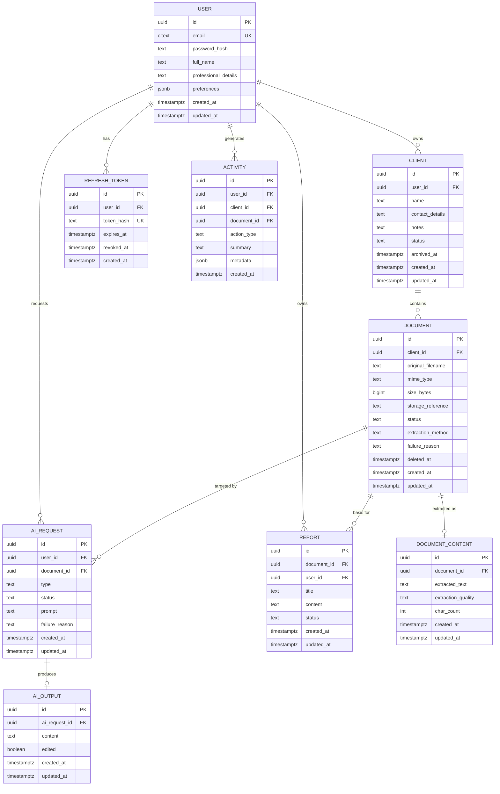

# Database Design — LedgerAI MVP

> **Status:** Draft v1
> **Owner:** Founding Engineer / Principal Database Architect
> **Last updated:** 2026-07-14
> **Database:** PostgreSQL (Neon) — [PD-007](../00-product/PRODUCT_DECISIONS.md#3-accepted-product-decisions)
> **Upstream (frozen):
** [Product Vision](../00-product/PRODUCT_VISION.md) · [Product Decisions](../00-product/PRODUCT_DECISIONS.md) · [PRD](../00-product/PRD.md) · [SRS](../00-product/SRS.md) · [Architecture](./ARCHITECTURE.md)
> **Downstream:
** [API Spec](./API_SPEC.md) · [Security](./SECURITY.md) · [AI Architecture](./AI_ARCHITECTURE.md) · [ADRs](./decisions/)

---

## 1. Purpose

### 1.1 Scope

This document defines the **logical and physical database design** for the LedgerAI MVP on PostgreSQL. It is the single
source of truth for the schema: entities, relationships, fields, keys, constraints, indexing, integrity rules, logical
transaction boundaries, and retention.

It is **implementation-ready but implementation-independent**: it uses PostgreSQL terminology and concrete column types,
but contains **no** SQL DDL/migration scripts, **no** JPA/Hibernate annotations, and **no** application code. Those are
derived from this document during implementation.

### 1.2 Audience

Backend engineers, database engineers, QA engineers, and reviewers who will implement, migrate, and verify the schema.

### 1.3 Related Documents

| Document                                                   | Relevance                                                                                                                                                                                                              |
|------------------------------------------------------------|------------------------------------------------------------------------------------------------------------------------------------------------------------------------------------------------------------------------|
| [ARCHITECTURE.md](./ARCHITECTURE.md)                       | Modules, ports/adapters, external-service boundary (storage/AI/OCR are **not** in this DB).                                                                                                                            |
| [SRS.md](../00-product/SRS.md)                             | Entities, state models ([§7](../00-product/SRS.md#7-state-models)), business rules ([§5](../00-product/SRS.md#5-business-rules)), validation ([§6](../00-product/SRS.md#6-validation-rules)) this schema must satisfy. |
| [PRODUCT_DECISIONS.md](../00-product/PRODUCT_DECISIONS.md) | PD-007 (PostgreSQL), DD-001/002/003 (deferred storage/AI/vector), boundaries.                                                                                                                                          |

> **Scope boundary:** LedgerAI is **not a system of record
** ([Boundaries §2](../00-product/PRODUCT_DECISIONS.md#2-product-boundaries)).
> This database stores LedgerAI's own working data (users, clients, document metadata, AI outputs, activity). **Raw
> document binaries live in the external Storage Provider, not in PostgreSQL** — the schema stores a *reference/handle*
> only ([DD-001](../00-product/PRODUCT_DECISIONS.md#4-deferred-decisions)).

---

## 2. Database Design Goals

| Goal                               | How this design pursues it                                                                                                                                       |
|------------------------------------|------------------------------------------------------------------------------------------------------------------------------------------------------------------|
| **Normalize appropriately**        | Third normal form (3NF) by default; denormalize only with a measured reason (none in MVP).                                                                       |
| **Minimize duplication**           | Each fact lives in exactly one place; relationships carry references, not copies.                                                                                |
| **Preserve referential integrity** | Foreign keys with explicit `ON DELETE` behavior on every relationship ([§10](#10-data-integrity-rules)).                                                         |
| **Support auditing**               | Standard audit columns on every table; an append-only `activity` log ([§6](#6-common-fields), [NFR-012](../00-product/SRS.md#9-non-functional-requirements)).    |
| **Optimize common queries**        | Indexes derived from the real access paths (per-user, per-client, search) ([§9](#9-indexing-strategy)).                                                          |
| **Keep future features additive**  | Nullable/extension seams (e.g., `tenant_id` future, separated content table) so growth adds columns/tables, not rewrites ([§13](#13-future-database-evolution)). |
| **Multi-tenancy readiness**        | Consistent ownership columns and UUID keys make a future `tenant_id` a purely additive change.                                                                   |
| **Provider independence**          | No provider-specific data in the schema; only opaque storage references.                                                                                         |

**Design stance:** *normalize until there is a measurable reason not to; avoid premature optimization.* The MVP's
volumes are modest; correctness, clarity, and additive evolution outrank micro-optimization.

---

## Database Naming Conventions

These naming standards are binding: **every** future schema change MUST follow them. They exist so that the schema reads
consistently, so that migrations and debugging are predictable, and so that a name alone communicates a column or
constraint's role.

### Tables

- Use **singular nouns** (`user`, not `users`).
- Use **snake_case**.
- Table names MUST represent **business entities**.

Examples: `user`, `client`, `document`, `ai_request`.

### Columns

- Use **snake_case**.
- The primary key MUST be named **`id`**.
- Foreign keys MUST follow **`<entity>_id`** (e.g., `client_id`, `ai_request_id`).
- Timestamp columns MUST end with **`_at`** (e.g., `created_at`, `deleted_at`).
- Boolean columns SHOULD begin with a meaningful predicate such as **`is_`** or **`has_`** (e.g., `is_edited`).
- Avoid abbreviations unless they are universally understood (`id`, `mime_type` are fine; invented shorthands are not).

> Existing columns that predate this convention (e.g., the boolean `edited` on `ai_output`) are **not** renamed here —
> per the freeze on existing schema — but new boolean columns SHOULD adopt the predicate prefix.

### Constraints

Name constraints consistently by role and target:

| Constraint  | Pattern                         | Example               |
|-------------|---------------------------------|-----------------------|
| Primary key | `pk_<table>`                    | `pk_document`         |
| Foreign key | `fk_<table>_<referenced_table>` | `fk_document_client`  |
| Unique      | `uq_<table>_<column>`           | `uq_user_email`       |
| Check       | `chk_<table>_<rule>`            | `chk_document_status` |

Consistent constraint names make failures **self-describing**: a violation message names the exact table, relationship,
or rule involved, which dramatically speeds debugging and makes migrations (which frequently drop and recreate named
constraints) predictable rather than guesswork against database-generated names.

### Indexes

Name indexes after the **columns they cover**, not after implementation details:

| Index kind      | Pattern                           | Example                               |
|-----------------|-----------------------------------|---------------------------------------|
| Single-column   | `idx_<table>_<column>`            | `idx_document_client_id`              |
| Composite       | `idx_<table>_<column1>_<column2>` | `idx_activity_user_id_created_at`     |
| GIN / full-text | `gin_<table>_<column>`            | `gin_document_content_extracted_text` |

An index name should tell a reader *what* is indexed at a glance; it SHOULD NOT encode volatile implementation choices.

### Enums

Enumerated string values (e.g., `status`, `type`, `extraction_method`, `action_type`) MUST:

- Be **UPPERCASE** (e.g., `READY`, `SUMMARY`).
- Use **stable names** that describe the state/kind.
- **Never be repurposed** — a value's meaning is permanent.
- Be **extended rather than renamed** whenever possible; add a new value instead of redefining an existing one.

> This mirrors the requirement-versioning discipline of the [SRS §14](../00-product/SRS.md#14-requirement-versioning):
> enum values are identifiers other systems and history depend on, so they are additive, not mutable.

These conventions exist to preserve **readability, consistency, and maintainability** as the schema evolves. A schema
that names things the same way everywhere is one a new engineer can navigate by pattern alone — and one where migrations
and diagnostics behave predictably.

---

## 3. Domain Model

The core entities and their single responsibility. Each maps to SRS concepts and the architecture's modules.

| Entity              | Responsibility                                                                                                              | SRS anchor                                                                                                     |
|---------------------|-----------------------------------------------------------------------------------------------------------------------------|----------------------------------------------------------------------------------------------------------------|
| **User**            | The authenticated accounting professional; owner of all data.                                                               | [Definitions](../00-product/SRS.md#14-definitions)                                                             |
| **Client**          | The organizing container; belongs to exactly one User.                                                                      | [§4.3](../00-product/SRS.md#43-client-management-clnt)                                                         |
| **Document**        | Metadata + lifecycle state for an uploaded file; belongs to exactly one Client. Holds the storage reference, not the bytes. | [§4.4–4.5](../00-product/SRS.md#44-document-upload-upld), [§7.1](../00-product/SRS.md#71-document-lifecycle)   |
| **DocumentContent** | The Extracted Text (native or OCR) for a Document, separated from metadata.                                                 | [§4.6](../00-product/SRS.md#46-ocr-ocr)                                                                        |
| **AIRequest**       | One invocation of an AI Action (summary/chat/email/report) with its own lifecycle.                                          | [§7.2](../00-product/SRS.md#72-ai-request-lifecycle)                                                           |
| **AIOutput**        | The produced, editable result of an AIRequest.                                                                              | [BR-031](../00-product/SRS.md#5-business-rules)                                                                |
| **Report**          | A saved, editable, exportable report generated from a Document.                                                             | [§4.10](../00-product/SRS.md#410-report-generation-rpt), [§7.3](../00-product/SRS.md#73-report-lifecycle)      |
| **Activity**        | Immutable, timestamped record of significant actions.                                                                       | [§4.12](../00-product/SRS.md#412-activity-timeline-tmln)                                                       |
| **RefreshToken**    | A persisted refresh-token record enabling session renewal/rotation and revocation.                                          | [§4.1](../00-product/SRS.md#41-authentication-auth), [ADR-001](./decisions/ADR-001-Authentication-Strategy.md) |

### 3.1 Justification for entities beyond the raw list

Two modeling choices deserve explicit justification, since the SRS treats some concepts abstractly:

- **AIRequest vs. AIOutput (two entities, not one).** The SRS defines an *AI Request* with a lifecycle
  (Requested → InProgress → Completed/Failed) **separately** from its *output*. Splitting them keeps a clean record of
  *attempts* (including Failed ones, for observability and retries) distinct from the *editable result*. A single table
  would either lose failed-attempt history or bloat output rows with request-state churn. One AIRequest has **zero or
  one** AIOutput (zero while in progress or on failure).
- **DocumentContent separated from Document.** Extracted Text can be large; summaries, chat, and search all read it, but
  most Document queries (listing, status) do not. Separating it keeps the hot `document` table narrow and lets large
  text
  live in its own row/TOAST storage ([§14](#14-risks)). This is a deliberate 1:1 split for query performance and
  clarity,
  not denormalization.

**Chat note (MVP):** AI Chat is modeled as AIRequest/AIOutput pairs of type `CHAT` scoped to a Document, which satisfies
[SRS §4.8](../00-product/SRS.md#48-ai-chat-chat) (conversation retained within the Document's context) without
introducing a separate conversation/message schema in the MVP. A dedicated `conversation`/`message` model is a
documented
future evolution ([§13](#13-future-database-evolution)) and is **not** added now (no measurable MVP need — avoids
premature structure).

---

## 4. Entity Relationship Diagram

> **Cardinality summary:** User 1—* Client; Client 1—* Document; Document 1—0..1 DocumentContent; Document 1—*
> AIRequest;
> AIRequest 1—0..1 AIOutput; Document 1—* Report; User 1—* {AIRequest, Report, Activity, RefreshToken}. Activity
> optionally references a Client and/or Document (nullable FKs).

---

## 5. Entity Specifications

> Types are PostgreSQL. `citext` = case-insensitive text; `timestamptz` = timestamp with time zone; `jsonb` = binary
> JSON. Concrete length limits marked **[Assumption]** finalize the SRS `[Assumption]`
> items ([SRS §6](../00-product/SRS.md#6-validation-rules))
> and are recorded here, not product commitments.

### 5.1 User

**Purpose:** The account owner (accounting professional); root of all ownership.

| Field                | Type        | Nullable | Description                                                                                   |
|----------------------|-------------|----------|-----------------------------------------------------------------------------------------------|
| id                   | uuid        | No       | Primary key ([§7](#7-primary-key-strategy)).                                                  |
| email                | citext      | No       | Login identifier; unique, case-insensitive ([BR-021](../00-product/SRS.md#5-business-rules)). |
| password_hash        | text        | No       | BCrypt hash; never the plaintext ([BR-022](../00-product/SRS.md#5-business-rules)).           |
| full_name            | text        | Yes      | Display name.                                                                                 |
| professional_details | text        | Yes      | Free-form professional info (e.g., firm, designation).                                        |
| preferences          | jsonb       | Yes      | Basic UI/app preferences ([FR-PROF-005](../00-product/SRS.md#42-user-profile-prof)).          |
| created_at           | timestamptz | No       | Audit ([§6](#6-common-fields)).                                                               |
| updated_at           | timestamptz | No       | Audit.                                                                                        |

**Relationships:** owns many Clients, RefreshTokens, Activities, AIRequests, Reports.
**Constraints:** `UNIQUE(email)`; `NOT NULL` on email/password_hash.
**Lifecycle:** created at registration; updated via profile. No soft delete in MVP (account deletion is out of MVP
scope).
**Audit fields:** created_at, updated_at.

### 5.2 Client

**Purpose:** The organizing container for a professional's customer.

| Field           | Type        | Nullable | Description                                                                                    |
|-----------------|-------------|----------|------------------------------------------------------------------------------------------------|
| id              | uuid        | No       | Primary key.                                                                                   |
| user_id         | uuid        | No       | Owning User ([BR-003](../00-product/SRS.md#5-business-rules)).                                 |
| name            | text        | No       | Client name ([VR-004](../00-product/SRS.md#6-validation-rules)); ≤ 200 chars **[Assumption]**. |
| contact_details | text        | Yes      | Optional contact info.                                                                         |
| notes           | text        | Yes      | Optional free-form notes.                                                                      |
| status          | text        | No       | `ACTIVE` \| `ARCHIVED` (constrained set). Default `ACTIVE`.                                    |
| archived_at     | timestamptz | Yes      | Set when archived; null when active ([§8](#8-soft-delete-strategy)).                           |
| created_at      | timestamptz | No       | Audit.                                                                                         |
| updated_at      | timestamptz | No       | Audit.                                                                                         |

**Relationships:** belongs to one User; contains many Documents.
**Constraints:** `FK(user_id) → user(id)` `ON DELETE CASCADE`; `CHECK(status IN ('ACTIVE','ARCHIVED'))`; index
`(user_id)`.
**Lifecycle:** created → (edited) → archived (soft). Archiving retains
Documents ([BR-002](../00-product/SRS.md#5-business-rules)).
**Audit fields:** created_at, updated_at (+ archived_at).

### 5.3 Document

**Purpose:** Metadata and lifecycle state for an uploaded file; holds the external storage reference, not the bytes.

| Field             | Type        | Nullable | Description                                                                                                                                                          |
|-------------------|-------------|----------|----------------------------------------------------------------------------------------------------------------------------------------------------------------------|
| id                | uuid        | No       | Primary key.                                                                                                                                                         |
| client_id         | uuid        | No       | Owning Client ([BR-001](../00-product/SRS.md#5-business-rules)).                                                                                                     |
| original_filename | text        | No       | Filename as uploaded.                                                                                                                                                |
| mime_type         | text        | No       | Detected content type ([VR-005](../00-product/SRS.md#6-validation-rules)).                                                                                           |
| size_bytes        | bigint      | No       | File size in bytes.                                                                                                                                                  |
| storage_reference | text        | Yes      | Opaque handle to the file in the Storage Provider ([DD-001](../00-product/PRODUCT_DECISIONS.md#4-deferred-decisions)); null only transiently before store completes. |
| status            | text        | No       | Lifecycle: `UPLOADED` \| `PROCESSING` \| `OCR_PROCESSING` \| `READY` \| `FAILED` \| `DELETED` ([SRS §7.1](../00-product/SRS.md#71-document-lifecycle)).              |
| extraction_method | text        | Yes      | `NATIVE` \| `OCR` once determined ([BR-014](../00-product/SRS.md#5-business-rules)).                                                                                 |
| failure_reason    | text        | Yes      | Human-readable reason when `FAILED`.                                                                                                                                 |
| deleted_at        | timestamptz | Yes      | Soft-delete marker; set on `DELETED` ([BR-012](../00-product/SRS.md#5-business-rules)).                                                                              |
| created_at        | timestamptz | No       | Audit.                                                                                                                                                               |
| updated_at        | timestamptz | No       | Audit.                                                                                                                                                               |

**Relationships:** belongs to one Client; has 0..1 DocumentContent; has many AIRequests and Reports.
**Constraints:** `FK(client_id) → client(id)` `ON DELETE CASCADE`; `CHECK(status IN (...))`; indexes `(client_id)`,
`(status)`, partial index for non-deleted rows ([§9](#9-indexing-strategy)).
**Lifecycle:** exactly the SRS Document state machine; `status` is the single source of
state ([NFR-006](../00-product/SRS.md#9-non-functional-requirements)).
**Audit fields:** created_at, updated_at (+ deleted_at).

### 5.4 DocumentContent

**Purpose:** The Extracted Text for a Document, stored apart from hot metadata.

| Field              | Type        | Nullable | Description                                                                          |
|--------------------|-------------|----------|--------------------------------------------------------------------------------------|
| id                 | uuid        | No       | Primary key.                                                                         |
| document_id        | uuid        | No       | Owning Document; **unique** (1:1).                                                   |
| extracted_text     | text        | Yes      | Extracted content (native/OCR); null until extraction succeeds.                      |
| extraction_quality | text        | Yes      | `HIGH` \| `LOW` \| `UNKNOWN` signal ([FR-OCR-006](../00-product/SRS.md#46-ocr-ocr)). |
| char_count         | int         | Yes      | Length of extracted text (cheap size signal).                                        |
| created_at         | timestamptz | No       | Audit.                                                                               |
| updated_at         | timestamptz | No       | Audit.                                                                               |

**Relationships:** belongs to exactly one Document (1:1).
**Constraints:** `FK(document_id) → document(id)` `ON DELETE CASCADE`; `UNIQUE(document_id)`; full-text search index on
`extracted_text` ([§9](#9-indexing-strategy)).
**Lifecycle:** created when extraction produces text; updated on re-extraction/retry; removed with its Document.
**Audit fields:** created_at, updated_at.

### 5.5 AIRequest

**Purpose:** A single AI Action invocation with its own lifecycle and attempt record.

| Field          | Type        | Nullable | Description                                                                                                                                |
|----------------|-------------|----------|--------------------------------------------------------------------------------------------------------------------------------------------|
| id             | uuid        | No       | Primary key.                                                                                                                               |
| user_id        | uuid        | No       | Requesting User (owner scoping, [BR-004](../00-product/SRS.md#5-business-rules)).                                                          |
| document_id    | uuid        | Yes      | Source Document; required for summary/chat/report, optional for email ([FR-EMAIL-001](../00-product/SRS.md#49-ai-email-generation-email)). |
| type           | text        | No       | `SUMMARY` \| `CHAT` \| `EMAIL` \| `REPORT`.                                                                                                |
| status         | text        | No       | `REQUESTED` \| `IN_PROGRESS` \| `COMPLETED` \| `FAILED` ([SRS §7.2](../00-product/SRS.md#72-ai-request-lifecycle)).                        |
| prompt         | text        | Yes      | User question/instruction where applicable ([VR-007](../00-product/SRS.md#6-validation-rules)).                                            |
| failure_reason | text        | Yes      | Reason when `FAILED`.                                                                                                                      |
| created_at     | timestamptz | No       | Audit.                                                                                                                                     |
| updated_at     | timestamptz | No       | Audit.                                                                                                                                     |

**Relationships:** belongs to one User; optionally references one Document; has 0..1 AIOutput.
**Constraints:** `FK(user_id) → user(id)` `ON DELETE CASCADE`; `FK(document_id) → document(id)` `ON DELETE CASCADE`;
`CHECK(type IN (...))`, `CHECK(status IN (...))`; indexes `(document_id)`, `(user_id)`.
**Lifecycle:** SRS AI Request state machine. Only created when the source Document is `READY` for document-bound types
([BR-010](../00-product/SRS.md#5-business-rules)).
**Audit fields:** created_at, updated_at.

### 5.6 AIOutput

**Purpose:** The produced, **editable** result of a completed AIRequest.

| Field         | Type        | Nullable | Description                                                                             |
|---------------|-------------|----------|-----------------------------------------------------------------------------------------|
| id            | uuid        | No       | Primary key.                                                                            |
| ai_request_id | uuid        | No       | Owning AIRequest; **unique** (1:1).                                                     |
| content       | text        | No       | The generated, user-editable content ([BR-031](../00-product/SRS.md#5-business-rules)). |
| edited        | boolean     | No       | Whether the User has modified the AI-produced content. Default `false`.                 |
| created_at    | timestamptz | No       | Audit.                                                                                  |
| updated_at    | timestamptz | No       | Audit.                                                                                  |

**Relationships:** belongs to exactly one AIRequest (1:1).
**Constraints:** `FK(ai_request_id) → ai_request(id)` `ON DELETE CASCADE`; `UNIQUE(ai_request_id)`.
**Lifecycle:** created when an AIRequest reaches `COMPLETED`; updated when the User
edits ([BR-032](../00-product/SRS.md#5-business-rules): assistive, never system of record).
**Audit fields:** created_at, updated_at.

### 5.7 Report

**Purpose:** A saved, editable, exportable report generated from a Document.

| Field       | Type        | Nullable | Description                                                                                                          |
|-------------|-------------|----------|----------------------------------------------------------------------------------------------------------------------|
| id          | uuid        | No       | Primary key.                                                                                                         |
| document_id | uuid        | No       | Source Document (single-document in V1, [BR-035](../00-product/SRS.md#5-business-rules)).                            |
| user_id     | uuid        | No       | Owning User (owner scoping).                                                                                         |
| title       | text        | Yes      | Report title.                                                                                                        |
| content     | text        | No       | Editable report body ([BR-031](../00-product/SRS.md#5-business-rules)).                                              |
| status      | text        | No       | `DRAFT` \| `SAVED` (export is an action, not a stored state) ([SRS §7.3](../00-product/SRS.md#73-report-lifecycle)). |
| created_at  | timestamptz | No       | Audit.                                                                                                               |
| updated_at  | timestamptz | No       | Audit.                                                                                                               |

**Relationships:** belongs to one Document and one User.
**Constraints:** `FK(document_id) → document(id)` `ON DELETE CASCADE`; `FK(user_id) → user(id)` `ON DELETE CASCADE`;
`CHECK(status IN ('DRAFT','SAVED'))`; indexes `(document_id)`, `(user_id)`.
**Lifecycle:** Generating → Draft → Saved (per SRS Report lifecycle; Generating/Exported are transient/action states not
persisted as rows).
**Audit fields:** created_at, updated_at.

### 5.8 Activity

**Purpose:** Immutable, timestamped record of significant actions for the
timeline ([NFR-012](../00-product/SRS.md#9-non-functional-requirements)).

| Field       | Type        | Nullable | Description                                                                                                       |
|-------------|-------------|----------|-------------------------------------------------------------------------------------------------------------------|
| id          | uuid        | No       | Primary key.                                                                                                      |
| user_id     | uuid        | No       | Owning User ([BR-006](../00-product/SRS.md#5-business-rules)).                                                    |
| client_id   | uuid        | Yes      | Related Client, when applicable.                                                                                  |
| document_id | uuid        | Yes      | Related Document, when applicable.                                                                                |
| action_type | text        | No       | e.g., `DOCUMENT_UPLOADED`, `SUMMARY_GENERATED`, `EMAIL_GENERATED`, `REPORT_CREATED`, `DOCUMENT_DELETED`.          |
| summary     | text        | Yes      | Human-readable one-line description.                                                                              |
| metadata    | jsonb       | Yes      | Structured context (no secrets/sensitive content, [NFR-013](../00-product/SRS.md#9-non-functional-requirements)). |
| created_at  | timestamptz | No       | When the action occurred (audit + ordering).                                                                      |

**Relationships:** belongs to one User; optionally references a Client and/or Document.
**Constraints:** `FK(user_id) → user(id)` `ON DELETE CASCADE`; `FK(client_id)`/`FK(document_id)` `ON DELETE SET NULL`
(keep history if the referenced row is removed); indexes `(user_id, created_at DESC)`, `(client_id)`.
**Lifecycle:** **append-only.** Rows MUST NOT be updated or deleted by
Users ([BR-016](../00-product/SRS.md#5-business-rules), [FR-TMLN-004](../00-product/SRS.md#412-activity-timeline-tmln)).
No `updated_at` — immutability is the point.
**Audit fields:** created_at only (immutable record).

### 5.9 RefreshToken

**Purpose:** Persisted refresh-token record enabling renewal, rotation, and revocation.

| Field      | Type        | Nullable | Description                                                                                                                 |
|------------|-------------|----------|-----------------------------------------------------------------------------------------------------------------------------|
| id         | uuid        | No       | Primary key.                                                                                                                |
| user_id    | uuid        | No       | Owning User.                                                                                                                |
| token_hash | text        | No       | **Hash** of the refresh token, never the raw token ([NFR-008](../00-product/SRS.md#9-non-functional-requirements)). Unique. |
| expires_at | timestamptz | No       | Expiry timestamp ([FR-AUTH-004](../00-product/SRS.md#41-authentication-auth)).                                              |
| revoked_at | timestamptz | Yes      | Set when revoked/rotated; null while valid.                                                                                 |
| created_at | timestamptz | No       | Issue time (audit).                                                                                                         |

**Relationships:** belongs to one User.
**Constraints:** `FK(user_id) → user(id)` `ON DELETE CASCADE`; `UNIQUE(token_hash)`; index `(user_id)`, `(expires_at)`.
**Lifecycle:** created on login/refresh; revoked on rotation, sign-out, or expiry cleanup ([§12](#12-data-retention)).
**Audit fields:** created_at (+ revoked_at). No `updated_at` — a token record is effectively immutable except for
revocation.

---

## 6. Common Fields

Every table (except the deliberately immutable `activity` and `refresh_token`, which omit `updated_at`) carries a
standard set of audit columns.

| Column       | Type        | Present        | Purpose                                                                                                 |
|--------------|-------------|----------------|---------------------------------------------------------------------------------------------------------|
| `id`         | uuid        | All tables     | Surrogate primary key ([§7](#7-primary-key-strategy)).                                                  |
| `created_at` | timestamptz | All tables     | When the row was created. Immutable after insert.                                                       |
| `updated_at` | timestamptz | Mutable tables | When the row last changed; supports optimistic freshness and debugging.                                 |
| `created_by` | uuid        | **Future**     | Actor who created the row — trivial in single-user MVP (== owner), meaningful under team collaboration. |
| `updated_by` | uuid        | **Future**     | Actor who last modified the row — future team/multi-user auditing.                                      |

**Why they exist:** `created_at`/`updated_at` give every row a basic audit trail, enable chronological ordering, and aid
debugging and support. `created_by`/`updated_by` are **documented now but not added in MVP**: with one professional per
account they equal the owner and would be pure overhead. They are called out here so their future addition is a purely
additive migration ([§13](#13-future-database-evolution)), consistent with the "keep future features additive" goal.

---

## 7. Primary Key Strategy

### 7.1 Alternatives

| Option           | Pros                                                                                                                                                                      | Cons                                                                                                                                                                            |
|------------------|---------------------------------------------------------------------------------------------------------------------------------------------------------------------------|---------------------------------------------------------------------------------------------------------------------------------------------------------------------------------|
| **UUID (v4/v7)** | Globally unique; non-enumerable (no ID-guessing of another user's data); safe to generate app-side; merges cleanly across environments and future multi-tenancy/sharding. | 16 bytes vs. 8; random v4 hurts index locality (mitigated by time-ordered **UUID v7**).                                                                                         |
| **BIGSERIAL**    | Compact (8 bytes); naturally ordered; excellent index locality.                                                                                                           | Sequential and **enumerable** (exposes volume and enables ID-guessing — a real concern for confidential client data); central sequence complicates future distribution/merging. |

### 7.2 Decision

> **Decision:** **UUID** primary keys for all entities, generated by the application. Prefer **UUID v7** (time-ordered)
> to retain most of BIGSERIAL's index locality while keeping UUID's non-enumerability. This confirms
> [PD-007's UUID direction](../00-product/PRODUCT_DECISIONS.md#3-accepted-product-decisions).

**Rationale:** LedgerAI stores confidential client documents; **non-enumerable identifiers** materially reduce the risk
of cross-user data probing and pair naturally with per-user
authorization ([BR-004](../00-product/SRS.md#5-business-rules)).
UUIDs also make the future **multi-tenancy/distribution** path additive (no sequence coordination). The storage/index
cost is acceptable at MVP scale and largely neutralized by UUID v7's time ordering — a textbook case of *not* trading a
security property for premature optimization. Final scheme to be formalized in a future **ADR** (referenced in
[§15](#15-database-decision-summary)).

---

## 8. Soft Delete Strategy

| Entity                   | Deletion                                        | Rationale                                                                                                                                                                                                                                                                                                            |
|--------------------------|-------------------------------------------------|----------------------------------------------------------------------------------------------------------------------------------------------------------------------------------------------------------------------------------------------------------------------------------------------------------------------|
| **Document**             | **Soft** (`status = DELETED`, `deleted_at` set) | SRS requires deletion to remove the Document from all surfaces while preserving referential history and enabling the state machine ([BR-012/013](../00-product/SRS.md#5-business-rules)). The external **file** SHOULD be removed from the Storage Provider on delete; the metadata row is retained as soft-deleted. |
| **Client**               | **Soft** (`status = ARCHIVED`, `archived_at`)   | Archiving must retain the client's Documents and history ([BR-002](../00-product/SRS.md#5-business-rules)); this is archival, not deletion.                                                                                                                                                                          |
| **AIRequest / AIOutput** | **Hard** (cascade with Document)                | No independent user-facing "delete AI output" requirement; they are subordinate to their Document and removed with it.                                                                                                                                                                                               |
| **Report**               | **Hard** (cascade with Document)                | No soft-delete requirement in MVP; a Report has no meaning without its Document.                                                                                                                                                                                                                                     |
| **Activity**             | **Neither** (append-only, immutable)            | Audit integrity; Users cannot edit/delete entries ([BR-016](../00-product/SRS.md#5-business-rules)).                                                                                                                                                                                                                 |
| **RefreshToken**         | **Hard** (+ `revoked_at` tombstone)             | Security artifact; revoked/expired tokens are cleaned up ([§12](#12-data-retention)).                                                                                                                                                                                                                                |
| **User**                 | **N/A in MVP**                                  | Account deletion is out of MVP scope.                                                                                                                                                                                                                                                                                |

**Query implications:** Because `document` and `client` use soft delete, **all read paths MUST exclude soft-deleted rows
by default** — Search MUST NOT return `DELETED` Documents ([BR-013](../00-product/SRS.md#5-business-rules)); active
listings MUST filter `status`. This is enforced via **partial indexes** and a consistent query convention
([§9](#9-indexing-strategy), [DIR-009](#10-data-integrity-rules)). Forgetting the filter is the classic soft-delete bug;
the partial indexes make the correct path also the fast path.

---

## 9. Indexing Strategy

> Indexes are derived from **real access paths**, not speculation. Primary keys are implicitly indexed; foreign keys are
> explicitly indexed because they drive nearly every join and ownership filter.

| Entity              | Primary | Foreign-key indexes          | Search / special                      | Composite                                      | Why                                                                                                       |
|---------------------|---------|------------------------------|---------------------------------------|------------------------------------------------|-----------------------------------------------------------------------------------------------------------|
| **User**            | `id`    | —                            | `UNIQUE(email)` (citext)              | —                                              | Login by email; uniqueness ([BR-021](../00-product/SRS.md#5-business-rules)).                             |
| **Client**          | `id`    | `(user_id)`                  | —                                     | `(user_id, status)`                            | List a user's active clients quickly.                                                                     |
| **Document**        | `id`    | `(client_id)`                | `(status)`                            | partial `(client_id) WHERE deleted_at IS NULL` | List non-deleted docs per client; filter by state.                                                        |
| **DocumentContent** | `id`    | `UNIQUE(document_id)`        | **GIN full-text** on `extracted_text` | —                                              | 1:1 link; powers Global Search over content ([FR-SRCH-003](../00-product/SRS.md#411-global-search-srch)). |
| **AIRequest**       | `id`    | `(document_id)`, `(user_id)` | `(status)`                            | `(document_id, type)`                          | Fetch a document's AI actions by type; monitor in-progress.                                               |
| **AIOutput**        | `id`    | `UNIQUE(ai_request_id)`      | —                                     | —                                              | 1:1 link to request.                                                                                      |
| **Report**          | `id`    | `(document_id)`, `(user_id)` | —                                     | —                                              | List reports per document/user.                                                                           |
| **Activity**        | `id`    | `(client_id)`                | —                                     | `(user_id, created_at DESC)`                   | Timeline is inherently "latest first, per user/client."                                                   |
| **RefreshToken**    | `id`    | `(user_id)`                  | `UNIQUE(token_hash)`, `(expires_at)`  | —                                              | Validate/rotate tokens; expiry cleanup.                                                                   |

**Search index note:** Global Search over `extracted_text` uses PostgreSQL's built-in **full-text search** (`tsvector` +
**GIN** index) for the MVP. This is provider-independent, needs no extra infrastructure (honoring the free-tier goal),
and is sufficient for keyword search over a user's documents. Semantic/vector search (embeddings) is a **future
evolution** ([§13](#13-future-database-evolution), [DD-003](../00-product/PRODUCT_DECISIONS.md#4-deferred-decisions)),
**not** MVP — added later without disturbing this design.

---

## 10. Data Integrity Rules

> Enforced by foreign keys, unique constraints, `CHECK`s, and query conventions. IDs are stable.

| ID          | Rule                                                                                            | Enforcement                                                                                      |
|-------------|-------------------------------------------------------------------------------------------------|--------------------------------------------------------------------------------------------------|
| **DIR-001** | Every Client MUST belong to exactly one User.                                                   | `client.user_id NOT NULL` + FK ([BR-003](../00-product/SRS.md#5-business-rules)).                |
| **DIR-002** | Every Document MUST belong to exactly one Client.                                               | `document.client_id NOT NULL` + FK ([BR-001](../00-product/SRS.md#5-business-rules)).            |
| **DIR-003** | A Document MUST have at most one DocumentContent.                                               | `UNIQUE(document_content.document_id)` (1:1).                                                    |
| **DIR-004** | An AIRequest MUST reference the owning User; document-bound types MUST reference a Document.    | FKs; type/status `CHECK`s; service enforces document requirement per type.                       |
| **DIR-005** | An AIOutput MUST reference exactly one AIRequest.                                               | `UNIQUE(ai_output.ai_request_id)` + FK.                                                          |
| **DIR-006** | A Report MUST reference exactly one Document and one User.                                      | FKs `NOT NULL`.                                                                                  |
| **DIR-007** | Every RefreshToken MUST belong to exactly one User.                                             | `refresh_token.user_id NOT NULL` + FK.                                                           |
| **DIR-008** | Activity rows MUST be immutable and owner-scoped.                                               | Append-only convention; no update/delete path ([BR-016](../00-product/SRS.md#5-business-rules)). |
| **DIR-009** | Soft-deleted Documents and archived Clients MUST be excluded from default reads (incl. search). | Partial indexes + mandatory `WHERE` filters ([BR-013](../00-product/SRS.md#5-business-rules)).   |
| **DIR-010** | Status/type columns MUST hold only defined enum values.                                         | `CHECK` constraints on `status`/`type`/`extraction_method`.                                      |
| **DIR-011** | A User's `email` MUST be unique (case-insensitive).                                             | `citext` + `UNIQUE(email)` ([BR-021](../00-product/SRS.md#5-business-rules)).                    |
| **DIR-012** | Deleting a Document MUST remove its subordinate content, AI requests/outputs, and reports.      | `ON DELETE CASCADE` from Document.                                                               |

---

## 11. Transaction Boundaries

> Logical (atomic) units of work — *what must succeed or fail together* — described independently of any framework.

| Flow                            | Atomic unit                                                                                                          | Notes                                                                                                                                                                                                                                                             |
|---------------------------------|----------------------------------------------------------------------------------------------------------------------|-------------------------------------------------------------------------------------------------------------------------------------------------------------------------------------------------------------------------------------------------------------------|
| **Registration**                | Insert User (+ optionally issue first RefreshToken).                                                                 | Uniqueness violation ([DIR-011](#10-data-integrity-rules)) aborts the whole unit.                                                                                                                                                                                 |
| **Client creation**             | Insert Client + insert Activity(`CLIENT_CREATED`).                                                                   | Client and its timeline entry commit together.                                                                                                                                                                                                                    |
| **Document upload**             | Persist Document metadata (`UPLOADED`) after the file is stored; insert Activity(`DOCUMENT_UPLOADED`).               | The **external file store** happens first; the DB row is written only once a `storage_reference` exists. If the DB write fails, the stored file is orphaned and MUST be cleaned up (compensating action) — external storage is not transactional with PostgreSQL. |
| **OCR / extraction completion** | Upsert DocumentContent + transition Document `status` (`READY`/`FAILED`) + set `extraction_method`/`failure_reason`. | Content and the resulting state change commit atomically ([NFR-006](../00-product/SRS.md#9-non-functional-requirements)).                                                                                                                                         |
| **AI generation**               | Transition AIRequest to `COMPLETED` + insert AIOutput (or set `FAILED` + `failure_reason`) + insert Activity.        | Creating the request (`REQUESTED`) MAY be a separate earlier unit; completion is atomic with its output. The **provider call itself is outside the transaction** — only persistence of its result is transactional.                                               |
| **Report generation**           | Insert/Update Report + insert Activity(`REPORT_CREATED`).                                                            | Draft creation and its timeline entry commit together; export is a read-side action, not a transaction.                                                                                                                                                           |

**Principle:** the database transaction wraps only **local persistence**. External I/O (Storage, OCR, AI providers) sits
**outside** the transaction and is reconciled via explicit success/failure states and compensating cleanup — never by
holding a DB transaction open across a network call to a provider.

---

## 12. Data Retention

| Data                  | Retention philosophy                                                                                                                                                                                                                                                                                                                                |
|-----------------------|-----------------------------------------------------------------------------------------------------------------------------------------------------------------------------------------------------------------------------------------------------------------------------------------------------------------------------------------------------|
| **Deleted documents** | Metadata retained as soft-deleted (`DELETED`, `deleted_at`) for integrity/history; the **external file** SHOULD be removed from the Storage Provider promptly on delete (privacy, [NFR-010](../00-product/SRS.md#9-non-functional-requirements)). A future purge job MAY hard-remove long-soft-deleted rows ([§13](#13-future-database-evolution)). |
| **AI outputs**        | Retained with their AIRequest as long as the parent Document exists; cascade-removed with the Document. They are working artifacts, never a system of record ([BR-032](../00-product/SRS.md#5-business-rules)).                                                                                                                                     |
| **Activity history**  | Retained append-only for auditability/traceability; not user-deletable ([BR-016](../00-product/SRS.md#5-business-rules)). Long-term archival/rollup is a future concern ([§14](#14-risks)).                                                                                                                                                         |
| **Refresh tokens**    | Short-lived by design; expired and revoked tokens are periodically **hard-deleted** (cleanup), retaining only what is needed for valid sessions and recent rotation.                                                                                                                                                                                |

**Overall philosophy:** retain what serves **auditability and integrity**; aggressively remove what carries **privacy or
security risk** (raw files on delete, spent tokens). LedgerAI keeps the *minimum* client data necessary to provide the
service ([NFR-010](../00-product/SRS.md#9-non-functional-requirements)).

---

## Database Migration Strategy

This section governs **how** the schema changes over time. It defines principles, not tooling: the choice of migration
tool is an implementation concern outside this document's scope.

### Migration Principles

- **Prefer additive changes** over destructive ones (add columns/tables; avoid drops) — consistent with the
  additive-evolution stance of [§13](#13-future-database-evolution).
- **Never remove a column in the same release in which it is deprecated.** Deprecate first, remove in a later release,
  once nothing reads it.
- **Backfill data before adding a new `NOT NULL` constraint** — add the column nullable, populate it, then enforce.
- **Avoid long-running blocking migrations** that lock hot tables; favor changes that apply quickly or online.
- **Keep each migration focused on one logical change**, so it is easy to review, reason about, and reverse.
- **Every migration MUST be reversible where reasonably practical** — a clear rollback path for each forward change.

### Compatibility

- **Rolling deployments MUST remain compatible during a migration**: the schema should tolerate both the old and new
  application versions running simultaneously (expand-then-contract).
- **Schema evolution SHOULD minimize application downtime** — prefer online, backward-compatible steps.
- **Significant schema changes SHOULD be introduced incrementally** across releases rather than as one large cutover.

### Review Process

- **Major schema changes SHOULD be documented with an ADR** (and are captured in the
  [Database Decision Summary](#15-database-decision-summary)).
- **Product-impacting schema changes SHOULD reference the
  relevant [Product Decisions](../00-product/PRODUCT_DECISIONS.md)**,
  so the schema never silently drifts from approved product scope.
- **Database migrations SHOULD be reviewed alongside the application changes** that depend on them — never in isolation.

### Migration Philosophy

The database should evolve **incrementally**, through small, well-reviewed migrations that each make one clear,
reversible
change — not through large, disruptive redesigns. Steady expand-then-contract evolution keeps the system deployable at
every step, keeps risk low, and keeps the schema's history readable. Big-bang rewrites are precisely what the additive
design in this document is built to avoid.

---

## 13. Future Database Evolution

All paths below are **additive** — new columns/tables/indexes, not rewrites — enabled by UUID keys, consistent ownership
columns, and the metadata/content split. **None are MVP commitments
** ([Boundaries §2](../00-product/PRODUCT_DECISIONS.md#2-product-boundaries)).

| Future capability              | Additive change                                                                                                                                                                              |
|--------------------------------|----------------------------------------------------------------------------------------------------------------------------------------------------------------------------------------------|
| **Multi-tenancy**              | Add nullable `tenant_id` to owned tables + composite indexes; backfill; enforce later. UUID keys avoid sequence conflicts.                                                                   |
| **Team collaboration**         | Activate `created_by`/`updated_by` ([§6](#6-common-fields)); add a membership/role table linking Users to a workspace.                                                                       |
| **Versioned documents**        | Add a `document_version` table (1 Document → many versions) without altering `document`.                                                                                                     |
| **Embeddings / vector search** | Add an `embedding` table (or `pgvector` column) keyed to DocumentContent; existing full-text search stays. ([DD-003](../00-product/PRODUCT_DECISIONS.md#4-deferred-decisions))               |
| **Conversations (rich chat)**  | Introduce `conversation`/`message` tables; migrate `CHAT` AIRequests into them if/when needed.                                                                                               |
| **Integrations**               | Add `integration_connection` / `external_reference` tables; no change to core entities ([DD-006](../00-product/PRODUCT_DECISIONS.md#4-deferred-decisions)).                                  |
| **Background jobs**            | Add a `job`/`processing_task` table to track async OCR/AI work; Document/AIRequest state columns already model progress ([DD-007](../00-product/PRODUCT_DECISIONS.md#4-deferred-decisions)). |

---

## 14. Risks

| Risk                                                         | Impact                                          | Mitigation                                                                                                                                                                  |
|--------------------------------------------------------------|-------------------------------------------------|-----------------------------------------------------------------------------------------------------------------------------------------------------------------------------|
| **Large document storage**                                   | Bloated DB, slow backups, cost.                 | **Binaries never in PostgreSQL** — only in the Storage Provider; DB holds a reference ([§1.3](#13-related-documents)).                                                      |
| **Long text fields** (`extracted_text`, AI content, reports) | Wide rows, slow scans.                          | Separate `document_content` table; PostgreSQL TOAST stores large text out-of-line; `char_count` gives a cheap size signal; index only via GIN/tsvector, not the raw column. |
| **Search performance**                                       | Slow full-text queries as content grows.        | GIN full-text index; owner/client-scoped queries narrow the set; vector search is a future, additive upgrade.                                                               |
| **Migration complexity**                                     | Schema changes risk downtime/data loss.         | Additive-by-design evolution ([§13](#13-future-database-evolution)); nullable new columns; no destructive rewrites; UUID keys ease environment merges.                      |
| **AI output growth**                                         | `ai_request`/`ai_output` tables grow unbounded. | Cascade-delete with Documents; indexes on access paths; future archival/rollup if volume warrants; failed requests are lean (no output row).                                |
| **Activity table growth**                                    | Append-only log grows indefinitely.             | Composite `(user_id, created_at DESC)` index keeps reads fast; future partitioning/rollup by time is additive.                                                              |
| **Orphaned files** (DB/storage divergence)                   | Storage cost, stragglers.                       | Compensating cleanup on failed upload; delete removes external file; periodic reconciliation job (future).                                                                  |

---

## 15. Database Decision Summary

| Decision                        | Chosen Approach                                                          | Alternatives                                   | Rationale                                                                                                                                              | Future ADR                                                |
|---------------------------------|--------------------------------------------------------------------------|------------------------------------------------|--------------------------------------------------------------------------------------------------------------------------------------------------------|-----------------------------------------------------------|
| **Primary key strategy**        | UUID (prefer v7), app-generated                                          | BIGSERIAL                                      | Non-enumerable (protects confidential data), distribution-friendly, additive multi-tenancy; locality recovered via v7 ([§7](#7-primary-key-strategy)). | ADR (pending) — PK Strategy                               |
| **Soft deletes**                | Soft for Document & Client; hard/cascade elsewhere; append-only Activity | Soft-delete everything; hard-delete everything | Matches SRS deletion/archival semantics and audit needs; avoids blanket complexity ([§8](#8-soft-delete-strategy)).                                    | ADR (pending) — Deletion Strategy                         |
| **Audit fields**                | `created_at`/`updated_at` now; `created_by`/`updated_by` future          | Full actor auditing from day one               | Owner == actor in single-user MVP; future-add is additive ([§6](#6-common-fields)).                                                                    | —                                                         |
| **Document content separation** | Separate 1:1 `document_content` table                                    | Inline `extracted_text` on `document`          | Keeps hot metadata narrow; isolates large text; supports search index ([§3.1](#31-justification-for-entities-beyond-the-raw-list)).                    | —                                                         |
| **Raw file storage**            | External Storage Provider; DB stores reference only                      | Store bytes in PostgreSQL (bytea/large object) | Avoids DB bloat/cost; provider independence; honors free-tier goal ([§14](#14-risks)).                                                                 | [ADR-002](./decisions/ADR-002-Storage-Provider.md)        |
| **Refresh token storage**       | Persist **hash** + expiry + revocation                                   | Stateless (no persistence); store raw token    | Enables rotation/revocation/cleanup; never store raw secrets ([§5.9](#59-refreshtoken)).                                                               | [ADR-001](./decisions/ADR-001-Authentication-Strategy.md) |
| **AI persistence model**        | Split AIRequest (attempt/lifecycle) + AIOutput (editable result)         | Single combined table                          | Preserves failed-attempt history; separates state churn from output ([§3.1](#31-justification-for-entities-beyond-the-raw-list)).                      | —                                                         |
| **Search implementation**       | PostgreSQL full-text (tsvector + GIN)                                    | External search engine; vector DB now          | Zero extra infra; sufficient for MVP keyword search; vector is future-additive ([§9](#9-indexing-strategy)).                                           | ADR (pending) — Search/RAG                                |

---

*This is the single source of truth for the LedgerAI MVP schema — logical and physical design, no DDL or ORM mappings.
It MUST remain consistent with the frozen Product Vision, Product Decisions, PRD, SRS, and Architecture. Significant
schema decisions are summarized in [§15](#15-database-decision-summary) and will be formalized as ADRs.*
