# User Flows — LedgerAI MVP

> **Status:** Draft v1
> **Owner:** Principal UX Architect / Frontend Principal Engineer
> **Last updated:** 2026-07-14
> **Upstream (frozen):
> ** [PRD](../00-product/PRD.md) · [SRS](../00-product/SRS.md) · [API_SPEC](../01-architecture/API_SPEC.md) · [AI_ARCHITECTURE](../01-architecture/AI_ARCHITECTURE.md) · [SECURITY](../01-architecture/SECURITY.md)
> **Related:
> ** [COMPONENTS](./COMPONENTS.md) · [DESIGN_SYSTEM](./DESIGN_SYSTEM.md) · [UI_GUIDELINES](./UI_GUIDELINES.md) · [CLAUDE.md](../../CLAUDE.md)

---

## 1. Purpose

### Why this document exists

This document defines **how a user moves through LedgerAI** to accomplish real goals — the complete end-to-end journeys,
their decision points, alternate and failure paths, and the success outcomes that connect *product requirements* to
*reusable components*. It is the behavioral backbone that turns a list of features into a coherent experience. Every
production screen SHOULD participate in at least one documented user flow. Screens that do not belong to a documented
flow should be treated as design gaps requiring review.

It is **not** a wireframe, **not** a UI mockup, and **not** an interaction-design specification. It contains **no screen
layouts, no CSS, no React, no Material UI, and no Figma references**. It describes *what happens and why*, not *what it
looks like*.

The distinction that governs the design layer:

> **User flows define behavior. Components define building blocks.**
>
> A flow says "the user uploads a document, waits for extraction, then reviews an AI summary they can edit." The
> components ([COMPONENTS.md](./COMPONENTS.md)) are the Upload Zone, OCR Status, and AI Summary Card that the flow is
> *expressed with*. Flows never invent UI; they compose the documented vocabulary.

### Relationship to the frozen and sibling documents

| Document                                      | Relationship                                                                                                                                                                                                                      |
|-----------------------------------------------|-----------------------------------------------------------------------------------------------------------------------------------------------------------------------------------------------------------------------------------|
| [PRD.md](../00-product/PRD.md)                | Defines **what capabilities exist** (the twelve MVP modules) and their scope. Every flow here realizes documented product behavior; no flow introduces a capability the PRD does not grant. Flows stay synchronized with the PRD. |
| [SRS.md](../00-product/SRS.md)                | Defines the **precise behavior** — business rules, validation, and state models. Flows follow those rules exactly: the document lifecycle, the AI request lifecycle, ownership rules, and validation outcomes come from the SRS.  |
| [COMPONENTS.md](./COMPONENTS.md)              | Defines the **building blocks** flows are assembled from. When a flow needs an interaction no component provides, that is a *component gap* resolved through component review — never by improvising UI inside the flow.          |
| [UI_GUIDELINES.md](./UI_GUIDELINES.md)        | Defines the **experience conventions** (tone, microcopy, interaction norms) applied while walking these flows. Flows define the path; UI guidelines shape how each step feels. The two must never contradict.                     |
| [API_SPEC.md](../01-architecture/API_SPEC.md) | Defines the **contract** each step calls. Success, failure, async, and 404-on-non-owned behavior in these flows mirror the API's defined responses; flows never assume behavior the contract does not offer.                      |

---

## 2. User Flow Philosophy

These principles explain *why* the flows are shaped the way they are. They are the reasoning behind the enforceable
rules that follow.

| Principle                           | Why it exists                                                                                                                                                                                     |
|-------------------------------------|---------------------------------------------------------------------------------------------------------------------------------------------------------------------------------------------------|
| **Goal-oriented journeys**          | Accountants come to LedgerAI to *finish a task*, not to admire an interface. Every flow is organized around a concrete user goal with a defined completion, so the product measurably saves time. |
| **Minimal friction**                | The product's promise is "hours to minutes." Each avoidable step, confirmation, or field is friction taxed against that promise, so flows carry only the steps the goal genuinely requires.       |
| **Progressive disclosure**          | Showing everything at once overwhelms; revealing detail as the user advances keeps each step comprehensible. Complexity is introduced only when the user needs it.                                |
| **One primary action per screen**   | A screen with a single obvious next action is one the user can act on without deliberation. Competing primary actions create hesitation and error.                                                |
| **Recoverable failures**            | Document processing and AI generation *will* sometimes fail. A flow that treats failure as a dead end loses the user's trust and work; every failure offers a way forward (retry, edit, or exit). |
| **Consistent navigation**           | When moving between areas always works the same way, the user builds a reliable mental map and never feels lost. Divergent navigation forces constant relearning.                                 |
| **Human remains in control**        | LedgerAI advises; the professional decides. No flow lets the system take a consequential action on the user's behalf without an explicit human step — the core trust guarantee of the product.    |
| **AI assists rather than replaces** | AI drafts, summarizes, and answers, but its output is always a starting point the human reviews and owns. This keeps the accountant professionally accountable and keeps AI honest and grounded.  |

---

## User Flow Rules

> *Unnumbered governance section. These are enforceable rules, not preferences. Each protects a specific guarantee — the
> rationale follows each rule.*

- **Every flow MUST begin with a clear user goal.** *A flow without a goal has no way to be "done"; naming the goal is
  what lets us judge whether the flow succeeds and where it wastes the user's time.*
- **Every flow MUST have a successful completion.** *The user must always be able to reach the outcome they came for; a
  flow with no defined success state cannot deliver the "hours to minutes" value.*
- **Every flow MUST define failure paths.** *Real operations fail; an undefined failure path becomes a dead end or a
  confusing blank screen. "The happy path works" is not complete ([CLAUDE.md §9](../../CLAUDE.md)).*
- **Every flow MUST support cancellation where appropriate.** *A user who cannot back out of a multi-step or destructive
  action feels trapped; a clear exit preserves their sense of control.*
- **Every flow MUST preserve user data.** *Edited AI drafts, in-progress form input, and reviewed content must survive
  navigation and transient errors; losing work silently is the fastest way to lose trust.*
- **Every flow MUST remain ownership-aware.** *A user only ever sees and acts on their own resources; a non-owned
  resource is indistinguishable from a missing one and returns
  404 ([SECURITY §5](../01-architecture/SECURITY.md#5-authorization)).*
- **AI-generated content MUST remain editable.** *Every summary, answer, email draft, and report is a starting point the
  human owns and can change before use — the human-in-the-loop guarantee
  of [AI_ARCHITECTURE](../01-architecture/AI_ARCHITECTURE.md).*
- **Navigation MUST remain predictable.** *The same navigational gesture behaves the same way in every flow, so the user
  never has to relearn how to move around.*
- **Long-running operations MUST communicate progress.** *OCR and AI generation take time; a flow that goes silent
  leaves the user unsure whether the system is working, stalled, or broken. Progress must always be visible.*
- **Users MUST never lose work silently.** *If work cannot be saved, the flow says so and offers recovery; silent loss
  is never acceptable, no matter the underlying cause.*

---

## 3. Flow Catalog

Every documented journey, each mapped to a primary goal, an entry point, and an exit point. Flow IDs are stable
references used throughout this document. Flow identifiers (UF-01, UF-02, …) are permanent references and MUST NOT be
renumbered or reused. New flows receive new identifiers.

| Flow ID | Name               | Primary Goal                                          | Entry Point                       | Exit Point                                    |
|---------|--------------------|-------------------------------------------------------|-----------------------------------|-----------------------------------------------|
| UF-01   | Authentication     | Gain authenticated access to the account              | Login screen (unauthenticated)    | Authenticated session on the Dashboard        |
| UF-02   | Onboarding         | Reach a usable first state after first login          | First successful login            | Dashboard with a clear first action           |
| UF-03   | Dashboard          | Orient and choose the next task                       | Post-login landing                | Entry into any feature flow                   |
| UF-04   | Client Management  | Maintain the client records documents belong to       | Clients area                      | A created/updated/archived client             |
| UF-05   | Document Upload    | Add a document into the system for processing         | A client context / Documents area | Document accepted and processing              |
| UF-06   | Document Review    | Read a document and its extracted content and outputs | A document in the list            | Document viewed with actions available        |
| UF-07   | AI Summary         | Obtain and refine a grounded summary of a document    | A ready document                  | An accepted, editable summary                 |
| UF-08   | AI Chat            | Ask grounded questions about a document               | A ready document                  | Answers received; conversation ended          |
| UF-09   | Email Drafting     | Produce an editable client email draft                | A document / summary context      | A draft copied out (never sent)               |
| UF-10   | Report Generation  | Produce a report from a single document               | A ready document                  | A reviewed/exported report                    |
| UF-11   | Global Search      | Find a client or document quickly                     | Global search entry (header)      | Navigated to a result, or cleared             |
| UF-12   | Activity Timeline  | Review what has happened in the account               | Activity area                     | Inspected an event / navigated to its subject |
| UF-13   | Profile Management | View and update the professional's own profile        | Profile area                      | Saved (or cancelled) profile changes          |
| UF-14   | Logout             | End the session securely                              | User menu                         | Unauthenticated state                         |

> Flows UF-02, UF-03, and UF-06 use the same structural pattern as the detailed flows below; their behavior is covered
> by
> the Document Flow (§6) and the cross-flow principles (§15) rather than given a separate diagram, to keep this document
> focused on the decision-heavy journeys.

---

## Flow State Reference

> *Unnumbered governance section. It marks the boundary between this document and the authoritative state models.*

This document describes **user journeys, not authoritative state models**. Where a flow refers to a state — a document
being *Processing*, *Ready*, or *Failed*; an AI request moving *Requested → In Progress → Completed / Failed*; a report
being generated, exported, or deleted — those states are **owned by the [SRS](../00-product/SRS.md)**. This document
references them only for narrative clarity; it never defines, renames, or extends a state machine.

This document **MUST NOT** introduce additional lifecycle states, transitions, transition rules, or state semantics.
Those are owned exclusively by the SRS state models. User flows describe journeys through those states, not the states
themselves.

| Entity     | Authoritative Source                                   |
|------------|--------------------------------------------------------|
| Document   | [SRS §7](../00-product/SRS.md#71-document-lifecycle)   |
| AI Request | [SRS §7](../00-product/SRS.md#72-ai-request-lifecycle) |
| Report     | [SRS §7](../00-product/SRS.md#73-report-lifecycle)     |

If a state definition changes, **the [SRS](../00-product/SRS.md) is updated first and this document is synchronized
afterwards** — never the reverse. Where a flow here and the SRS appear to disagree about a state, the SRS is
authoritative and this document is corrected to match it.

---

## 4. Authentication Flow (UF-01)

**Purpose.** Give the professional secure, authenticated access to their own account and nothing else — the gate in
front of every other flow.

**Entry Conditions.** The user is unauthenticated (no valid session) and arrives at the login screen, either directly or
by being redirected from a protected route.

**Success Flow.** The user submits valid credentials → the system authenticates and establishes a session (access +
refresh tokens per [ADR-001](../01-architecture/decisions/ADR-001-Authentication-Strategy.md)) → the user lands on the
Dashboard, on their own data only.

**Failure Flow.** Invalid credentials return a single, non-enumerating error ("those credentials don't match") that does
**not** reveal whether the email exists ([SECURITY](../01-architecture/SECURITY.md)); the user stays on the login screen
with their entered email preserved and can retry.

**Alternative Flow.** A user without an account follows registration; a returning user with an expired access token has
the session refreshed transparently via the refresh token; a user whose refresh token is also invalid is returned to
login.

**Exit Conditions.** Either an authenticated session on the Dashboard (success) or a remaining unauthenticated state on
the login screen (failure/cancel).

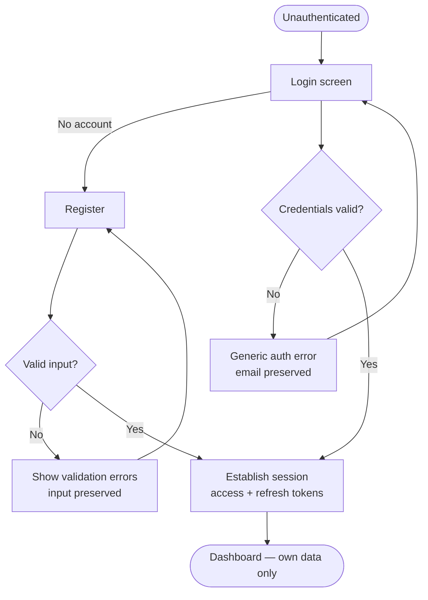

---

## 5. Client Management Flow (UF-04)

**Purpose.** Let the professional maintain the client records that documents are organized under — the ownership-scoped
container for all downstream work.

**Create.** The user opens the create form (an Edit Dialog or dedicated page), enters client details, and submits.
Validation runs at the boundary ([SRS §6](../00-product/SRS.md#6-validation-rules)); on success the client is created
and appears in the owner's client list.

**View.** The client list shows only the authenticated user's clients (ownership-scoped). Selecting one opens its
detail, from which its documents and actions are reachable.

**Edit.** The user updates fields in an Edit Dialog; the same validation applies; on success the record updates and the
change is reflected immediately.

**Archive.** Archiving is a soft, reversible removal (soft-delete per [DATABASE](../01-architecture/DATABASE.md)),
confirmed through a Confirmation/Delete Dialog that states the consequence. Archived clients leave the active list but
their data is not destroyed.

**Validation failures.** Invalid input keeps the user in the form with clear, field-level messages and their entered
data preserved — never discarded.

**Ownership failures.** Any attempt to view or act on a client the user does not own resolves as **not found (404)** —
the resource is indistinguishable from one that never existed
([SECURITY §5](../01-architecture/SECURITY.md#5-authorization)).

**Success outcome.** A created, updated, or archived client, with the client list reflecting the current state.

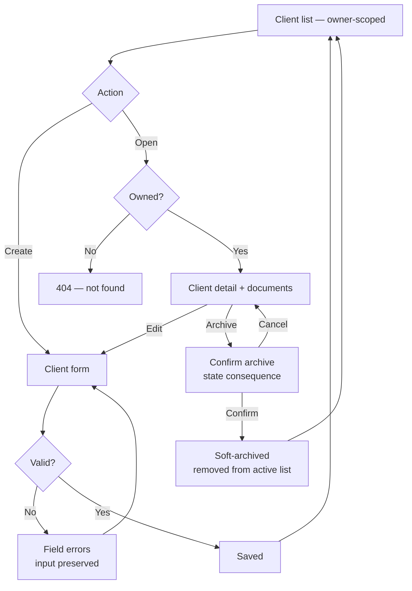

---

## 6. Document Flow (UF-05 / UF-06)

The **most important flow** in LedgerAI — the entry point of the core loop (*upload → understand → act*). It moves a
document through upload, validation, storage, OCR extraction, and into a readable, actionable state. The state model is
owned by the [SRS](../00-product/SRS.md); this flow follows it and never invents states.

**Upload.** From a client context or the Documents area, the user adds a file through the Upload Zone, which states
accepted types and size limits up front.

**Validation.** The file is validated (type, size, and the rules in [SRS §6](../00-product/SRS.md#6-validation-rules))
**before** it is accepted. Invalid files are rejected immediately with a clear reason; nothing is stored.

**Storage.** A valid file is persisted to external object storage
([ADR-002](../01-architecture/decisions/ADR-002-Storage-Provider.md), deferred provider) with the database holding only
a reference. If storage fails, the flow surfaces the failure and does not leave a half-created record.

**OCR.** Once stored, the document enters extraction. This is a **long-running operation**, so its progress is
communicated (Skeleton/Progress + OCR Status) rather than leaving the user waiting in silence.

**Ready.** When extraction succeeds, the document reaches a **Ready** state — its content is available and all
downstream actions (Summary, Chat, Email, Report) become enabled.

**Failure.** When extraction fails, the document reaches a **Failed** state that is surfaced honestly with the reason,
never hidden. Downstream AI actions remain disabled until the document is Ready.

**Retry.** From a Failed document the user can retry extraction; the document re-enters processing. Retry never silently
duplicates the document.

**Viewing.** A Ready document is viewable (PDF Viewer + Metadata Panel) alongside its extracted content and any AI
outputs, which is where Document Review (UF-06) lives.

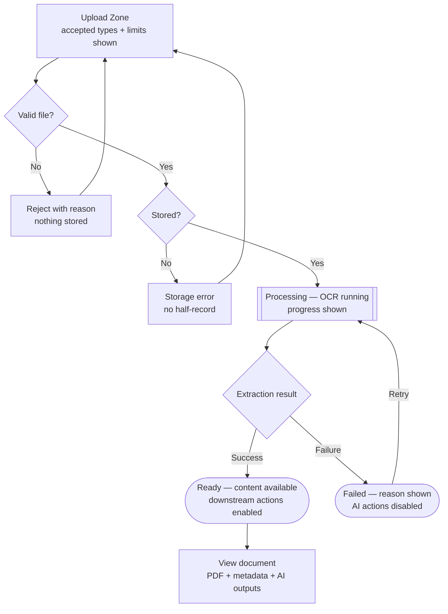

> **State fidelity:** *Processing*, *Ready*, and *Failed* correspond to the document/OCR states defined in the
> [SRS](../00-product/SRS.md). If the SRS names them differently, the SRS is authoritative and this flow follows it.

---

## 7. AI Summary Flow (UF-07)

**Purpose.** Turn a Ready document into a grounded, editable summary the professional can trust and refine — the first
"understand" step of the core loop.

- **Generate.** From a Ready document, the user requests a summary. The request enters the AI request lifecycle
  (Requested → In Progress → Completed / Failed) defined in [AI_ARCHITECTURE](../01-architecture/AI_ARCHITECTURE.md).
- **Waiting.** Generation is long-running, so progress is communicated (the AI Summary Card shows an in-progress state).
- **Review.** On completion the summary is presented in the AI Summary Card, clearly marked as AI-generated and grounded
  in the document — a starting point, not a verdict.
- **Edit.** The user can edit the summary freely. **The summary is always editable**; the human owns the final text.
- **Regenerate.** The user may request a fresh attempt; the previous editable text is not silently overwritten without
  the user's action.
- **Failure.** If generation fails, the failure is surfaced with a clear message and the user can retry; the document
  itself is unaffected.
- **Completion.** The flow completes when the user accepts (keeps) a summary — original or edited.

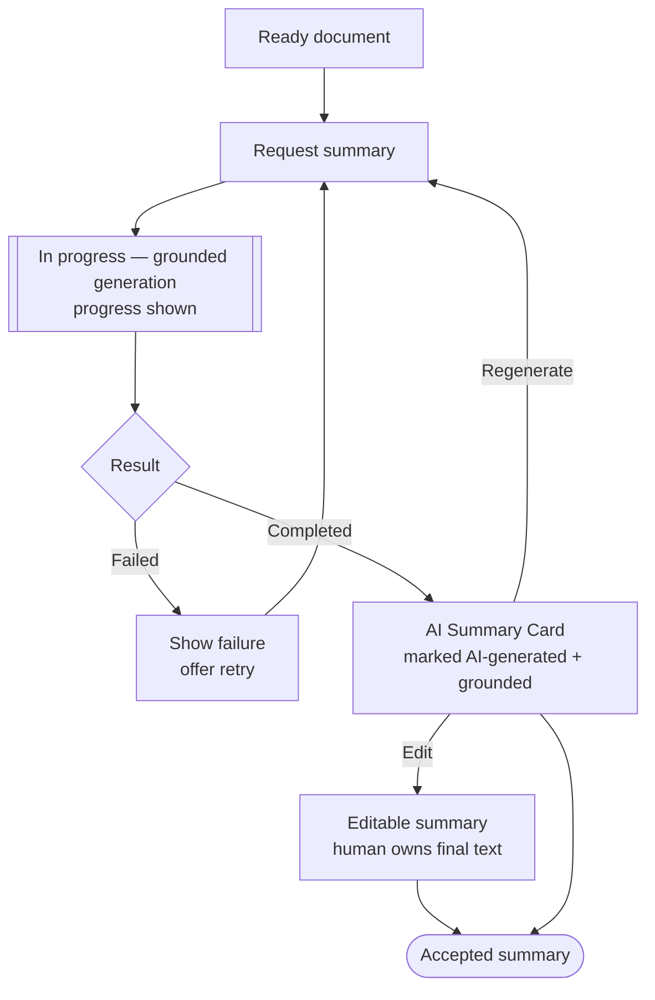

**Cancellation.** This documents cancellation behavior only; it does not change the flow above.

- Leaving the page MUST NOT silently discard completed work — an already-produced summary remains available.
- If generation has already begun, it MAY continue to completion unless it is explicitly cancelled by the backend.
- Previously generated content MUST NOT be discarded automatically as a side effect of leaving, refreshing, or
  cancelling; only an explicit user action removes it.
- Completed outputs remain available to the user when they return, so the user MAY safely leave and continue working
  later from what already exists.

---

## 8. AI Chat Flow (UF-08)

**Purpose.** Let the professional ask natural-language questions about a specific document and receive **grounded,
cited** answers — never ungrounded speculation.

- **Question.** From a Ready document, the user asks a question in the AI Chat Panel.
- **Grounding.** The system grounds the answer in the document's extracted content per
  [AI_ARCHITECTURE](../01-architecture/AI_ARCHITECTURE.md); answers are document-scoped, not open-web.
- **Generation.** The request runs through the AI request lifecycle, with an in-progress state shown while it works.
- **Citation.** The answer is presented as an AI Response with a Citation Block pointing to its grounding, so claims are
  traceable. When the document does not support an answer, the system says so honestly ("not found in this document")
  rather than fabricating one.
- **Follow-up.** The user can ask further questions in the same document-scoped conversation.
- **Regenerate.** Any answer can be regenerated for a fresh attempt.
- **Failure.** A failed generation is surfaced with a retry option; prior conversation content is preserved.
- **Conversation end.** The user ends the conversation by leaving the document; no consequential action is ever taken
  from a chat answer without a separate, explicit human step.

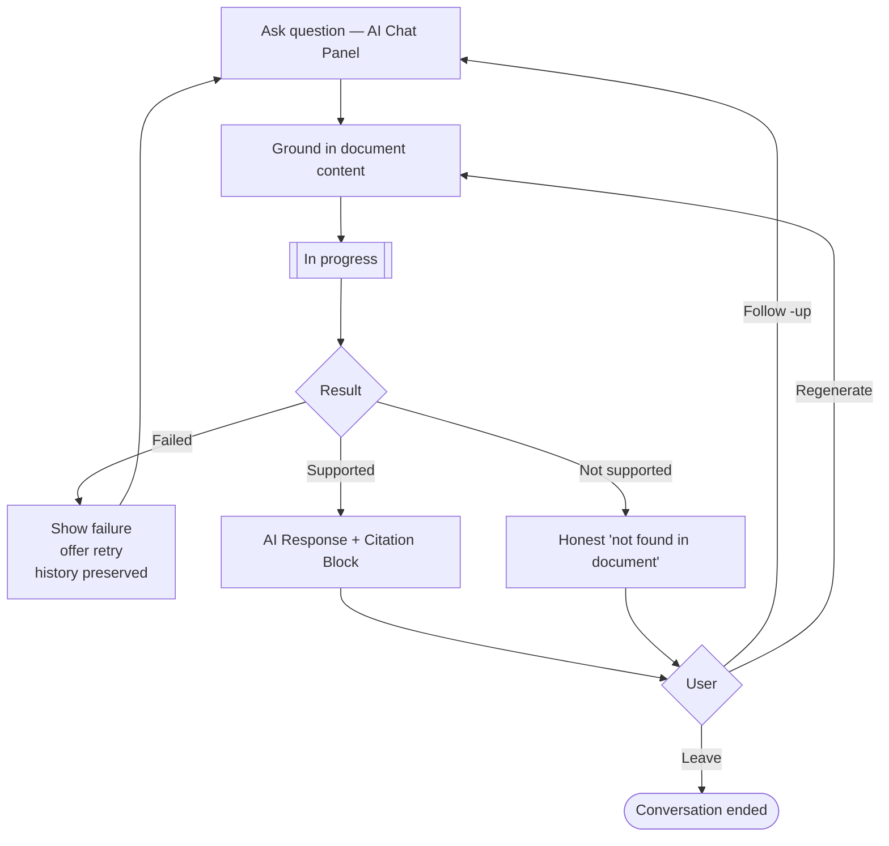

**Cancellation.** This documents cancellation behavior only; it does not change the flow above.

- Leaving the page MUST NOT silently discard completed work — an already-produced answer remains available.
- If generation has already begun, it MAY continue to completion unless it is explicitly cancelled by the backend.
- Previously generated content MUST NOT be discarded automatically as a side effect of leaving, refreshing, or
  cancelling; only an explicit user action removes it.
- Completed outputs remain available to the user when they return, so the user MAY safely leave and continue working
  later from what already exists.

---

## 9. Email Drafting Flow (UF-09)

**Purpose.** Produce a professional, editable **draft** client email grounded in the document context — saving the
accountant the blank-page effort while keeping them fully in control of what is communicated.

- **Prompt.** From a document or summary context, the user requests an email draft, optionally guiding its intent.
- **Generation.** The draft is generated through the AI request lifecycle, with progress shown.
- **Editing.** The draft is presented as editable text (Text Area within the email surface) and **the user can change
  anything** before using it.
- **Copy.** The user copies the finished draft out of LedgerAI to send it through their own email system.
- **Discard.** The user can discard the draft; discarding is confirmed if unsaved edits would be lost, honoring "never
  lose work silently."

> **Explicit product boundary — non-negotiable:**
> **LedgerAI *drafts* emails. LedgerAI *never sends* emails in the
MVP ([BR-034](../00-product/SRS.md#5-business-rules)).**
> There is no send action anywhere in this flow. The flow's terminal action is *copy* (or *discard*) — the human sends
> the email themselves, elsewhere. This preserves human control over all outbound client communication.

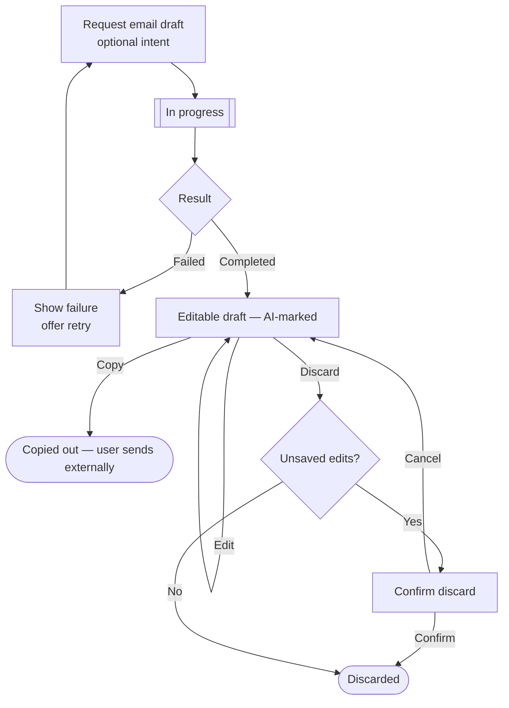

---

## 10. Report Generation Flow (UF-10)

**Purpose.** Generate a structured report from a document, ready for the professional to review, refine, and export.

- **Generate.** From a Ready document, the user requests a report; generation runs through the AI request lifecycle with
  progress shown.
- **Review.** The completed report is presented for review, clearly derived from the source document.
- **Edit.** The report content is editable before it is finalized — the human owns the output.
- **Export.** The user exports the report out of LedgerAI for their own use.
- **Delete.** A report can be deleted (soft-delete per [DATABASE](../01-architecture/DATABASE.md)), confirmed through a
  Delete Dialog.
- **Failure.** A failed generation surfaces its reason and offers retry; the source document is unaffected.

> **Single-document limitation ([BR-035](../00-product/SRS.md#5-business-rules)):** in the MVP a report is generated
> from
> **exactly one document**. There is no multi-document or consolidated report. This flow never offers to combine
> documents; that is an explicit non-goal, not an oversight.

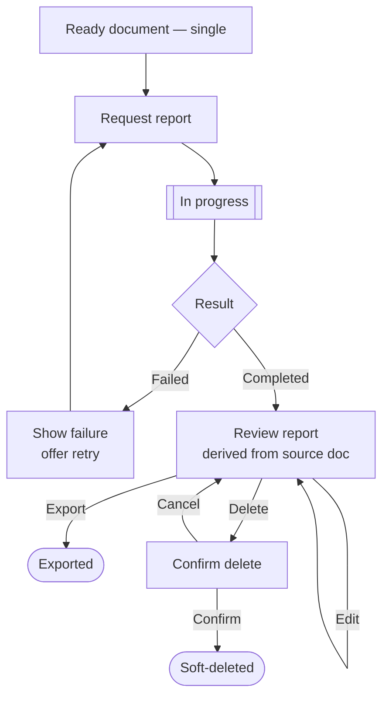

**Cancellation.** This documents cancellation behavior only; it does not change the flow above.

- Leaving the page MUST NOT silently discard completed work — an already-produced report remains available.
- If generation has already begun, it MAY continue to completion unless it is explicitly cancelled by the backend.
- Previously generated content MUST NOT be discarded automatically as a side effect of leaving, refreshing, or
  cancelling; only an explicit user action removes it.
- Completed outputs remain available to the user when they return, so the user MAY safely leave and continue working
  later from what already exists.

---

## 11. Search Flow (UF-11)

**Purpose.** Let the professional find a client or document quickly across their own data.

- **Search.** The user enters a query in the Search Box (from the header). Search is **owner-scoped** and excludes
  soft-deleted resources
  ([SECURITY §5](../01-architecture/SECURITY.md#5-authorization), [DATABASE](../01-architecture/DATABASE.md)).
- **Filtering.** The user can narrow results by the documented facets (e.g. resource type).
- **Results.** Matches are presented in a consistent, navigable List; each result leads to its subject.
- **No results.** An explicit, informative empty state is shown ("no matches for …") — never a blank area.
- **Navigation.** Selecting a result navigates to that client or document, entering its flow.
- **Clear search.** The user can clear the query to return to the unfiltered state.

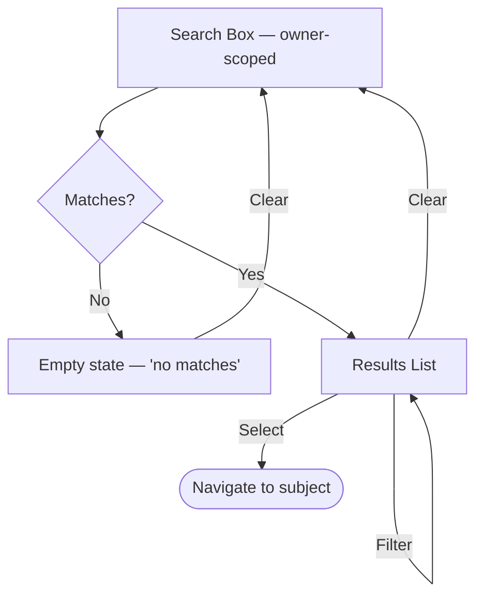

---

## 12. Activity Timeline Flow (UF-12)

**Purpose.** Give the professional an honest, read-only record of what has happened in their account — an audit trail,
never an editable log.

- **Timeline.** The Activity area presents events in reverse-chronological order (Timeline component). Activity is
  **read-only and immutable** ([DATABASE](../01-architecture/DATABASE.md) append-only) and owner-scoped.
- **Filtering.** The user can filter by the documented facets to focus the record.
- **Inspection.** Selecting an event reveals its detail.
- **Navigation.** Where an event refers to a still-existing owned resource, the user can navigate to it.
- **No activity.** When there is nothing to show, an explicit empty state is presented.

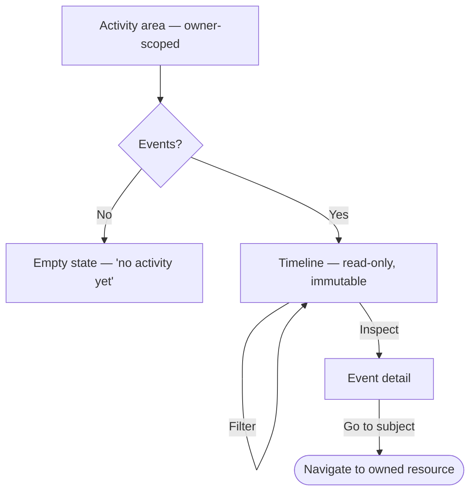

---

## 13. Profile Flow (UF-13)

**Purpose.** Let the professional view and maintain their own profile — self-only access, never another user's.

- **View.** The user opens their profile and sees their own current details.
- **Update.** The user edits editable fields.
- **Validation.** Input is validated at the boundary ([SRS §6](../00-product/SRS.md#6-validation-rules)); invalid input
  keeps the user in the form with clear messages and preserved input.
- **Save.** Valid changes are saved and reflected immediately.
- **Cancel.** The user can cancel; if unsaved edits exist, the flow confirms before discarding them.

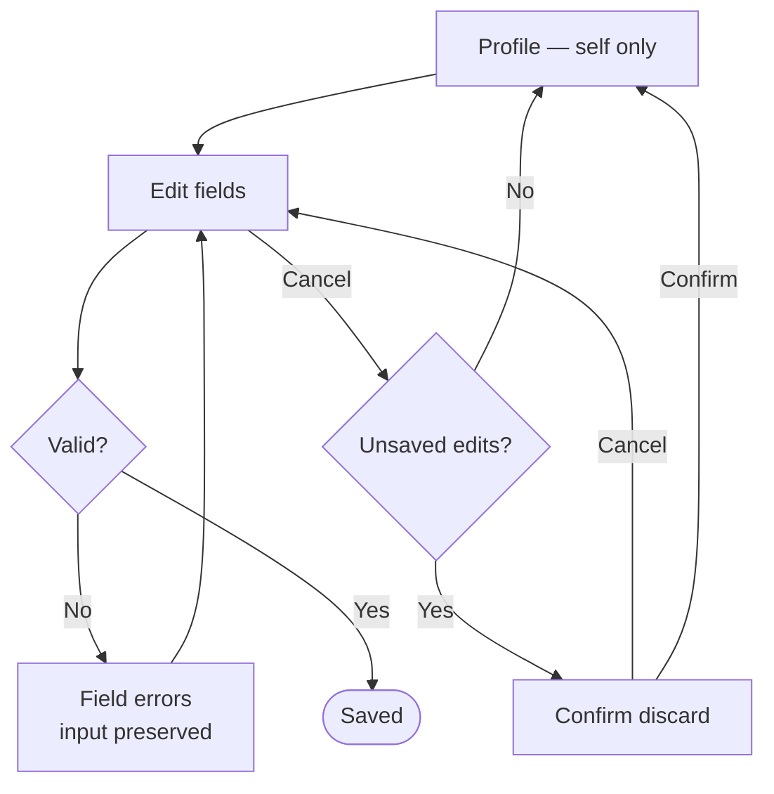

---

## 14. Logout Flow (UF-14)

**Purpose.** End the session securely and return the user to an unauthenticated state.

Simple but explicit: the user selects Logout from the user menu → the session is terminated and the refresh token
invalidated server-side ([ADR-001](../01-architecture/decisions/ADR-001-Authentication-Strategy.md),
[SECURITY](../01-architecture/SECURITY.md)) → the user lands on the login screen. After logout, protected routes are no
longer reachable with the old session; a back-navigation attempt returns the user to login, not to cached protected
data.

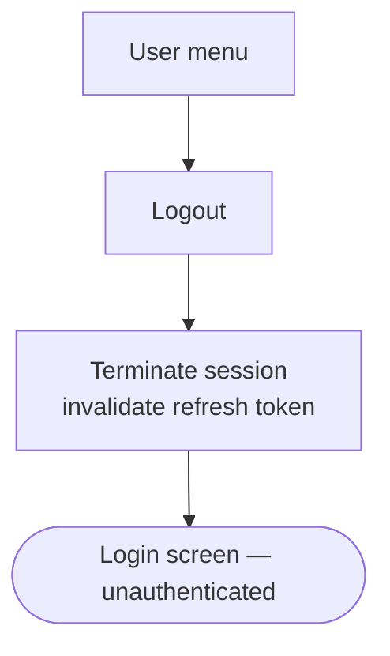

---

## 15. Cross-Flow Principles

Behaviors every flow inherits, so the product feels uniform regardless of which journey the user is on. These are
realized with the shared vocabulary in [COMPONENTS.md](./COMPONENTS.md) — flows never reinvent them.

- **Loading.** Any wait on the network shows a loading state (Skeleton/Spinner/Progress); no flow ever appears frozen.
- **Error handling.** Failures surface a clear, non-technical, non-leaking message (Alert/Toast/Banner) with a way
  forward; no dead ends and no exposure of internal detail ([SECURITY](../01-architecture/SECURITY.md)).
- **Empty states.** Any list, result, or timeline with no data shows an explicit, informative empty state — never a
  blank region.
- **Confirmation dialogs.** Consequential and destructive actions are confirmed (Confirmation/Delete Dialog) with their
  consequence stated plainly.
- **Navigation consistency.** Sidebar, Breadcrumb, and Tabs behave identically across flows, so movement is predictable.
- **Ownership enforcement.** Every flow shows and acts on only the user's own resources; non-owned access resolves as
  404 ([SECURITY §5](../01-architecture/SECURITY.md#5-authorization)).
- **Accessibility.** Every step is keyboard-operable, focus-visible, and announced as required — inherited from
  accessible components and enforced by [FRONTEND_CODING_STANDARDS](../03-engineering/FRONTEND_CODING_STANDARDS.md).
- **AI transparency.** Wherever AI appears, its output is marked as AI-generated, grounded/cited, editable, and never
  auto-acted-upon ([AI_ARCHITECTURE](../01-architecture/AI_ARCHITECTURE.md)).
- **Navigation Recovery.** Refreshing the browser, a temporary network interruption, or returning to an unfinished
  workflow SHOULD restore the user's context wherever practical, rather than forcing the user to restart. This
  reinforces the "users never lose work silently" rule: the flow tries to resume the user where they were, not send them
  back to the beginning.

---

## 16. Flow Dependency Graph

Flows build on one another: authentication gates everything, clients contain documents, documents enable the AI
capabilities, and every action feeds the Activity Timeline. The core value loop runs down the center (upload →
understand → act).

```mermaid
flowchart TD
    Auth[UF-01 Authentication] --> Dash[UF-03 Dashboard]
    Auth -. first login .-> Onboard[UF-02 Onboarding] --> Dash
    Dash --> Client[UF-04 Client Management]
    Dash --> Search[UF-11 Global Search]
    Dash --> Activity[UF-12 Activity Timeline]
    Dash --> Profile[UF-13 Profile]
    Dash --> Logout[UF-14 Logout]
    Client --> Doc[UF-05/06 Document Upload & Review]
    Doc --> Summary[UF-07 AI Summary]
    Doc --> Chat[UF-08 AI Chat]
    Summary --> Email[UF-09 Email Drafting]
    Summary --> Report[UF-10 Report Generation]
    Doc --> Email
    Doc --> Report
    Client -. records .-> Activity
    Doc -. records .-> Activity
    Summary -. records .-> Activity
    Chat -. records .-> Activity
    Email -. records .-> Activity
    Report -. records .-> Activity
    classDef gate fill: #e6f0ff, stroke: #3366cc, color: #11294d;
    classDef core fill: #fff2e6, stroke: #cc7a33, color: #4d2f11;
class Auth, Dash gate;
class Doc,Summary, Chat, Email, Report core;
```

> **Reading the graph:** solid arrows are *enables / leads to*; dotted arrows to Activity are *records an event*.
> Nothing
> downstream of Authentication is reachable without it, and every AI flow depends on a Ready document — matching the
> dependency order in [IMPLEMENTATION_PLAN §3](../03-engineering/IMPLEMENTATION_PLAN.md#3-build-order).

---

## Flow Ownership

> *Unnumbered governance section. It records which module is accountable for each flow's behavior.*

Every flow has a **primary owning module** — the functional module accountable for keeping that flow's behavior correct
and in step with the frozen documents. Ownership is recorded so that a flow always has a module answerable for it, and
so that a change to a flow has an obvious place to be reviewed.

| Flow                     | Primary Owner                          |
|--------------------------|----------------------------------------|
| Authentication           | Authentication Module                  |
| Onboarding               | User Module                            |
| Dashboard                | *No single owner — see the note below* |
| Client Management        | Client Module                          |
| Document Upload / Review | Document Module + OCR Module           |
| AI Summary               | AI Module                              |
| AI Chat                  | AI Module                              |
| Email Drafting           | AI Module                              |
| Report Generation        | Report Module                          |
| Search                   | Search Module                          |
| Activity Timeline        | Activity Module                        |
| Profile                  | User Module                            |
| Logout                   | Authentication Module                  |

**Ownership is architectural only.** It records which module answers for a flow's behavior — its steps, failure paths,
and outcomes — and nothing more. It implies **no UI boundary**: it does not divide the interface, dictate page
structure, or imply that a flow occupies a screen of its own. A single screen MAY express flows owned by several
modules, and a single flow MAY span several screens. How any of this is laid out remains outside this document's scope
(§1).

The owning module keeps its flow aligned with the [PRD](../00-product/PRD.md), [SRS](../00-product/SRS.md), and the
frozen architecture. A change that crosses module boundaries is a **cross-module change** and requires coordination
between the owning modules, so that no module alters a shared flow in isolation.

**Dashboard note.** The Dashboard (UF-03) has **no single owning module**: it is a composition surface that arranges
outputs from several modules — Activity Timeline, Client Management, Documents, and others. Those modules **contribute**
to it; none of them **owns** it. Activity Timeline in particular is one contributor among several, not the owner. A
change to the Dashboard is therefore a cross-module change by default, reviewed with every contributing module.

**Onboarding note.** For the MVP, onboarding establishes a **usable account state** — nothing more — so **User Profile
owns it**. Should onboarding later expand into guided setup, walkthroughs, sample data, first-client creation, or
similar, its ownership MAY be reconsidered through the normal architecture/ADR process. This is a conditional note, not
a planned change.

---

## Future Flow Evolution

> *Unnumbered governance section. It governs how the flow set grows without drifting from the frozen product.*

- **Every new flow MUST be added to the [Flow Catalog](#3-flow-catalog) before implementation.** A flow that is built
  before it is catalogued is undocumented product behavior by definition.
- **Every new flow MUST trace back to an approved [PRD](../00-product/PRD.md) capability and its corresponding
  [SRS](../00-product/SRS.md) requirements.** A flow with no upstream requirement has no authority to exist.
- **User flows MUST NOT introduce new product behavior independently.** New behavior is added to the PRD and SRS first,
  through their change process; only then is it expressed as a flow here. When a proposed flow would introduce behavior
  the frozen documents do not grant, it stops and is raised per [CLAUDE.md §8](../../CLAUDE.md).
- **Existing flows SHOULD be extended before introducing new flows when the underlying user journey remains the same.**
  New flow identifiers are intended for genuinely new user journeys, not incremental evolution of existing behavior.
- **Flow IDs are permanent and MUST NOT be renumbered or reused.** A retired flow's identifier is never reassigned; new
  flows always receive new identifiers, so every reference to a flow remains stable over the product's lifetime.

---

## 17. Review Checklist

Every flow — new or changed — is evaluated against this checklist before acceptance. A "no" is a finding to resolve.

- [ ] **User goal clear?** — The flow states the concrete goal it exists to accomplish.
- [ ] **Success defined?** — There is an explicit successful-completion state.
- [ ] **Failure handled?** — Every failure path is defined and offers a way forward.
- [ ] **Accessibility considered?** — Every step is operable by keyboard and announced as needed.
- [ ] **Ownership enforced?** — The flow shows/acts on owned resources only; non-owned resolves as 404.
- [ ] **Components reused?** — The flow is expressed with documented components, not new one-off UI.
- [ ] **AI transparent?** — AI output is marked, grounded/cited, editable, and never auto-acted-upon.
- [ ] **No dead-end screens?** — Every screen offers a next action or a way back.
- [ ] **Navigation consistent?** — Movement matches the shared navigation conventions.

---

## Flow Versioning

> *Unnumbered governance section. It defines how user flows evolve over time while their identifiers stay stable.*

- **Flow identifiers (UF-01, UF-02, …) are permanent references and MUST NOT be renumbered or reused.** A reference to a
  flow must mean the same journey for the entire life of the product.
- **Minor behavioral refinements SHOULD update the existing flow rather than creating a new one.** A clarified step, an
  added failure path, or a tightened outcome is an evolution of the same journey, not a new one.
- **A new Flow ID SHOULD be created only when a fundamentally new user journey is introduced** — a goal the existing
  flows do not already serve.
- **Deprecated flows SHOULD remain documented until they are fully removed from the product**, so historical references
  stay traceable and nothing silently disappears from the record.
- **Changes to user flows MUST remain consistent with the approved [Product Vision](../00-product/PRODUCT_VISION.md),
  [PRD](../00-product/PRD.md), [SRS](../00-product/SRS.md), and [Product Decisions](../00-product/PRODUCT_DECISIONS.md).
  **
  A flow may only evolve within the behavior those documents already grant.

This policy exists to keep flow references **stable**, the documentation **consistent**, and the product's journey
history **traceable** over the long term: identifiers that never move, refinements that stay attached to the journey
they belong to, and deprecated journeys that remain on record until they are truly gone.

---

## User Flow Review Process

> *Unnumbered governance section. It defines when a flow is reviewed and how flows stay synchronized with product
> behavior.*

**Review triggers** — a flow review is required when any of the following occurs:

- **A new feature** is introduced (it must be expressed as one or more flows).
- **A new page** is proposed (it must justify itself by participating in a documented flow).
- **A flow changes** — its goal, steps, decision points, or outcomes are altered.
- **Navigation changes** — the way users move between areas is modified.
- **AI interaction changes** — how AI is requested, presented, grounded, or edited is altered.

**Review outcomes** — each review resolves to exactly one:

- **Approved** — the flow meets the checklist and rules; it is accepted as-is.
- **Flow refinement required** — the journey is sound but a step, failure path, or outcome must change before
  acceptance.
- **Component gap identified** — the flow needs an interaction no component provides; the gap is routed to the
  [Component Review Process](./COMPONENTS.md) rather than solved by improvising UI in the flow.
- **Architecture review required** — the flow implies behavior not permitted by the frozen documents; it stops and is
  raised per [CLAUDE.md §8](../../CLAUDE.md) before proceeding.

**Newly introduced journeys** — before any user journey that is not already documented here is built:

- **It MUST first be added to the [Flow Catalog](#3-flow-catalog)**, with its own new Flow ID, goal, entry point, and
  exit point. An uncatalogued journey is undocumented product behavior by definition.
- **It MUST reference an approved product capability** — a granted [PRD](../00-product/PRD.md) capability and its
  corresponding [SRS](../00-product/SRS.md) requirements. A journey with no upstream requirement has no authority to
  exist.
- **It MUST NOT be implemented before its documentation review concludes.** The review resolves to one of the outcomes
  above first; implementation follows the review, never precedes it.

These conditions are the review-time expression of the [Future Flow Evolution](#future-flow-evolution) rules; they add
no new policy, only the point at which it is enforced.

**Synchronization with the PRD:** flows evolve **with product behavior**, never ahead of it. A flow may only realize
capability the [PRD](../00-product/PRD.md) and [SRS](../00-product/SRS.md) already grant; when a flow and the PRD
disagree, the PRD wins and the flow is corrected. New product behavior is added to the PRD first (through its change
process), then expressed here — keeping flows and requirements permanently in step.

---

## 18. User Flow Decision Summary

The load-bearing decisions behind these journeys, recorded so they are not silently reversed.

| Decision                       | Chosen Approach                                                            | Alternatives                                                   | Rationale                                                                                                                                          | Related Source                                                                                                                                               |
|--------------------------------|----------------------------------------------------------------------------|----------------------------------------------------------------|----------------------------------------------------------------------------------------------------------------------------------------------------|--------------------------------------------------------------------------------------------------------------------------------------------------------------|
| **Goal-oriented flows**        | Organize every journey around one concrete user goal with a completion     | Feature-oriented screens with no defined journey               | A goal gives the flow a measurable "done" and keeps it aligned to the "hours to minutes" promise; feature-first screens drift into dead ends.      | [Product Vision](../00-product/PRODUCT_VISION.md) · [PRD](../00-product/PRD.md)                                                                              |
| **Progressive disclosure**     | Reveal complexity step-by-step as the user advances                        | Present all options and detail up front                        | Keeps each step comprehensible and low-friction; front-loading everything overwhelms and slows the user.                                           | [Product Vision](../00-product/PRODUCT_VISION.md)                                                                                                            |
| **Human-in-the-loop AI**       | AI assists; the human reviews, edits, and takes every consequential action | AI acts autonomously (e.g. auto-sends email)                   | Keeps the professional accountable and in control; autonomous action violates [AI_ARCHITECTURE](../01-architecture/AI_ARCHITECTURE.md) and BR-034. | [AI_ARCHITECTURE](../01-architecture/AI_ARCHITECTURE.md) · [BR-031](../00-product/SRS.md#5-business-rules) · [BR-034](../00-product/SRS.md#5-business-rules) |
| **Recoverable failures**       | Every failure path offers retry, edit, or a clear exit                     | Treat failures as terminal errors                              | Document/AI operations fail routinely; recoverable failure preserves trust and work, matching "never lose work silently."                          | [SRS](../00-product/SRS.md) · [BR-033](../00-product/SRS.md#5-business-rules)                                                                                |
| **Predictable navigation**     | Identical navigation behavior across all flows                             | Per-area bespoke navigation                                    | A stable mental map lets users move without relearning; bespoke navigation creates confusion and error.                                            | [COMPONENTS](./COMPONENTS.md)                                                                                                                                |
| **Editable AI output**         | All AI output is a starting point the human owns and can change            | Present AI output as final/authoritative                       | Grounded-but-editable output keeps the human in control and AI honest; final output would overstate machine authority.                             | [AI_ARCHITECTURE](../01-architecture/AI_ARCHITECTURE.md) · [BR-031](../00-product/SRS.md#5-business-rules) · [BR-032](../00-product/SRS.md#5-business-rules) |
| **Reusable components**        | Express flows using the documented component vocabulary only               | Build custom UI per flow                                       | Reuse yields a coherent, learnable, testable product; per-flow custom UI fragments the experience ([COMPONENTS.md](./COMPONENTS.md)).              | [COMPONENTS](./COMPONENTS.md)                                                                                                                                |
| **Ownership-aware navigation** | Every flow is scoped to the user's own data; non-owned resolves as 404     | Show existence of others' resources (e.g. 403) or shared views | Per-user isolation is the product's existential confidentiality promise ([SECURITY §5](../01-architecture/SECURITY.md#5-authorization)).           | [SECURITY](../01-architecture/SECURITY.md) · [BR-004](../00-product/SRS.md#5-business-rules)                                                                 |

---

*This document defines how users move through LedgerAI; it does not override the frozen documents under
[`docs/`](../). It realizes the behavior granted by [PRD](../00-product/PRD.md) and [SRS](../00-product/SRS.md), is
expressed with the vocabulary in [COMPONENTS.md](./COMPONENTS.md), and is shaped by [UI_GUIDELINES](./UI_GUIDELINES.md).
When a flow decision is required, review it through the process above and, when a flow would imply new product behavior
or contradict a frozen contract, stop and raise it per [CLAUDE.md §8](../../CLAUDE.md).*
