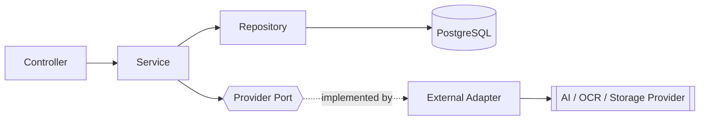

# Backend Coding Standards — LedgerAI MVP

> **Status:** Draft v1
> **Owner:** Founding Engineer / Java Principal Engineer
> **Last updated:** 2026-07-14
> **Stack:** Java 21 · Spring Boot 3 · Spring Security · Spring Data JPA · Hibernate ·
> Maven ([PD-005](../00-product/PRODUCT_DECISIONS.md#3-accepted-product-decisions))
> **Upstream (frozen):
** [Architecture](../01-architecture/ARCHITECTURE.md) · [Database](../01-architecture/DATABASE.md) · [API Spec](../01-architecture/API_SPEC.md) · [Security](../01-architecture/SECURITY.md) · [AI Architecture](../01-architecture/AI_ARCHITECTURE.md) · [SRS](../00-product/SRS.md)
> **Related:
** [CLAUDE.md](../../CLAUDE.md) · [TESTING_STRATEGY](./TESTING_STRATEGY.md) · [IMPLEMENTATION_PLAN](./IMPLEMENTATION_PLAN.md)

---

## 1. Purpose

### Why this document exists

This document defines **how LedgerAI's Java + Spring Boot backend code should be written** so the codebase stays
consistent, maintainable, testable, secure, and faithful to the approved architecture. It is **not** a general Java
style
guide and **not** an architecture document — it is the bridge between the two: the concrete engineering standards that
make the architecture real in code. It contains **no code examples, no framework configuration, and no annotation
discussion**.

### Relationship to the frozen documents

| Document                                              | Relationship                                                                                                                                                                                     |
|-------------------------------------------------------|--------------------------------------------------------------------------------------------------------------------------------------------------------------------------------------------------|
| [ARCHITECTURE.md](../01-architecture/ARCHITECTURE.md) | Defines the modular monolith, layering, and ports/adapters. These standards enforce that structure at the code level; they never redefine it.                                                    |
| [CLAUDE.md](../../CLAUDE.md)                          | The behavioral playbook. Its [Coding Expectations §6](../../CLAUDE.md) and [Engineering Rules §4](../../CLAUDE.md) are the top-level rules; this document is their backend-specific elaboration. |
| [TESTING_STRATEGY.md](./TESTING_STRATEGY.md)          | Testable code is a standard here; the two are complementary — code written to these standards is straightforward to test to that strategy.                                                       |

---

## 2. Backend Engineering Philosophy

| Principle                                      | Why it exists                                                                                                                                                          |
|------------------------------------------------|------------------------------------------------------------------------------------------------------------------------------------------------------------------------|
| **Readability over cleverness**                | Code is read far more than written; the next engineer (or Claude) must understand it quickly. Clever code that saves keystrokes but costs comprehension is a net loss. |
| **Explicit over implicit**                     | Explicit dependencies, flow, and intent are debuggable and testable. Hidden behavior (magic) is where bugs and surprises live.                                         |
| **Small classes**                              | A class with one responsibility is easy to name, test, and change. Large classes accumulate unrelated concerns and become change-risk hotspots.                        |
| **Small methods**                              | Short methods read like prose and are unit-testable in isolation; long methods hide branches and side effects.                                                         |
| **Composition over inheritance**               | Composition assembles behavior flexibly and avoids rigid, fragile hierarchies; inheritance couples subclasses to superclass internals.                                 |
| **SOLID principles**                           | They keep modules cohesive and substitutable — the foundation that makes the ports/adapters seam and independent modules possible.                                     |
| **Business logic belongs in services**         | One predictable home for rules makes them findable, testable, and reusable; scattering them across layers hides them ([BR](../00-product/SRS.md#5-business-rules)).    |
| **Thin controllers**                           | Controllers translate transport ↔ application and delegate; keeping them logic-free makes the API layer trivial and the logic testable without HTTP.                   |
| **Predictable code over magical abstractions** | Straightforward code that does what it says beats speculative frameworks; we add abstraction only when it earns its place ([KISS](../../CLAUDE.md)).                   |

> These operationalize the product's **lightweight-over-heavy** bias and the architecture's **maintainability** goal —
> the codebase must stay legible as it grows.

---

## Backend Engineering Rules

Non-negotiable rules. Each enforces a boundary defined in the architecture; a violation silently erodes it.

- **Business logic MUST NOT exist in controllers.** Logic in controllers is untestable without HTTP and duplicates
  across endpoints.
- **Controllers MUST delegate** to services and return DTOs — nothing more.
- **Services MUST own business rules** ([SRS §5](../00-product/SRS.md#5-business-rules)) and transaction boundaries;
  they are the single home of domain behavior.
- **Repositories MUST only perform persistence.** No business rules in queries or repository methods.
- **DTOs MUST NOT contain business logic.** They are inert data carriers across boundaries.
- **Entities MUST model persistence only.** They map to the schema ([DATABASE](../01-architecture/DATABASE.md)); they
  are never exposed outward and hold no cross-cutting behavior.
- **Dependencies MUST point inward** — toward the domain service; controllers depend on services, services on
  repositories and on *ports*, never the
  reverse ([ARCHITECTURE §5.3](../01-architecture/ARCHITECTURE.md#5-backend-architecture)).
- **Constructor injection MUST be used.** Dependencies are explicit, final, and testable; no field/setter injection.
- **Circular dependencies MUST NOT exist** — between classes or modules. They signal a boundary violation and must be
  resolved by redesign, not worked around.
- **Static mutable state MUST NOT exist.** It breaks isolation, testability, and thread-safety.
- **Shared utilities SHOULD remain minimal.** A bloated `common` becomes a dumping ground that couples everything;
  utilities must be genuinely cross-cutting and stateless.

> **Why these are rules:** each maps directly to
> a [Guiding Architectural Rule](../01-architecture/ARCHITECTURE.md#guiding-architectural-rules).
> They exist because module boundaries, layering, and dependency direction are only real if they are enforced in every
> class — one shortcut here quietly contradicts the frozen architecture.

---

## 3. Package Organization

The backend is organized **domain-first**: one package per domain module, each self-contained, plus a small set of
shared
infrastructure packages ([ARCHITECTURE §5.1](../01-architecture/ARCHITECTURE.md#5-backend-architecture),
[ADR-006](../01-architecture/decisions/ADR-006-Architecture-Style.md)). This document describes **responsibilities and
boundaries only** — not an exact folder tree (that is an implementation detail).

| Package     | Responsibility                                                                                                   |
|-------------|------------------------------------------------------------------------------------------------------------------|
| `auth`      | Registration, authentication, tokens, sessions.                                                                  |
| `users`     | User profile and preferences.                                                                                    |
| `clients`   | Client management — the ownership container.                                                                     |
| `documents` | Document upload, storage reference, lifecycle, extraction/OCR coordination.                                      |
| `ai`        | AI orchestration (summary, chat, email, report) behind the AI port.                                              |
| `reports`   | Report assembly, editing, export.                                                                                |
| `search`    | Global search over owner-scoped content.                                                                         |
| `activity`  | Immutable activity timeline.                                                                                     |
| `common`    | Genuinely cross-cutting, stateless concerns (error model, shared DTO conventions, base types). Kept **minimal**. |

**Boundaries:**

- A module **owns its own** controllers, services, repositories, entities, DTOs, mappers, validation, and exceptions.
- Modules interact **only through published services** — never by reaching into another module's repositories, entities,
  or internal classes ([Engineering Rules](#backend-engineering-rules)).
- External providers (AI, OCR, Storage) are reached only through **ports** owned by the relevant domain, with adapters
  in their own boundary ([§6](#6-dependency-rules)).
- `common` is for what is *truly* shared; when in doubt, keep code in its owning module.

---

## 4. Layer Responsibilities

Within each module, responsibilities are strictly separated. For each layer: what it does, what it **must** do, what it
**must not** do.

### Controller

- **Responsibilities:** Translate HTTP ↔ application calls; bind and shape-validate the request; delegate to a service;
  return a DTO with the correct status.
- **Must:** Stay thin; validate request shape ([VR](../00-product/SRS.md#6-validation-rules)); return DTOs; map to the
  API contract ([API_SPEC](../01-architecture/API_SPEC.md)).
- **Must not:** Contain business logic; access repositories or entities directly; perform authorization logic beyond
  delegating to the service.

### Service

- **Responsibilities:** Own business rules, orchestration, ownership authorization, transaction boundaries; call
  repositories and ports.
- **Must:** Enforce business rules ([SRS §5](../00-product/SRS.md#5-business-rules)) and
  ownership ([BR-004](../00-product/SRS.md#5-business-rules)); define transactions ([§9](#9-transaction-guidelines));
  depend on ports for external work.
- **Must not:** Depend on web/HTTP types; depend on a concrete provider SDK; leak entities outward.

### Repository

- **Responsibilities:** Persist and retrieve entities.
- **Must:** Contain only data access; produce owner-scoped queries that exclude soft-deleted rows by
  default ([DATABASE §8](../01-architecture/DATABASE.md#8-soft-delete-strategy)).
- **Must not:** Contain business rules or orchestration.

### Domain (entities + domain types)

- **Responsibilities:** Model the persistent data and core domain concepts (enums, value types).
- **Must:** Map to the schema in [DATABASE.md](../01-architecture/DATABASE.md); keep status/type as defined enums.
- **Must not:** Be exposed through the API; carry cross-cutting or provider concerns.

### DTO

- **Responsibilities:** Carry data across the API boundary (requests and responses).
- **Must:** Be immutable where practical; expose only intended
  fields ([API_SPEC §17](../01-architecture/API_SPEC.md#17-common-dtos)).
- **Must not:** Contain business logic; expose sensitive/internal fields (`passwordHash`, raw tokens,
  `storageReference`).

### Mapper

- **Responsibilities:** Convert entity ↔ DTO.
- **Must:** Be deterministic and pure; guarantee sensitive fields never map outward.
- **Must not:** Contain business logic or side effects.

### Configuration

- **Responsibilities:** Wire the application and externalize environment/provider settings.
- **Must:** Keep secrets
  externalized ([§11](#11-configuration-standards), [SECURITY §13](../01-architecture/SECURITY.md#13-secrets-management));
  select adapters by configuration.
- **Must not:** Contain business logic or hard-coded secrets.

### External Adapter

- **Responsibilities:** Implement a domain **port** for one external provider (AI/OCR/Storage); map
  requests/responses/errors.
- **Must:** Be the *only* code aware of provider specifics; translate provider errors into the domain error
  taxonomy ([SRS §8](../00-product/SRS.md#8-error-handling)).
- **Must not:** Leak provider types into the domain; hold business rules.

---

## 5. Naming Conventions

Names carry intent. **No abbreviations** except universally understood ones (e.g., `id`, `url`, `dto` in a type suffix).
Names are descriptive, consistent, and predictable across modules.

| Element            | Convention                                                                                                                                                                                                              |
|--------------------|-------------------------------------------------------------------------------------------------------------------------------------------------------------------------------------------------------------------------|
| **Classes**        | Descriptive `PascalCase` nouns naming the responsibility (e.g., a client service, a document lifecycle handler).                                                                                                        |
| **Interfaces**     | Named for the capability, not prefixed with `I`; ports read as domain capabilities (e.g., an AI generation port, a storage port).                                                                                       |
| **DTOs**           | Suffixed `...Dto` or split into request/response (below); never named like entities.                                                                                                                                    |
| **Requests**       | Suffixed `...Request` for inbound payloads.                                                                                                                                                                             |
| **Responses**      | Suffixed `...Response` for outbound payloads (matching [API_SPEC §17](../01-architecture/API_SPEC.md#17-common-dtos)).                                                                                                  |
| **Exceptions**     | Suffixed `...Exception`, named for the failure (e.g., a not-found, a validation, an unauthorized-access exception).                                                                                                     |
| **Services**       | Suffixed `...Service`; name the domain they serve.                                                                                                                                                                      |
| **Repositories**   | Suffixed `...Repository`; name the entity they persist.                                                                                                                                                                 |
| **Configurations** | Suffixed `...Config`; name the concern they configure.                                                                                                                                                                  |
| **Enums**          | `PascalCase` type; **UPPERCASE** values matching the database enums ([DATABASE Naming Conventions](../01-architecture/DATABASE.md#database-naming-conventions)) — statuses/types stay identical across code and schema. |

Consistency matters more than any single choice: a name should let a reader predict a class's role and locate its
collaborators without searching.

---

## 6. Dependency Rules

Dependencies flow **inward toward the domain service**; external providers are reached **only through ports**.

- **Allowed:** Controller → Service → Repository → Database; Service → Port; Adapter implements Port.
- **Forbidden:** Controller → Repository (skipping the service); Service → Adapter/SDK directly (must go through the
  port); any inward layer depending on an outward one; any cross-module dependency except through a published service.
- **External providers:** never called from business logic directly — only via the domain-owned port
  ([ARCHITECTURE §10](../01-architecture/ARCHITECTURE.md#10-external-services), [ADR-003](../01-architecture/decisions/ADR-003-AI-Provider-Abstraction.md)).
- **No circular dependencies** at class or module level.

This is the code-level expression of the architecture's dependency-inversion seam — the one place inversion is applied
rigorously, because it is what buys provider independence.

---

## 7. Validation Standards

Validation happens in **distinct layers**, each with a clear home:

| Kind                         | Where               | What                                                                                                                                                                                                                                                  |
|------------------------------|---------------------|-------------------------------------------------------------------------------------------------------------------------------------------------------------------------------------------------------------------------------------------------------|
| **Input validation**         | Controller boundary | Request shape, required fields, formats, sizes — the [VR rules](../00-product/SRS.md#6-validation-rules). Invalid → `422` with field errors ([API_SPEC §18](../01-architecture/API_SPEC.md#18-validation)).                                           |
| **Business validation**      | Service             | Domain rules and preconditions — e.g., only `READY` documents are summarizable ([BR-010](../00-product/SRS.md#5-business-rules)); state-transition legality ([SRS §7](../00-product/SRS.md#7-state-models)).                                          |
| **Authorization validation** | Service             | The caller is authenticated and permitted; fail closed.                                                                                                                                                                                               |
| **Ownership validation**     | Service             | The caller **owns** the target resource and its parent chain ([BR-004](../00-product/SRS.md#5-business-rules)); non-owned → `404` ([SECURITY §5](../01-architecture/SECURITY.md#5-authorization)). This is mandatory on every data-bearing operation. |

**Fail fast:** reject invalid input at the earliest appropriate layer with a clear, specific error. Input validation
never
substitutes for business/ownership validation — the server is always authoritative, never the client.

---

## 8. Error Handling Standards

Errors are modeled as **typed exceptions** and mapped centrally to the
API's [RFC 7807 error model](../01-architecture/API_SPEC.md#212-error-model--rfc-7807-problem-details).

| Exception kind             | Purpose                                                                                                 | Maps to                                                                                                                           |
|----------------------------|---------------------------------------------------------------------------------------------------------|-----------------------------------------------------------------------------------------------------------------------------------|
| **Custom/base exceptions** | A small hierarchy so handling is consistent and centralized.                                            | Central handler → Problem Details.                                                                                                |
| **Domain exceptions**      | A business rule/precondition failed (e.g., acting on a non-`READY` document).                           | `409`/`422` as appropriate.                                                                                                       |
| **Validation exceptions**  | Input failed validation.                                                                                | `422` with `validationErrors`.                                                                                                    |
| **Security exceptions**    | Unauthenticated / unauthorized / non-owned.                                                             | `401`/`403`/`404` per [SECURITY](../01-architecture/SECURITY.md#5-authorization).                                                 |
| **Provider failures**      | AI/OCR/Storage unavailable, timeout, or invalid response — translated by the adapter into domain terms. | `503`/`FAILED` state, graceful degradation ([AI_ARCHITECTURE §12](../01-architecture/AI_ARCHITECTURE.md#12-ai-failure-handling)). |

**Principles:** exception handling is **centralized** — controllers do not build error responses ad hoc; errors **never
leak internals** (no stack traces, no sensitive content) to clients ([SRS §8](../00-product/SRS.md#8-error-handling));
every error is actionable and non-technical for the user.

---

## 9. Transaction Guidelines

Transactions wrap **local persistence only** ([DATABASE §11](../01-architecture/DATABASE.md#11-transaction-boundaries)).

- **Where transactions belong:** in the **service** layer, around a logical atomic unit of work (e.g., create client +
  activity entry commit together).
- **What should not be transactional:** read-only queries need no write transaction; controllers and adapters never
  manage transactions.
- **External provider calls outside transactions:** AI/OCR/Storage calls are network I/O and **MUST NOT** be held inside
  a database transaction — only the *persistence of their result* is transactional. Reconcile external state via
  explicit
  success/failure states and compensating
  actions ([DATABASE §11](../01-architecture/DATABASE.md#11-transaction-boundaries)).
- **Rollback philosophy:** a failed atomic unit rolls back entirely — no partial writes presented as
  success ([NFR-005/006](../00-product/SRS.md#9-non-functional-requirements)). Orphaned external artifacts (e.g., an
  uploaded file whose DB write failed) are cleaned up by compensating logic.

---

## 10. Logging Standards

Logging serves diagnosis and observability **without** exposing confidential
content ([SECURITY §16](../01-architecture/SECURITY.md#16-logging-and-audit), [NFR-013](../00-product/SRS.md#9-non-functional-requirements)).

| Aspect                      | Standard                                                                                                                                                                                                                                                                           |
|-----------------------------|------------------------------------------------------------------------------------------------------------------------------------------------------------------------------------------------------------------------------------------------------------------------------------|
| **What to log**             | Significant events, errors with context, state transitions, provider failures — enough to diagnose issues.                                                                                                                                                                         |
| **What NOT to log**         | Passwords/hashes, tokens, secrets, document content, extracted text, AI prompt/response **content**, PII beyond what identifies an event.                                                                                                                                          |
| **Correlation IDs**         | Propagate a `traceId` and include it in logs and error responses ([API_SPEC §2.12](../01-architecture/API_SPEC.md#212-error-model--rfc-7807-problem-details)) so events correlate across the stack.                                                                                |
| **Error logging**           | Log errors with enough context to act on; never log the raw exception to the client.                                                                                                                                                                                               |
| **AI request logging**      | Record AI *requests* as domain records (`AIRequest`) for lifecycle/audit ([DATABASE §5.5](../01-architecture/DATABASE.md#55-airequest)); never log prompt/response content to operational logs ([AI_ARCHITECTURE §14](../01-architecture/AI_ARCHITECTURE.md#14-ai-observability)). |
| **Sensitive data handling** | When in doubt, do not log it. Prefer identifiers and metadata over content.                                                                                                                                                                                                        |

---

## 11. Configuration Standards

Configuration is **externalized** and environment-driven; **no implementation specifics here**.

| Concern                    | Standard                                                                                                                                                                                                                                                                     |
|----------------------------|------------------------------------------------------------------------------------------------------------------------------------------------------------------------------------------------------------------------------------------------------------------------------|
| **Environment variables**  | All environment-specific settings come from configuration, not hard-coded.                                                                                                                                                                                                   |
| **Secrets**                | Never in source or logs; provided via environment/secret management; rotatable ([SECURITY §13](../01-architecture/SECURITY.md#13-secrets-management)).                                                                                                                       |
| **Feature flags**          | Where used, flags are configuration, not code branches littered through the domain; kept simple.                                                                                                                                                                             |
| **Provider configuration** | The active AI/OCR/Storage **adapter is selected by configuration**, enabling provider swaps with no business-logic change ([ADR-003](../01-architecture/decisions/ADR-003-AI-Provider-Abstraction.md), [ADR-002](../01-architecture/decisions/ADR-002-Storage-Provider.md)). |
| **Profiles**               | Per-environment profiles (local/CI/staging/production) isolate settings; production secrets never reach development ([TESTING_STRATEGY §13](./TESTING_STRATEGY.md#13-test-environments)).                                                                                    |

---

## 12. Code Review Checklist

Every backend change is reviewed against this list before merge (complements
the [Definition of Done](./IMPLEMENTATION_PLAN.md#7-definition-of-done)):

- [ ] **Architecture respected** — layering, module boundaries, dependency direction, ports honored.
- [ ] **Tests included** — appropriate layers per [TESTING_STRATEGY](./TESTING_STRATEGY.md); green.
- [ ] **Security considered** — ownership enforced; nothing sensitive
  logged/exposed ([SECURITY](../01-architecture/SECURITY.md)).
- [ ] **Documentation updated** — API_SPEC / DATABASE / ADR / STATUS as applicable.
- [ ] **No duplication** — logic lives once; shared concerns centralized.
- [ ] **No dead code** — no unused classes, methods, or commented-out blocks.
- [ ] **Error handling complete** — typed exceptions; central mapping; no leaked internals.
- [ ] **Logging appropriate** — useful, correlated, no sensitive content.
- [ ] **Validation complete** — input, business, authorization, and ownership validation present where required.

---

## Backend Review Process

Backend quality is maintained through **continuous review during development**, not an end-of-project audit. Certain
changes MUST trigger a focused review before merge:

| Trigger              | Review focus                                                                                                                         |
|----------------------|--------------------------------------------------------------------------------------------------------------------------------------|
| **New module**       | Boundaries, layering, naming, and dependency direction established correctly.                                                        |
| **API changes**      | Contract consistency with [API_SPEC](../01-architecture/API_SPEC.md); DTOs, errors, ownership.                                       |
| **Database changes** | Repository responsibility, owner-scoping, migration safety ([DATABASE](../01-architecture/DATABASE.md#database-migration-strategy)). |
| **Security changes** | Authn/authz, ownership, logging, secrets ([Security Review](../01-architecture/SECURITY.md#security-review-process)).                |
| **AI changes**       | Port usage, prompt centralization, failure handling ([AI Review](../01-architecture/AI_ARCHITECTURE.md#ai-review-process)).          |
| **Shared utilities** | Is it *truly* cross-cutting? Does it belong in a module instead? Guards against a bloated `common`.                                  |

**Review outcomes:** **Approved**; **Changes requested** (specific fixes before merge); **ADR required** (the change
embodies an architectural decision); **Refactor required** (a boundary/rule was strained and must be corrected).

Review is woven into the workflow so the backend stays aligned with its architecture at every step — small, corrected
deviations never accumulate into drift.

---

## 13. Backend Decision Summary

| Decision                 | Chosen Approach                                        | Alternatives                               | Rationale                                                                                                                                       |
|--------------------------|--------------------------------------------------------|--------------------------------------------|-------------------------------------------------------------------------------------------------------------------------------------------------|
| **Controllers**          | **Thin, delegate-only**                                | Logic in controllers                       | Testable logic without HTTP; no duplication across endpoints ([§4](#4-layer-responsibilities)).                                                 |
| **Business logic**       | **Service-centric**                                    | Logic in controllers/repositories/entities | One findable, testable home for rules ([SRS §5](../00-product/SRS.md#5-business-rules)).                                                        |
| **Dependency injection** | **Constructor injection**                              | Field/setter injection                     | Explicit, final, testable dependencies ([Engineering Rules](#backend-engineering-rules)).                                                       |
| **External providers**   | **Ports + adapters, config-selected**                  | Direct SDK calls                           | Provider independence; reversible deferred choices ([ADR-003](../01-architecture/decisions/ADR-003-AI-Provider-Abstraction.md)).                |
| **API models**           | **DTO separation** (entities never exposed)            | Serialize entities                         | Prevents leaking persistence/sensitive fields ([§4](#4-layer-responsibilities), [API_SPEC §17](../01-architecture/API_SPEC.md#17-common-dtos)). |
| **Repositories**         | **Persistence only**                                   | Business logic in queries                  | Keeps rules in services; queries stay simple and owner-scoped ([DATABASE](../01-architecture/DATABASE.md)).                                     |
| **Reuse strategy**       | **Composition over inheritance**                       | Deep inheritance hierarchies               | Flexible, testable, avoids fragile base classes ([§2](#2-backend-engineering-philosophy)).                                                      |
| **Validation**           | **Explicit, layered** (input/business/authz/ownership) | Implicit/scattered validation              | Fail fast; server authoritative; ownership always enforced ([§7](#7-validation-standards)).                                                     |
| **Transactions**         | **Service-layer, local-only; providers outside**       | Transactions spanning provider calls       | Correct atomicity; no network I/O in a DB transaction ([DATABASE §11](../01-architecture/DATABASE.md#11-transaction-boundaries)).               |

---

*These standards make the approved architecture real in backend code — they enforce it, never redefine it. They MUST
remain consistent with the frozen Architecture, Database, API Spec, Security, AI Architecture, and SRS. Frontend
standards
are defined separately under [`03-engineering/`](.).*
