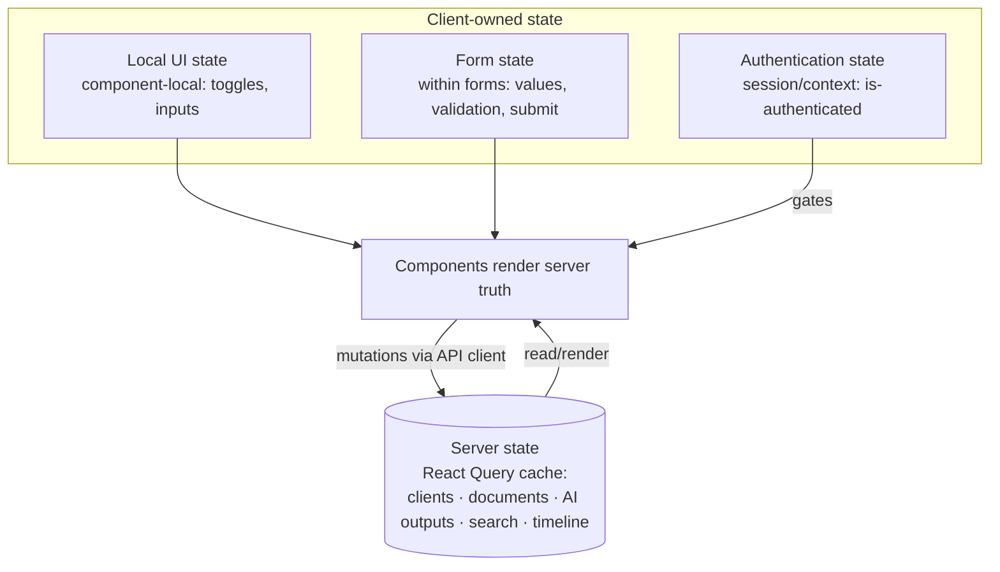

# Frontend Coding Standards — LedgerAI MVP

> **Status:** Draft v1
> **Owner:** Founding Engineer / React Principal Engineer
> **Last updated:** 2026-07-14
> **Stack:** React 19 · TypeScript 5 · Vite · Material UI · React Query ·
>
Axios ([PD-006](../00-product/PRODUCT_DECISIONS.md#3-accepted-product-decisions), [ADR-007](../01-architecture/decisions/ADR-007-Frontend-Architecture.md))
> **Upstream (frozen):
** [Architecture](../01-architecture/ARCHITECTURE.md) · [API Spec](../01-architecture/API_SPEC.md) · [Security](../01-architecture/SECURITY.md) · [SRS](../00-product/SRS.md)
> **Related:
** [CLAUDE.md](../../CLAUDE.md) · [TESTING_STRATEGY](./TESTING_STRATEGY.md) · [BACKEND_CODING_STANDARDS](./BACKEND_CODING_STANDARDS.md) · [IMPLEMENTATION_PLAN](./IMPLEMENTATION_PLAN.md)

---

## 1. Purpose

### Why this document exists

This document defines **how LedgerAI's React + TypeScript frontend code should be written** so the application stays
maintainable, predictable, accessible, testable, and faithful to the approved architecture. It is **not** a React
tutorial and **not** a UI design document — it is the concrete engineering standard that makes the frontend architecture
real in code. It contains **no code examples, no library-specific APIs, no CSS-framework choices, and no folder trees**.

### Relationship to the frozen documents

| Document                                              | Relationship                                                                                                                                                                                                                                 |
|-------------------------------------------------------|----------------------------------------------------------------------------------------------------------------------------------------------------------------------------------------------------------------------------------------------|
| [ARCHITECTURE.md](../01-architecture/ARCHITECTURE.md) | Defines the frontend architecture — feature-first, React Query server state, centralized API layer ([§6](../01-architecture/ARCHITECTURE.md#6-frontend-architecture)). These standards enforce it at the code level; they never redefine it. |
| [CLAUDE.md](../../CLAUDE.md)                          | The behavioral playbook. Its [Coding Expectations](../../CLAUDE.md) and [Engineering Rules](../../CLAUDE.md) are the top-level rules; this document is their frontend-specific elaboration.                                                  |
| [TESTING_STRATEGY.md](./TESTING_STRATEGY.md)          | UI testing ([§8](./TESTING_STRATEGY.md#8-ui-testing-strategy)) verifies behavior; code written to these standards is straightforward to test that way.                                                                                       |
| [API_SPEC.md](../01-architecture/API_SPEC.md)         | The contract the frontend consumes — endpoints, DTOs, RFC 7807 errors, async-ready behavior. The frontend integrates strictly to this contract.                                                                                              |

---

## 2. Frontend Engineering Philosophy

| Principle                               | Why it exists                                                                                                                                                                                                                             |
|-----------------------------------------|-------------------------------------------------------------------------------------------------------------------------------------------------------------------------------------------------------------------------------------------|
| **Feature-first organization**          | Grouping a capability's views, components, and hooks together makes it understandable end-to-end and mirrors the backend modules — supporting fast onboarding ([ADR-007](../01-architecture/decisions/ADR-007-Frontend-Architecture.md)). |
| **Simplicity over clever abstractions** | The MVP must ship lightweight; the simplest approach that meets the need beats speculative abstraction (KISS).                                                                                                                            |
| **Predictable state management**        | Clear ownership of each kind of state prevents the "where does this live?" confusion that makes UIs buggy and hard to reason about.                                                                                                       |
| **Composition over inheritance**        | Small components composed together are flexible and testable; deep configuration/inheritance produces rigid, hard-to-change components.                                                                                                   |
| **Declarative UI**                      | Describing *what* the UI should look like for a given state — not imperative DOM steps — makes rendering predictable and bugs rarer.                                                                                                      |
| **Single responsibility**               | A component that does one thing is easy to name, test, reuse, and change; multi-purpose components become change-risk hotspots.                                                                                                           |
| **Accessibility by default**            | Accessibility designed in from the start is cheap and correct; retrofitted later it is expensive and partial ([NFR-011](../00-product/SRS.md#9-non-functional-requirements)).                                                             |
| **Reusable before duplicated**          | Genuinely shared UI lives once in a shared component; copy-paste UI drifts and multiplies fixes.                                                                                                                                          |
| **UI reflects server truth**            | The server is authoritative ([SECURITY](../01-architecture/SECURITY.md)); the UI renders server state rather than maintaining a parallel, divergent copy.                                                                                 |

> These operationalize the product's **lightweight-over-heavy** bias and the architecture's **maintainability** and
> **non-blocking UX** goals — the app must stay legible and responsive as it grows.

---

## Frontend Engineering Rules

Non-negotiable rules. Each protects predictability, reuse, or the architecture's boundaries; a violation erodes one.

- **Components MUST have a single responsibility.**
- **Pages MUST orchestrate, not implement business logic** — they compose feature components and wire data, nothing
  more.
- **Business logic MUST remain outside presentational components** — presentational components render props and emit
  events; they hold no domain logic.
- **API calls MUST go through the centralized API client** — never raw fetch/HTTP scattered in
  components ([§8](#8-api-integration-standards)).
- **Shared UI components MUST remain generic** — no feature-specific assumptions in `shared`.
- **Feature modules MUST remain isolated** — a feature does not import another feature's internals; genuinely shared
  code moves to `shared`.
- **State duplication MUST be avoided** — one source of truth per piece of state ([§6](#6-state-management-rules)).
- **Server state MUST remain the source of truth** — cached and read via the server-state layer, not copied into local
  state.
- **Accessibility MUST be considered by default** — every interactive element is keyboard- and
  screen-reader-usable ([§11](#11-accessibility-standards)).
- **Components SHOULD be composable rather than configurable** — prefer composing small pieces over a mega-component
  with many flags.
- **Styling SHOULD remain consistent** — shared tokens/components, not ad hoc one-off
  styles ([§12](#12-styling-standards)).

> **Why these are rules:** they keep the frontend predictable and
> the [feature-first architecture](../01-architecture/ARCHITECTURE.md#6-frontend-architecture)
> intact. Frontends decay fastest through duplicated state and feature entanglement; binding every change to these rules
> keeps the app coherent as features multiply.

---

## 3. Feature Organization

The frontend is organized **feature-first**: one module per capability, each self-contained, plus a `shared` module for
genuinely cross-cutting UI and
utilities ([ARCHITECTURE §6.1](../01-architecture/ARCHITECTURE.md#6-frontend-architecture)).
This document describes **responsibilities and boundaries only** — not a folder tree.

| Feature     | Responsibility                                                                                                                  |
|-------------|---------------------------------------------------------------------------------------------------------------------------------|
| `auth`      | Sign-in, registration, session handling, route protection wiring.                                                               |
| `dashboard` | The authenticated home / overview surface.                                                                                      |
| `clients`   | Client management views and interactions.                                                                                       |
| `documents` | Upload, listing, status, and document detail.                                                                                   |
| `ai`        | AI interaction surfaces — summary, chat, email draft (consuming the AI endpoints).                                              |
| `reports`   | Report generation, editing, export.                                                                                             |
| `search`    | Global search UI and results.                                                                                                   |
| `activity`  | Activity timeline views.                                                                                                        |
| `shared`    | Generic, reusable UI (buttons, inputs, layout primitives), the API client, and cross-cutting hooks/utilities. Kept **generic**. |

**Boundaries:**

- A feature **owns** its pages, feature components, hooks, and feature-local types.
- Features **do not import each other's internals**; cross-feature reuse goes through `shared`, and cross-feature data
  goes through the API layer, not shared component state.
- `shared` components carry **no feature-specific logic** — if a component "knows" about clients or documents, it
  belongs
  in that feature, not `shared`.
- This mirrors the backend's module
  isolation ([BACKEND_CODING_STANDARDS §3](./BACKEND_CODING_STANDARDS.md#3-package-organization)),
  so a capability is understood consistently on both sides.

---

## 4. Component Responsibilities

Responsibilities are separated by role. For each: what it does, what it **must** do, what it **must not** do.

### Page

- **Responsibilities:** Represent a route; orchestrate feature components; wire data via hooks; own page-level layout.
- **Must:** Compose feature components; fetch via server-state hooks; handle page-level loading/error/empty states.
- **Must not:** Contain business logic or direct API calls; embed reusable presentational markup that belongs in a
  component.

### Layout

- **Responsibilities:** Provide structural shell (navigation, containers) shared across pages.
- **Must:** Stay presentational and generic; be accessible (landmarks, focus order).
- **Must not:** Contain feature logic or data fetching.

### Feature Component

- **Responsibilities:** Implement a piece of a feature's UI and interaction.
- **Must:** Live in its feature; use feature hooks for data; stay focused (single responsibility).
- **Must not:** Reach into another feature; embed cross-cutting logic that belongs in `shared` or a hook.

### Shared Component

- **Responsibilities:** Generic, reusable presentational building block.
- **Must:** Be feature-agnostic, composable, accessible, and consistently styled.
- **Must not:** Assume a feature's data shape or contain business logic.

### Form

- **Responsibilities:** Collect and validate user input; manage submission.
- **Must:** Provide client-side validation feedback matching the rules; surface server errors
  clearly ([§9](#9-forms--validation)); manage disabled/submitting states.
- **Must not:** Treat client validation as authoritative; hide server errors.

### Modal

- **Responsibilities:** Present focused, interruptive UI (confirm, quick-edit).
- **Must:** Trap and restore focus; be dismissible via keyboard; be accessible ([§11](#11-accessibility-standards)).
- **Must not:** Hold long-lived state or business logic.

### Table

- **Responsibilities:** Present tabular/list data with pagination/sorting where applicable.
- **Must:** Consume server-paginated data ([§8](#8-api-integration-standards)); handle empty/loading/error states; be
  accessible (headers, semantics).
- **Must not:** Fetch or own domain logic; duplicate server state.

### Hook

- **Responsibilities:** Encapsulate reusable logic — data fetching (server-state), derived state, side effects.
- **Must:** Be the home for data access and reusable behavior; keep components declarative.
- **Must not:** Hide side effects surprisingly; duplicate server state into local state.

### API Client

- **Responsibilities:** The single gateway to the backend.
- **Must:** Attach auth tokens; handle token refresh; normalize errors to the app's
  taxonomy ([§8](#8-api-integration-standards)); expose typed functions.
- **Must not:** Be bypassed by raw HTTP calls elsewhere.

### Route Guard

- **Responsibilities:** Gate protected routes on authentication state.
- **Must:** Redirect unauthenticated users to sign-in ([FR-AUTH-006](../00-product/SRS.md#41-authentication-auth)); rely
  on server-verified auth, not client trust.
- **Must not:** Be treated as a security control — it is UX; the server enforces
  authorization ([SECURITY §5](../01-architecture/SECURITY.md#5-authorization)).

---

## 5. Naming Conventions

Names carry intent. **No abbreviations** except universally understood ones (`id`, `url`). Names are descriptive,
consistent, and predictable across features.

| Element        | Convention                                                                                                                             |
|----------------|----------------------------------------------------------------------------------------------------------------------------------------|
| **Components** | Descriptive `PascalCase` naming the thing they render; no cryptic shorthands.                                                          |
| **Hooks**      | `useXxx` in `camelCase`, naming the behavior/data they provide (e.g., a client-list hook, a document-summary hook).                    |
| **Contexts**   | `...Context` (and a matching provider), naming the concern they carry (e.g., authentication).                                          |
| **Types**      | `PascalCase`, named for the concept; request/response types mirror the [API_SPEC DTOs](../01-architecture/API_SPEC.md#17-common-dtos). |
| **Interfaces** | `PascalCase`, named for the capability; no `I` prefix.                                                                                 |
| **API hooks**  | `camelCase` `useXxx` wrapping the API client for a resource/action (e.g., a create-client mutation hook).                              |
| **Pages**      | Suffixed `...Page`; named for the route/screen.                                                                                        |
| **Layouts**    | Suffixed `...Layout`; named for the structure they provide.                                                                            |
| **Forms**      | Suffixed `...Form`; named for what they capture.                                                                                       |
| **Modals**     | Suffixed `...Modal` (or `...Dialog`), named for their purpose.                                                                         |

Consistency matters more than any single choice: a name should let a reader predict a unit's role and find its
collaborators without searching — the same principle as
the [backend naming standard](./BACKEND_CODING_STANDARDS.md#5-naming-conventions).

---

## 6. State Management Rules

Each **kind** of state has exactly one home. Copying state between homes is the primary source of UI bugs and is
forbidden ([Engineering Rules](#frontend-engineering-rules)).

| State kind               | Home                                                                                             | Notes                                                                                                                                                                                                                                        |
|--------------------------|--------------------------------------------------------------------------------------------------|----------------------------------------------------------------------------------------------------------------------------------------------------------------------------------------------------------------------------------------------|
| **Local UI state**       | The component that uses it                                                                       | Ephemeral view concerns (open/closed, hover, local input). Keep minimal and local.                                                                                                                                                           |
| **Server state**         | **React Query cache** ([ADR-007](../01-architecture/decisions/ADR-007-Frontend-Architecture.md)) | Clients, documents, AI outputs, search, timeline. Fetching, caching, background refresh, and loading/error status live here — ideal for async AI/OCR polling ([§2.11 async-ready](../01-architecture/API_SPEC.md#211-async-ready-behavior)). |
| **Form state**           | Within the form                                                                                  | Field values, validation, submission status; discarded or synced to the server on submit.                                                                                                                                                    |
| **Authentication state** | A dedicated context/session home                                                                 | Whether a session exists; gates routing. Not duplicated into feature state.                                                                                                                                                                  |

**Why server state must not be copied unnecessarily:** the server is the source of
truth ([SECURITY](../01-architecture/SECURITY.md)).
Copying fetched data into local state creates a second, divergent copy that goes stale, must be manually re-synced, and
causes subtle "the screen disagrees with the database" bugs. Read server state from its cache and re-fetch/invalidate on
change — do not shadow it. A global client-state store is introduced **only** if genuinely shared client state emerges
([ADR-007](../01-architecture/decisions/ADR-007-Frontend-Architecture.md)).

---

## 7. Routing Standards

| Aspect                    | Standard                                                                                                                                                                                   |
|---------------------------|--------------------------------------------------------------------------------------------------------------------------------------------------------------------------------------------|
| **Protected routes**      | Gated by a [route guard](#4-component-responsibilities) on authentication state; unauthenticated access redirects to sign-in ([FR-AUTH-006](../00-product/SRS.md#41-authentication-auth)). |
| **Public routes**         | Sign-in and registration only; an already-authenticated user is routed to the app.                                                                                                         |
| **Nested routes**         | Reflect the ownership hierarchy where natural (e.g., a client's documents), consistent with the [API nesting](../01-architecture/API_SPEC.md#22-resource-naming).                          |
| **Navigation**            | Declarative and predictable; navigation reflects app state, not imperative history hacks.                                                                                                  |
| **Deep links**            | A direct URL to an owned resource resolves correctly for its authenticated owner; the guard handles the unauthenticated case.                                                              |
| **Unauthorized handling** | The UI reacts to `401`/`403`/`404` from the API ([API_SPEC §2.4](../01-architecture/API_SPEC.md#24-status-codes)) by routing to sign-in or an appropriate not-found/denied state.          |

> **Routing is UX, not security.** Guards improve experience; **authorization is always enforced server-side**
> ([SECURITY §5](../01-architecture/SECURITY.md#5-authorization)). The frontend must never assume a hidden route equals
> a
> protected resource.

---

## 8. API Integration Standards

All backend communication flows through the **centralized API client**, integrating strictly to
[API_SPEC.md](../01-architecture/API_SPEC.md).

| Aspect                 | Standard                                                                                                                                                                                                                                          |
|------------------------|---------------------------------------------------------------------------------------------------------------------------------------------------------------------------------------------------------------------------------------------------|
| **Central API client** | One gateway attaches auth tokens, handles refresh, and normalizes errors; feature code calls typed functions, never raw HTTP.                                                                                                                     |
| **Request lifecycle**  | Requests go through server-state hooks (queries/mutations) so loading/error/success are handled uniformly.                                                                                                                                        |
| **Error mapping**      | RFC 7807 responses are mapped centrally to the app's error taxonomy and rendered as clear, non-technical messages ([SRS §8](../00-product/SRS.md#8-error-handling)).                                                                              |
| **Retry philosophy**   | Safe reads MAY retry transient failures with backoff; mutations are **not** blindly retried. Long AI/OCR work uses the async-ready `202`+poll pattern rather than retry loops ([§2.11](../01-architecture/API_SPEC.md#211-async-ready-behavior)). |
| **Loading states**     | Every async operation shows progress and never blocks the UI ([NFR-002](../00-product/SRS.md#9-non-functional-requirements)); AI/OCR use polling with visible status.                                                                             |
| **Optimistic updates** | Used sparingly and only where safe and reversible; always reconciled with server truth, and rolled back on failure. Default to server-confirmed updates.                                                                                          |
| **Pagination**         | Consume `page`/`size`/`sort` and `PageResponse` metadata from the contract ([API_SPEC §2.5](../01-architecture/API_SPEC.md#25-pagination)).                                                                                                       |
| **Search**             | Use the `q` search endpoint; render owner-scoped results and a helpful empty state ([API_SPEC §14](../01-architecture/API_SPEC.md#14-search-module-search)).                                                                                      |

---

## 9. Forms & Validation

Client validation improves UX; the **server remains authoritative
** ([SECURITY Design Rules](../01-architecture/SECURITY.md#security-design-rules)).

| Aspect                 | Standard                                                                                                                                                                           |
|------------------------|------------------------------------------------------------------------------------------------------------------------------------------------------------------------------------|
| **Client validation**  | Mirror the [validation rules](../00-product/SRS.md#6-validation-rules) for fast feedback (required fields, formats, lengths). It guides the user; it never guarantees correctness. |
| **Server validation**  | The `422` + `validationErrors` response ([API_SPEC §18](../01-architecture/API_SPEC.md#18-validation)) is authoritative; the form maps field errors back to their inputs.          |
| **Error presentation** | Field-level, specific, and adjacent to the offending input; form-level errors summarized clearly.                                                                                  |
| **Disabled states**    | Submit is disabled while submitting or when the form is invalid; controls reflect their availability.                                                                              |
| **Submission flow**    | Submit → disable/show progress → on success, reflect server truth (invalidate/refetch) → on error, surface messages and re-enable. No double-submits.                              |

---

## 10. Error & Loading States

Every data-driven surface handles the full range of states — this is a completion requirement, not an afterthought.

| State                | Standard                                                                                                                                                        |
|----------------------|-----------------------------------------------------------------------------------------------------------------------------------------------------------------|
| **Global errors**    | Cross-cutting failures (e.g., session expiry, network down) handled centrally with a clear, non-technical message and recovery path.                            |
| **Page errors**      | A page whose primary data fails renders an error state with a retry, not a blank/broken screen.                                                                 |
| **Component errors** | A failing component degrades gracefully without taking down the page (error boundaries where appropriate).                                                      |
| **Empty states**     | Distinct, helpful empty states (no clients, no documents, no search results, empty timeline) — never an ambiguous blank.                                        |
| **Skeleton loading** | Loading uses skeletons/placeholders for perceived performance; the UI never freezes ([NFR-002](../00-product/SRS.md#9-non-functional-requirements)).            |
| **Retry UX**         | Recoverable failures (especially AI/OCR) offer a clear retry consistent with the [failure model](../01-architecture/AI_ARCHITECTURE.md#12-ai-failure-handling). |

---

## 11. Accessibility Standards

Accessibility is a **default**, targeting WCAG 2.1 AA for core
flows ([NFR-011](../00-product/SRS.md#9-non-functional-requirements)).

| Aspect                  | Standard                                                                                                          |
|-------------------------|-------------------------------------------------------------------------------------------------------------------|
| **Keyboard navigation** | All interactive elements are reachable and operable by keyboard; logical tab order.                               |
| **Focus management**    | Focus is visible, and moved/restored appropriately (modals trap and restore focus; route changes manage focus).   |
| **Semantic HTML**       | Use correct semantic elements and landmarks; ARIA only to fill genuine gaps, never as a substitute for semantics. |
| **Screen readers**      | Meaningful labels, roles, and announcements; dynamic updates (status, loading) are announced.                     |
| **Color independence**  | Never rely on color alone to convey meaning; pair with text/icons/patterns (supports color-blind users).          |
| **Form accessibility**  | Inputs have associated labels; errors are programmatically associated and announced.                              |

---

## 12. Styling Standards

Consistency over novelty. **No CSS framework is chosen here** (Material UI is the approved component
library, [PD-006](../00-product/PRODUCT_DECISIONS.md#3-accepted-product-decisions)); these are principles.

| Aspect                    | Standard                                                                                                                                                                                |
|---------------------------|-----------------------------------------------------------------------------------------------------------------------------------------------------------------------------------------|
| **Design tokens**         | Colors, spacing, typography, radii come from shared **tokens**, not hard-coded per component — one source of visual truth (detailed in [DESIGN_SYSTEM](../02-design/DESIGN_SYSTEM.md)). |
| **Consistent spacing**    | A consistent spacing scale; no arbitrary one-off margins/paddings.                                                                                                                      |
| **Typography**            | A defined type scale used consistently for hierarchy and readability.                                                                                                                   |
| **Responsive layouts**    | Layouts adapt across desktop and tablet ([NFR-017](../00-product/SRS.md#9-non-functional-requirements)) using relative units and flexible layout, not fixed pixel assumptions.          |
| **Component consistency** | Reuse shared components and their variants rather than restyling ad hoc; the app looks like one system.                                                                                 |

---

## 13. Frontend Review Checklist

Every frontend change is reviewed against this list before merge (complements
the [Definition of Done](./IMPLEMENTATION_PLAN.md#7-definition-of-done)):

- [ ] **Architecture respected** — feature isolation, single responsibility, centralized API client, server-state
  ownership.
- [ ] **Accessibility reviewed** — keyboard, focus, semantics, labels, color independence.
- [ ] **API usage correct** — via the client, integrating to [API_SPEC](../01-architecture/API_SPEC.md);
  pagination/search/errors handled.
- [ ] **Loading states handled** — progress shown; UI non-blocking.
- [ ] **Error states handled** — global/page/component errors and retry; RFC 7807 mapped.
- [ ] **Validation complete** — client feedback present; server errors surfaced; server treated as authoritative.
- [ ] **No duplicated state** — one source of truth; server state not shadowed.
- [ ] **Components reusable** — shared components generic; composition over configuration.
- [ ] **Tests included** — UI behavior tested per [TESTING_STRATEGY §8](./TESTING_STRATEGY.md#8-ui-testing-strategy).

---

## Frontend Review Process

Frontend quality is maintained through **continuous review during development**, not an end-of-project audit. Certain
changes MUST trigger a focused review before merge:

| Trigger                      | Review focus                                                                                                                   |
|------------------------------|--------------------------------------------------------------------------------------------------------------------------------|
| **New feature**              | Feature isolation, state ownership, component responsibilities, accessibility.                                                 |
| **Shared component**         | Genuinely generic? Composable, accessible, consistently styled? Not feature-coupled?                                           |
| **API integration**          | Via the central client; correct contract usage; loading/error/pagination handled ([API_SPEC](../01-architecture/API_SPEC.md)). |
| **Routing changes**          | Guarding, redirects, deep links, unauthorized handling ([SECURITY §5](../01-architecture/SECURITY.md#5-authorization)).        |
| **Accessibility changes**    | Keyboard, focus, semantics, screen-reader behavior.                                                                            |
| **State management changes** | No duplication; correct home per state kind; server truth preserved.                                                           |

**Review outcomes:** **Approved**; **Changes requested** (specific fixes before merge); **Refactor required** (a
boundary
or state rule was strained); **ADR required** (the change implies an architectural decision — e.g., introducing a global
state store, [ADR-007](../01-architecture/decisions/ADR-007-Frontend-Architecture.md)).

Review is woven into the workflow so the frontend stays aligned with its architecture at every step — small, corrected
deviations never accumulate into drift.

---

## 14. Frontend Decision Summary

| Decision             | Chosen Approach                                       | Alternatives                                       | Rationale                                                                                                                     |
|----------------------|-------------------------------------------------------|----------------------------------------------------|-------------------------------------------------------------------------------------------------------------------------------|
| **Organization**     | **Feature-first** modules                             | Type-first (all components/, all hooks/)           | Capability understood end-to-end; mirrors backend ([ADR-007](../01-architecture/decisions/ADR-007-Frontend-Architecture.md)). |
| **UI style**         | **Declarative** components                            | Imperative DOM manipulation                        | Predictable rendering; fewer bugs ([§2](#2-frontend-engineering-philosophy)).                                                 |
| **API access**       | **Central API client**                                | Raw HTTP in components                             | One place for auth, refresh, error normalization ([§8](#8-api-integration-standards)).                                        |
| **State ownership**  | **Server state via React Query**; minimal local state | Global store up front; local copies of server data | Async-friendly, single source of truth, no stale copies ([§6](#6-state-management-rules)).                                    |
| **Component design** | **Composition over configuration**                    | Mega-components with many flags                    | Flexible, testable, reusable ([Engineering Rules](#frontend-engineering-rules)).                                              |
| **Accessibility**    | **Accessibility-first (WCAG AA target)**              | Retrofit later                                     | Cheaper and correct when designed in ([NFR-011](../00-product/SRS.md#9-non-functional-requirements)).                         |
| **Shared UI**        | **Generic shared components; reuse before duplicate** | Copy-paste per feature                             | Consistency; single place to fix/evolve ([§3](#3-feature-organization)).                                                      |
| **States**           | **Consistent loading/error/empty handling**           | Ad hoc per screen                                  | Predictable, non-blocking UX ([§10](#10-error--loading-states)).                                                              |

---

*These standards make the approved frontend architecture real in code — they enforce it, never redefine it. They MUST
remain consistent with the frozen Architecture, API Spec, Security, and SRS. Visual/UX specifics live in the design
documents under [`02-design/`](../02-design/).*
