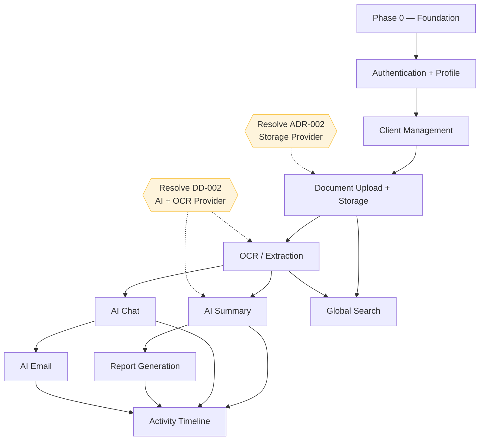
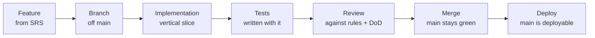

# Implementation Plan — LedgerAI MVP

> **Status:** Draft v1
> **Owner:** Founding Engineer / Principal Engineering Manager
> **Last updated:** 2026-07-14
> **Upstream (frozen):
** [Product Vision](../00-product/PRODUCT_VISION.md) · [Product Decisions](../00-product/PRODUCT_DECISIONS.md) · [PRD](../00-product/PRD.md) · [SRS](../00-product/SRS.md) · [Architecture](../01-architecture/ARCHITECTURE.md) · [Database](../01-architecture/DATABASE.md) · [API Spec](../01-architecture/API_SPEC.md) · [Security](../01-architecture/SECURITY.md) · [AI Architecture](../01-architecture/AI_ARCHITECTURE.md) · [ADRs](../01-architecture/decisions/)
> **Related:
** [TESTING_STRATEGY](./TESTING_STRATEGY.md) · [DEPLOYMENT](./DEPLOYMENT.md) · [LESSONS_LEARNED](./LESSONS_LEARNED.md)

---

## 1. Purpose

### Why this document exists

The architecture answers *what to build* and *how it is structured*. This document answers a different question:

> **In what order should we build the system?**

It is the **primary execution guide** for LedgerAI's development — practical enough that Claude Code (and any engineer)
can pick it up and know what to build next, what "done" means, and what must not be skipped. It sequences the twelve MVP
modules into phases and milestones that each leave the application in a **working, demonstrable state**.

### Relationship to architecture

This plan **executes** the frozen architecture; it never redefines it. Every phase implements modules exactly as
specified
in [SRS §4](../00-product/SRS.md#4-functional-requirements), [ARCHITECTURE](../01-architecture/ARCHITECTURE.md),
[DATABASE](../01-architecture/DATABASE.md), and [API_SPEC](../01-architecture/API_SPEC.md). Where the architecture left
a
decision **deferred** (storage provider, AI provider, background processing), this plan marks *when* that decision must
be
resolved before the dependent phase can proceed.

### Relationship to milestones

Phases (§3) are the **build sequence**; milestones (§4) are the **checkpoints** that prove progress with a demo. They
align with the milestone outline in [README](../../README.md) and detailed in [§4](#4-milestones). A phase completes
when its modules meet their completion criteria; a milestone is reached when a specific, demoable capability works
end-to-end.

---

## 2. Engineering Principles

The plan is built on a **vertical-slice, finish-before-expanding** philosophy. Each principle earns its place:

| Principle                                                   | Why                                                                                                                                                                                                             |
|-------------------------------------------------------------|-----------------------------------------------------------------------------------------------------------------------------------------------------------------------------------------------------------------|
| **Vertical slices over horizontal layers**                  | Build a feature end-to-end (DB → service → API → UI → tests) before starting the next, so value is demonstrable early and integration risk is paid down continuously — not deferred to a big-bang integration.  |
| **Working software over partially finished infrastructure** | Every phase leaves `main` runnable and demoable. We avoid half-built layers that can't be exercised or validated.                                                                                               |
| **Small pull requests**                                     | Small changes are reviewable, testable, and revertible; large PRs hide defects and stall review.                                                                                                                |
| **Test as you build**                                       | Tests written with the feature pin behavior while it's fresh and keep regressions out ([SRS §Testing intent](../00-product/PRD.md#8-functional-requirements)); retrofitting tests later is costlier and weaker. |
| **Keep `main` deployable**                                  | A always-green main branch means we can ship or demo at any moment and isolates breakage to short-lived branches.                                                                                               |
| **One feature at a time**                                   | Concurrency across half-finished features multiplies integration and context-switching cost; sequential finishing keeps focus and quality.                                                                      |
| **Finish before expanding**                                 | A feature is only "done" at its full Definition of Done (§7) — not "the happy path works." Unfinished features accrue silent debt.                                                                              |

> These principles operationalize the product's own bias: **lightweight over feature-heavy**, quality over surface area
> ([Vision §8](../00-product/PRODUCT_VISION.md#8-product-principles)).

---

## Engineering Rules

Non-negotiable rules that keep implementation aligned with the frozen architecture. They exist because the most common
way
a well-designed system decays is a series of individually-small shortcuts; binding every change to these rules preserves
integrity as the codebase grows.

- **Never implement undocumented features.** If it isn't in the [SRS](../00-product/SRS.md)/[PRD](../00-product/PRD.md),
  it isn't built until it is documented and approved — this is how scope creep and boundary violations are prevented
  ([Product Boundaries](../00-product/PRODUCT_DECISIONS.md#2-product-boundaries)).
- **Never bypass the architecture.** Respect module boundaries, layering, and the ports/adapters seam
  ([Guiding Architectural Rules](../01-architecture/ARCHITECTURE.md#guiding-architectural-rules)).
- **Every database change requires migration review.** Schema changes follow the
  [Migration Strategy](../01-architecture/DATABASE.md#database-migration-strategy) — additive, reversible, reviewed.
- **Every API change updates [API_SPEC.md](../01-architecture/API_SPEC.md).** The contract and the code never diverge.
- **Every architectural change requires an ADR** ([decisions/](../01-architecture/decisions/)).
- **Every security-sensitive change references [SECURITY.md](../01-architecture/SECURITY.md)** and the
  [Security Review Process](../01-architecture/SECURITY.md#security-review-process).
- **Every AI change references [AI_ARCHITECTURE.md](../01-architecture/AI_ARCHITECTURE.md)** and its
  [AI Review Process](../01-architecture/AI_ARCHITECTURE.md#ai-review-process).
- **Refactor only with tests.** No behavior-changing refactor lands without tests guarding the behavior first.
- **Keep modules independent.** Cross-module interaction goes through published services, never internals.
- **Preserve backward compatibility whenever possible.** Follow the
  API [versioning](../01-architecture/API_SPEC.md#20-api-versioning-strategy)
  and [lifecycle](../01-architecture/API_SPEC.md#api-lifecycle) policies; breaking changes are deliberate and versioned.

> **Why these are rules, not suggestions:** they are the enforcement layer for decisions already ratified upstream. A
> violation here silently contradicts a frozen document — exactly what the whole documentation-first process exists to
> prevent.

---

## 3. Build Order

Phases are strictly ordered by the [feature dependency graph](../00-product/PRD.md#feature-dependency-overview):
identity
→ organization → documents → understanding → AI actions → cross-cutting. Each phase is a set of **vertical slices** and
ends in a working state.

### Phase 0 — Foundation

- **Goal:** A runnable, deployable skeleton with nothing to demo yet but everything wired.
- **Work:** Repository setup; backend scaffold (modular-monolith package skeleton
  per [ARCHITECTURE §5](../01-architecture/ARCHITECTURE.md#5-backend-architecture)); frontend scaffold (feature-first
  per [ADR-007](../01-architecture/decisions/ADR-007-Frontend-Architecture.md)); Docker for local dev; CI (build + test
  gate); environment/secret configuration ([SECURITY §13](../01-architecture/SECURITY.md#13-secrets-management));
  OpenAPI wiring (PD-013); database connectivity to
  PostgreSQL/Neon ([ADR-004](../01-architecture/decisions/ADR-004-Primary-Database.md)).
- **Dependencies:** None.
- **Completion criteria:** `main` builds; CI is green; the app boots locally and in a deployed environment; a health
  endpoint responds; secrets are externalized. No product features yet.

### Phase 1 — Authentication & Profile

- **Goal:** A user can register, sign in, stay signed in, and manage their profile.
- **Features:** Authentication ([SRS §4.1](../00-product/SRS.md#41-authentication-auth)); JWT access + refresh tokens
  with
  rotation ([ADR-001](../01-architecture/decisions/ADR-001-Authentication-Strategy.md), [SECURITY §4](../01-architecture/SECURITY.md#4-authentication));
  User Profile ([SRS §4.2](../00-product/SRS.md#42-user-profile-prof)).
- **Dependencies:** Phase 0.
- **Completion criteria:** Register/login/refresh/logout work end-to-end; protected routes reject unauthenticated
  access ([FR-AUTH-006](../00-product/SRS.md#41-authentication-auth)); passwords BCrypt-hashed; refresh tokens hashed +
  rotated; profile view/edit persists; tests cover auth success/failure and
  validation ([VR-001/002/003](../00-product/SRS.md#6-validation-rules)).

### Phase 2 — Client Management

- **Goal:** A signed-in professional can organize work by client.
- **Features:** Client CRUD + archive ([SRS §4.3](../00-product/SRS.md#43-client-management-clnt)); input
  validation ([VR-004](../00-product/SRS.md#6-validation-rules)); **ownership enforcement
  ** ([BR-004](../00-product/SRS.md#5-business-rules), [SECURITY §5](../01-architecture/SECURITY.md#5-authorization)).
- **Dependencies:** Phase 1 (identity/ownership).
- **Completion criteria:** Create/list/get/edit/archive clients; every access owner-scoped (cross-user → `404`); archive
  retains data ([BR-002](../00-product/SRS.md#5-business-rules)); `CLIENT_CREATED` activity recorded; tests cover
  ownership isolation and validation.

### Phase 3 — Documents, Storage & OCR

- **Goal:** A professional can upload a document, have it stored securely, and get its text extracted and marked Ready.
- **Features:** Document Upload ([SRS §4.4](../00-product/SRS.md#44-document-upload-upld)); Document Storage in external
  object store ([ADR-008](../01-architecture/decisions/ADR-008-Object-Storage.md)); OCR / native
  extraction ([SRS §4.6](../00-product/SRS.md#46-ocr-ocr), [ADR-009](../01-architecture/decisions/ADR-009-OCR-Strategy.md));
  document lifecycle status tracking ([SRS §7.1](../00-product/SRS.md#71-document-lifecycle)).
- **Dependencies:** Phase 2; *
  *resolve [ADR-002 Storage Provider](../01-architecture/decisions/ADR-002-Storage-Provider.md) (DD-001) before starting
  **; select OCR provider ([DD-002](../00-product/PRODUCT_DECISIONS.md#4-deferred-decisions)).
- **Completion criteria:** Upload with type/size validation ([VR-005](../00-product/SRS.md#6-validation-rules)); binary
  in storage, reference + metadata in DB; extraction runs and drives `READY`/`FAILED`; status
  visible/pollable ([API_SPEC §9.1](../01-architecture/API_SPEC.md#91-get-ocr-status)); delete removes from all
  surfaces ([BR-012/013](../00-product/SRS.md#5-business-rules)); tests cover upload validation, lifecycle transitions,
  ownership.

### Phase 4 — AI Capabilities

- **Goal:** A professional can act on a Ready document with AI: summarize, ask, draft an email, generate a report.
- **Features:** AI Summary ([SRS §4.7](../00-product/SRS.md#47-ai-summary-summ)); AI
  Chat ([§4.8](../00-product/SRS.md#48-ai-chat-chat)); AI
  Email ([§4.9](../00-product/SRS.md#49-ai-email-generation-email)); Report
  Generation ([§4.10](../00-product/SRS.md#410-report-generation-rpt)) — all via the AI
  port ([ADR-003](../01-architecture/decisions/ADR-003-AI-Provider-Abstraction.md)) with the AI Request
  lifecycle ([ADR-010](../01-architecture/decisions/ADR-010-AI-Request-Lifecycle.md)).
- **Dependencies:** Phase 3 (Ready documents); **resolve AI
  provider ([DD-002](../00-product/PRODUCT_DECISIONS.md#4-deferred-decisions)) before starting**.
- **Completion criteria:** Each action works only on `READY`
  documents ([BR-010](../00-product/SRS.md#5-business-rules)); outputs
  grounded ([BR-030](../00-product/SRS.md#5-business-rules)),
  editable ([BR-031](../00-product/SRS.md#5-business-rules)), review-required; email is drafted, **never sent
  ** ([BR-034](../00-product/SRS.md#5-business-rules)); reports
  single-document ([BR-035](../00-product/SRS.md#5-business-rules)); async-ready (`201`/`202`+poll); failures degrade
  gracefully ([AI_ARCHITECTURE §12](../01-architecture/AI_ARCHITECTURE.md#12-ai-failure-handling)); no sensitive content
  logged ([§14](../01-architecture/AI_ARCHITECTURE.md#14-ai-observability)); tests cover grounding-precondition, failure
  paths, and ownership.

### Phase 5 — Search, Timeline & Launch

- **Goal:** The MVP is complete, findable, traceable, polished, and deployed.
- **Features:** Global
  Search ([SRS §4.11](../00-product/SRS.md#411-global-search-srch), [ADR-014](../01-architecture/decisions/ADR-014-Search-Strategy.md));
  Activity Timeline ([§4.12](../00-product/SRS.md#412-activity-timeline-tmln)); UX polish; production
  deployment ([ADR-012](../01-architecture/decisions/ADR-012-Deployment-Strategy.md)); baseline
  observability ([ADR-015](../01-architecture/decisions/ADR-015-Observability.md)).
- **Dependencies:** Phases 1–4 (search indexes content; timeline records their actions).
- **Completion criteria:** Owner-scoped search over content/metadata, excluding
  deleted ([BR-013](../00-product/SRS.md#5-business-rules)); read-only timeline with per-user/per-client
  views ([BR-016](../00-product/SRS.md#5-business-rules)); accessibility and error states
  polished ([NFR-011](../00-product/SRS.md#9-non-functional-requirements)); deployed to Vercel/Render/Neon; all twelve
  modules meet the [Definition of Done](#7-definition-of-done).

---

## 4. Milestones

Milestones are demoable checkpoints. Each maps to a point within the phases above.

| ID     | Milestone                   | Deliverables                                              | Acceptance criteria                                                      | Demo scenario                                                                                                              |
|--------|-----------------------------|-----------------------------------------------------------|--------------------------------------------------------------------------|----------------------------------------------------------------------------------------------------------------------------|
| **M1** | **Authentication complete** | Register/login/refresh/logout; profile; protected routing | Auth flows pass; unauthorized access blocked; tokens hashed/rotated      | Register a new professional, sign in, view/edit profile, sign out, confirm protected pages require login.                  |
| **M2** | **First document upload**   | Client management + document upload + storage             | A document uploads to a client, is stored, and appears with a status     | Create a client, upload a PDF to it, see it listed as processing/ready.                                                    |
| **M3** | **OCR working**             | Extraction pipeline + lifecycle                           | A scanned document reaches `READY` with extracted text; failures surface | Upload a scanned image; watch it move to Ready; upload an unreadable file and see a clear Failed state.                    |
| **M4** | **First AI summary**        | AI port + Summary capability                              | A Ready document yields a grounded, editable summary                     | Open a Ready document, generate a summary in seconds, edit it, and see it saved.                                           |
| **M5** | **First AI chat**           | Chat + (email/report as they land)                        | Grounded Q&A over a document; "not found" instead of fabrication         | Ask a document a question and get a grounded answer; ask something unsupported and see an honest "not found."              |
| **M6** | **Beta ready**              | Search + timeline + polish + deployment                   | All twelve modules meet Definition of Done; deployed and demoable        | End-to-end: sign in → client → upload → summarize → chat → email draft → report → search → review timeline, in production. |

> M1–M6 correspond to the README milestone outline; M6 = the MVP/beta
> of [PRD §15 "Must/Should Have"](../00-product/PRD.md#15-release-scope-moscow).

---

## 5. Dependency Graph

The graph mirrors [PRD's Feature Dependency Overview](../00-product/PRD.md#feature-dependency-overview): **Auth and
Clients unlock everything; Documents+OCR unlock all AI; AI outputs and documents feed Search and Timeline.** The dashed
nodes are the deferred decisions that gate their phases.

---

## 6. Development Workflow

Every feature follows the same path; each arrow is a gate, not a formality.

1. **Feature** — pick the next item from the current phase (one at a time).
2. **Branch** — short-lived feature branch off a green `main` (per the README branching strategy).
3. **Implementation** — a vertical slice: DB → service → API → UI, honoring the [Engineering Rules](#engineering-rules).
4. **Tests** — written alongside, covering business logic, validation, security/ownership, and key edge
   cases ([TESTING_STRATEGY](./TESTING_STRATEGY.md)).
5. **Review** — against the [Definition of Done](#7-definition-of-done), the Engineering Rules, and the
   relevant [Review Process](#review-process) triggers.
6. **Merge** — only when green; `main` remains deployable.
7. **Deploy** — `main` is always shippable; deployment is routine, not an event.

---

## 7. Definition of Done

A feature is **done** only when **all** of the following hold (this is the merge gate):

- [ ] **Requirements implemented** — matches its [SRS](../00-product/SRS.md) FRs, business rules, and validation.
- [ ] **Tests passing** — business logic, validation, security/ownership, and key edge cases covered and green.
- [ ] **Documentation updated** — user-facing/behavioral docs reflect the change.
- [ ] **Security considered** — checked against [SECURITY.md](../01-architecture/SECURITY.md); ownership enforced;
  nothing sensitive logged.
- [ ] **API updated (if needed)** — [API_SPEC.md](../01-architecture/API_SPEC.md) reflects any contract change.
- [ ] **Database migration reviewed (if needed)** — additive, reversible, per
  the [Migration Strategy](../01-architecture/DATABASE.md#database-migration-strategy).
- [ ] **ADR updated (if needed)** — any architectural decision recorded in [decisions/](../01-architecture/decisions/).
- [ ] **Ready for deployment** — `main` stays green and deployable.

> This mirrors the [Product Decisions Definition of Done](../00-product/PRODUCT_DECISIONS.md) and CLAUDE.md; "the happy
> path works" is **not** done.

---

## 8. Risks

| Risk                                         | Impact                          | Mitigation                                                                                                                                                                                                                                                                                                                                          |
|----------------------------------------------|---------------------------------|-----------------------------------------------------------------------------------------------------------------------------------------------------------------------------------------------------------------------------------------------------------------------------------------------------------------------------------------------------|
| **AI provider selection/integration delays** | Blocks Phase 4.                 | The AI **port** ([ADR-003](../01-architecture/decisions/ADR-003-AI-Provider-Abstraction.md)) lets Phases 0–3 proceed provider-agnostically; resolve DD-002 before Phase 4 with a benchmarking review.                                                                                                                                               |
| **OCR complexity / quality**                 | Poor extraction weakens all AI. | Native-first strategy ([ADR-009](../01-architecture/decisions/ADR-009-OCR-Strategy.md)); explicit Failed state + quality signals; provider behind a port; test with real scan samples early in Phase 3.                                                                                                                                             |
| **Scope creep**                              | Dilutes MVP, delays launch.     | Engineering Rule "never implement undocumented features"; [Product Boundaries](../00-product/PRODUCT_DECISIONS.md#2-product-boundaries) and the decision process gate every addition.                                                                                                                                                               |
| **Authentication bugs**                      | Security-critical.              | Build auth first (Phase 1) with focused security tests; follow [ADR-001](../01-architecture/decisions/ADR-001-Authentication-Strategy.md)/[SECURITY §4](../01-architecture/SECURITY.md#4-authentication); security review on any change.                                                                                                            |
| **Free-tier limits** (cold starts, quotas)   | Latency/capacity ceilings.      | Keep the monolith lightweight; async-ready design ([ADR-010](../01-architecture/decisions/ADR-010-AI-Request-Lifecycle.md)); vertical-then-extract scaling ([ARCHITECTURE §11](../01-architecture/ARCHITECTURE.md#11-scalability-strategy)); monitor via baseline observability ([ADR-015](../01-architecture/decisions/ADR-015-Observability.md)). |
| **Storage/DB divergence (orphaned files)**   | Cost, inconsistency.            | Compensating cleanup on failed upload/delete ([DATABASE §11](../01-architecture/DATABASE.md#11-transaction-boundaries)); reconciliation as a future job.                                                                                                                                                                                            |
| **Big-PR integration risk**                  | Hidden defects, stalled review. | Vertical slices + small PRs + always-green main.                                                                                                                                                                                                                                                                                                    |

---

## 9. Change Management

The frozen documents change only through deliberate updates. Update the relevant document **before or with** the code
that depends on it:

| Update…                                                                                                   | When                                                                                                                                                                                         |
|-----------------------------------------------------------------------------------------------------------|----------------------------------------------------------------------------------------------------------------------------------------------------------------------------------------------|
| **[PRD](../00-product/PRD.md)**                                                                           | Product scope/requirements change (a feature is added, cut, or redefined). Requires product approval; may cascade to SRS.                                                                    |
| **[SRS](../00-product/SRS.md)**                                                                           | Behavior, business rules, validation, or state models change. Follow [SRS §14 Requirement Versioning](../00-product/SRS.md#14-requirement-versioning) (new IDs, never renumber).             |
| **[ADRs](../01-architecture/decisions/)**                                                                 | Any significant architectural decision is made, superseded, or reversed — a new ADR (never edit a decided one's meaning).                                                                    |
| **[API_SPEC](../01-architecture/API_SPEC.md)**                                                            | Any endpoint, shape, status, or error changes. Follow [versioning](../01-architecture/API_SPEC.md#20-api-versioning-strategy) and [lifecycle](../01-architecture/API_SPEC.md#api-lifecycle). |
| **[DATABASE](../01-architecture/DATABASE.md)**                                                            | Any schema change — with a reviewed migration per the [Migration Strategy](../01-architecture/DATABASE.md#database-migration-strategy).                                                      |
| **[ARCHITECTURE](../01-architecture/ARCHITECTURE.md)**                                                    | Module boundaries, dependency direction, or style change — accompanied by an ADR.                                                                                                            |
| **[SECURITY](../01-architecture/SECURITY.md) / [AI_ARCHITECTURE](../01-architecture/AI_ARCHITECTURE.md)** | Any security- or AI-relevant change — via their respective review processes.                                                                                                                 |

> **Golden rule:** code and its governing document never diverge. A change that would contradict a frozen document
> requires updating that document first (with the appropriate approval), not working around it.

---

## Review Process

Quality is maintained by **continuous, triggered review** during development — not a single audit at the end. Certain
changes MUST trigger the corresponding review before merge:

| Trigger area     | Review focus                                                            | Reference                                                                                                                                       |
|------------------|-------------------------------------------------------------------------|-------------------------------------------------------------------------------------------------------------------------------------------------|
| **Architecture** | Boundaries, dependency direction, style; is an ADR needed?              | [ARCHITECTURE](../01-architecture/ARCHITECTURE.md), [Guiding Rules](../01-architecture/ARCHITECTURE.md#guiding-architectural-rules)             |
| **Database**     | Migration safety (additive/reversible), integrity, indexing             | [Migration Strategy](../01-architecture/DATABASE.md#database-migration-strategy)                                                                |
| **API**          | Contract consistency, versioning/compatibility, ownership, errors       | [API Design Rules](../01-architecture/API_SPEC.md#api-design-rules)                                                                             |
| **Security**     | Authn/authz, ownership, data exposure, secrets, upload/AI privacy       | [Security Review Process](../01-architecture/SECURITY.md#security-review-process)                                                               |
| **AI**           | Grounding, hallucination risk, privacy, prompt/provider/context changes | [AI Review Process](../01-architecture/AI_ARCHITECTURE.md#ai-review-process)                                                                    |
| **Performance**  | Latency, non-blocking async, free-tier limits, query/index cost         | [NFR-001/002](../00-product/SRS.md#9-non-functional-requirements), [ARCHITECTURE §14](../01-architecture/ARCHITECTURE.md#14-architecture-risks) |

**Every review produces one of these outcomes:**

- **Approval** — meets the Definition of Done and the rules; merge.
- **Requested changes** — specific fixes required before merge.
- **ADR creation** — the change embodies an architectural decision that must be recorded.
- **Documentation updates** — a frozen document must be updated to match (
  per [Change Management](#9-change-management)).

**Implementation quality is preserved through continuous review woven into the development workflow — not through large,
end-of-project audits.** Small, reviewed changes keep the system aligned with its architecture at every step; deferring
scrutiny to the end is how drift becomes irreversible.

---

## 10. Success Criteria

The MVP is **complete** when:

- **All twelve modules** are implemented and each meets
  the [Definition of Done](#7-definition-of-done) ([PRD §8](../00-product/PRD.md#8-functional-requirements)).
- **Milestone M6 ("Beta ready")** is achieved — the full loop (sign in → client → upload → understand → act → search →
  timeline) works **in production** ([ADR-012](../01-architecture/decisions/ADR-012-Deployment-Strategy.md)).
- **The MoSCoW "Must Have" and "Should Have"** scope is delivered; no "Won't Have (V1)" item was
  built ([PRD §15](../00-product/PRD.md#15-release-scope-moscow)).
- **The core promise holds:** a professional can genuinely go *from hours to minutes* on a real document — the product
  delivers its [value proposition](../00-product/PRODUCT_VISION.md#7-value-proposition) and honors
  every [product principle](../00-product/PRODUCT_VISION.md#8-product-principles) (grounded, human-in-the-loop,
  confidential, companion-not-replacement).
- **No product boundary was crossed** and **no frozen document was contradicted** along the way.

At that point LedgerAI is ready for beta — the validation goal of [PRD BG-1](../00-product/PRD.md#4-goals).

---

*This plan governs execution order; it does not restate or override the architecture. It MUST remain consistent with the
frozen Product Vision, Product Decisions, PRD, SRS, Architecture, Database, API Spec, Security, AI Architecture, and
ADRs.
Detailed testing, deployment, and contribution practices live in their own documents under [`03-engineering/`](.).*
