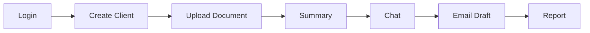

# Testing Strategy — LedgerAI MVP

> **Status:** Draft v1
> **Owner:** Founding Engineer / Principal QA Architect
> **Last updated:** 2026-07-14
> **Upstream (frozen):
> ** [PRD](../00-product/PRD.md) · [SRS](../00-product/SRS.md) · [Architecture](../01-architecture/ARCHITECTURE.md) · [Database](../01-architecture/DATABASE.md) · [API Spec](../01-architecture/API_SPEC.md) · [Security](../01-architecture/SECURITY.md) · [AI Architecture](../01-architecture/AI_ARCHITECTURE.md)
> **Related:
> ** [IMPLEMENTATION_PLAN](./IMPLEMENTATION_PLAN.md) · [CLAUDE.md](../../CLAUDE.md) · [IMPLEMENTATION_STATUS](./IMPLEMENTATION_STATUS.md)

---

## 1. Purpose

### Why this document exists

This document defines **how LedgerAI is tested** throughout development — the philosophy, responsibilities, layers, and
quality gates every feature must pass to be considered complete. It is **not** a framework guide and contains **no test
code or library recommendations**; it defines *what* to verify and *why*, not *how* to wire a test runner.

### Relationship to Definition of Done

Testing is a **required condition** of "done." The [Definition of Done](./IMPLEMENTATION_PLAN.md#7-definition-of-done)
and [CLAUDE.md §9](../../CLAUDE.md) both require passing tests before merge; this document specifies *what those tests
must cover* and defines [Definition of Test Complete](#14-definition-of-test-complete) as the testing-specific gate.

### Relationship to Implementation Plan

The plan mandates **test-as-you-build** and vertical slices
([PLAN §2](./IMPLEMENTATION_PLAN.md#2-engineering-principles)). This document operationalizes that: each slice ships
with the tests appropriate to its layer, written alongside the feature — never retrofitted.

### Relationship to CLAUDE.md

[CLAUDE.md](../../CLAUDE.md) makes tests a merge gate and forbids behavior-changing refactors without tests. This
strategy is the detailed backing for those rules.

---

## 2. Testing Philosophy

| Principle                                             | Why it exists                                                                                                                                                                                  |
|-------------------------------------------------------|------------------------------------------------------------------------------------------------------------------------------------------------------------------------------------------------|
| **Test behavior, not implementation.**                | Tests should survive refactors. Coupling tests to internal structure makes them brittle and discourages improvement; testing observable behavior keeps them durable and meaningful.            |
| **Prevent regressions.**                              | The chief long-term value of a test suite is catching *re-broken* behavior. Every passing test is a guarantee that keeps holding as the code changes.                                          |
| **Small, fast tests first.**                          | Fast unit tests give tight feedback and run on every change; they catch most defects cheaply. Slower tests are reserved for what genuinely needs them.                                         |
| **Confidence over coverage percentage.**              | Coverage is a proxy, not a goal. A high number with weak assertions is false comfort; we optimize for *justified confidence* that behavior is correct, especially business rules and security. |
| **Every bug becomes a test.**                         | A bug proves a missing test. Encoding each fix as a regression test ensures it never returns and gradually hardens the suite where it has historically been weak.                              |
| **Automation first.**                                 | Repeatable checks belong to machines; automated tests run consistently on every change and gate merges without human effort.                                                                   |
| **Human exploratory testing complements automation.** | Automation verifies known expectations; humans find the unknown — confusing flows, odd inputs, trust issues with AI output. The two are complementary, not substitutes.                        |

---

## Testing Rules

Non-negotiable rules for every test in LedgerAI:

- Every feature **MUST** include tests appropriate to its layer.
- Every bug fix **MUST** include a regression test that fails without the fix.
- Tests **MUST** be deterministic — no reliance on time, ordering, randomness, or network flakiness.
- Tests **MUST** be isolated — independent of each other; no shared mutable state or execution-order dependency.
- Tests **MUST** be repeatable — the same result on every run, locally and in CI.
- Tests **MUST NEVER** depend on production services, data, or credentials.
- **Mock only external boundaries** (AI/OCR/Storage providers, and only where necessary) — never mock the code under
  test or internal collaborators you should be exercising.
- Business logic **SHOULD** have the highest test coverage and the strongest assertions.
- AI prompts **SHOULD** be evaluated separately from application logic (see [§7](#7-ai-testing-strategy)).

> These rules ensure **long-term confidence as the codebase grows**. Deterministic, isolated, boundary-honest tests stay
> trustworthy at scale; flaky or over-mocked tests erode trust until the suite is ignored — the worst outcome, because a
> distrusted suite protects nothing.

---

## 3. Test Pyramid

LedgerAI follows a **pyramid**: many fast unit tests at the base, progressively fewer, broader tests above, with **AI
Evaluation as a separate track** alongside (because AI output is probabilistic and cannot be asserted like deterministic
code).

```mermaid
flowchart TB
subgraph Pyramid["Test Pyramid (deterministic)"]
E2E[End-to-End Tests<br/>few · full user journeys]
API[API Tests<br/>contract · auth · ownership · errors]
INT[Integration Tests<br/>DB · repositories · security · modules]
UNIT[Unit Tests<br/>many · services · rules · validators]
E2E --- API --- INT --- UNIT
end
AIEVAL[[AI Evaluation<br/>separate track · grounding · hallucination · quality]]
Pyramid -. complemented by . - AIEVAL
```

| Layer                   | Responsibility                                                                                                                          |
|-------------------------|-----------------------------------------------------------------------------------------------------------------------------------------|
| **Unit Tests**          | Verify business logic, rules, validators, mappers in isolation. The fast, broad base ([§4](#4-unit-testing-strategy)).                  |
| **Integration Tests**   | Verify components working together — persistence, transactions, security, module interaction ([§5](#5-integration-testing-strategy)).   |
| **API Tests**           | Verify the HTTP contract: validation, auth, ownership, errors, pagination ([§6](#6-api-testing-strategy)).                              |
| **End-to-End Tests**    | Verify complete user journeys across the running system ([§9](#9-end-to-end-testing)). Few and high-value.                              |
| **AI Evaluation Tests** | Verify AI *output quality* (grounding, hallucination, format) — a **separate**, non-deterministic track ([§7](#7-ai-testing-strategy)). |

Effort concentrates at the base (cheap, fast, precise); higher layers are fewer but broader. AI evaluation is
deliberately off the deterministic pyramid.

---

## 4. Unit Testing Strategy

Unit tests are the foundation and carry the **highest coverage expectation** ([Testing Rules](#testing-rules)).

| Target                        | What to verify                                                                                                                                                                                                                                            |
|-------------------------------|-----------------------------------------------------------------------------------------------------------------------------------------------------------------------------------------------------------------------------------------------------------|
| **Services (business logic)** | The core: business rules ([SRS §5](../00-product/SRS.md#5-business-rules)), orchestration decisions, state transitions ([SRS §7](../00-product/SRS.md#7-state-models)), ownership enforcement, and error paths — with external boundaries (ports) mocked. |
| **Validators**                | Every validation rule ([SRS §6](../00-product/SRS.md#6-validation-rules)) — valid input accepted, invalid rejected with the right outcome.                                                                                                                |
| **Business Rules**            | Each BR exercised directly (e.g., only `READY` documents summarizable, [BR-010](../00-product/SRS.md#5-business-rules); AI output editable, [BR-031](../00-product/SRS.md#5-business-rules)).                                                             |
| **Utility classes**           | Pure helpers with clear inputs/outputs and edge cases.                                                                                                                                                                                                    |
| **Mappers (entity ↔ DTO)**    | Correct field mapping; crucially, that **sensitive/internal fields never leak** into DTOs ([API_SPEC §17](../01-architecture/API_SPEC.md#17-common-dtos)).                                                                                                |

**Should be unit tested:** anything with logic, branching, rules, or transformation. **Should NOT be unit tested:**
trivial getters/setters, framework glue, or configuration with no logic — testing this adds maintenance cost without
confidence. Prefer integration tests where the value *is* the wiring.

---

## 5. Integration Testing Strategy

Integration tests verify that components work together against real infrastructure (a real database, not mocks) where
that interaction is the point.

| Area                   | What to verify                                                                                                                                                                                            |
|------------------------|-----------------------------------------------------------------------------------------------------------------------------------------------------------------------------------------------------------|
| **Database**           | Schema constraints hold — foreign keys, unique constraints, `CHECK`s, `citext` uniqueness ([DATABASE §10](../01-architecture/DATABASE.md#10-data-integrity-rules)).                                       |
| **Repositories**       | Queries return correct, **owner-scoped** results; soft-deleted rows are excluded ([DATABASE §8](../01-architecture/DATABASE.md#8-soft-delete-strategy), [BR-013](../00-product/SRS.md#5-business-rules)). |
| **Transactions**       | Atomic units commit/rollback as specified ([DATABASE §11](../01-architecture/DATABASE.md#11-transaction-boundaries)); provider I/O sits outside the transaction.                                          |
| **Security**           | Authn/authz enforced across the stack; ownership checks actually block cross-user access ([SECURITY §5](../01-architecture/SECURITY.md#5-authorization)).                                                 |
| **API layer**          | Controllers, validation, serialization, and error handling wired correctly end-to-end within the backend.                                                                                                 |
| **Module integration** | Cross-module interactions go **only through published services** and behave correctly ([ARCHITECTURE §5.4](../01-architecture/ARCHITECTURE.md#5-backend-architecture)).                                   |

---

## 6. API Testing Strategy

API tests verify the **contract** in [API_SPEC.md](../01-architecture/API_SPEC.md) — what clients actually depend on.

| Aspect                                | What to verify                                                                                                                                           |
|---------------------------------------|----------------------------------------------------------------------------------------------------------------------------------------------------------|
| **Request validation**                | Invalid requests → `422` with field-level `validationErrors` ([API_SPEC §18](../01-architecture/API_SPEC.md#18-validation)).                             |
| **Authentication**                    | Protected endpoints reject missing/invalid tokens → `401` ([BR-020](../00-product/SRS.md#5-business-rules)).                                             |
| **Authorization / Ownership**         | A user cannot access another user's resources; non-owned → `404` (existence not leaked) ([SECURITY §5](../01-architecture/SECURITY.md#5-authorization)). |
| **Error responses / Problem Details** | Errors conform to RFC 7807 with no stack traces/internals ([API_SPEC §2.12](../01-architecture/API_SPEC.md#212-error-model--rfc-7807-problem-details)).  |
| **Pagination**                        | `page`/`size`/`sort` behave; `PageResponse` metadata correct ([API_SPEC §2.5](../01-architecture/API_SPEC.md#25-pagination)).                            |
| **Search**                            | Owner-scoped; excludes deleted; sensible empty state ([API_SPEC §14](../01-architecture/API_SPEC.md#14-search-module-search)).                           |
| **Soft-delete behavior**              | Deleted documents disappear from listings, search, and AI actions ([BR-012/013](../00-product/SRS.md#5-business-rules)).                                 |
| **Async-ready generation**            | Both `201` (sync) and `202`+poll (async) paths behave per contract ([API_SPEC §2.11](../01-architecture/API_SPEC.md#211-async-ready-behavior)).          |

---

## 7. AI Testing Strategy

> **AI testing is split into two distinct kinds** and MUST NOT be conflated. Application tests are **deterministic** and
> verify the *machinery* around the model; AI evaluation is **non-deterministic** and assesses *output quality*. See
> [AI_ARCHITECTURE §Evaluation Strategy](../01-architecture/AI_ARCHITECTURE.md#ai-evaluation-strategy).

### 7.1 Application Tests (deterministic)

Verify the pipeline around the model, with the **AI provider mocked at the port
** ([ADR-003](../01-architecture/decisions/ADR-003-AI-Provider-Abstraction.md)):

- **Orchestration** — the AI Request lifecycle (`REQUESTED → IN_PROGRESS → COMPLETED | FAILED`) transitions correctly
  ([SRS §7.2](../00-product/SRS.md#72-ai-request-lifecycle)); actions only run on `READY`
  documents ([BR-010](../00-product/SRS.md#5-business-rules)).
- **Prompt construction** — prompts assemble from the correct separated channels
  ([AI_ARCHITECTURE §8](../01-architecture/AI_ARCHITECTURE.md#8-prompt-architecture)) with only the minimal necessary
  content ([NFR-018](../00-product/SRS.md#9-non-functional-requirements)).
- **Provider abstraction** — business logic calls the **port**, never a provider SDK; adapters map
  requests/responses/errors correctly.
- **Retries** — bounded retry on transient failure; graceful `FAILED` beyond the limit
  ([AI_ARCHITECTURE §11–12](../01-architecture/AI_ARCHITECTURE.md#11-ai-output-validation)).
- **Output validation** — empty/malformed/unsafe outputs are rejected, never persisted as success
  ([AI_ARCHITECTURE §11](../01-architecture/AI_ARCHITECTURE.md#11-ai-output-validation)).

These are ordinary deterministic tests using **stubbed** provider responses — no live provider calls.

### 7.2 AI Evaluation (non-deterministic)

Assess the **quality** of real AI output on curated inputs, as a **separate track** run deliberately (e.g., before a
provider/model/prompt change), not on every unit-test run:

- **Grounding** — outputs reflect the source document ([BR-030](../00-product/SRS.md#5-business-rules)).
- **Hallucination** — rate of unsupported claims; honest "not found" over fabrication
  ([BR-033](../00-product/SRS.md#5-business-rules)).
- **Formatting** — output conforms to the expected shape per capability.
- **Acceptance rate** — how often output is usable as-is vs. heavily edited
  ([PRD §11](../00-product/PRD.md#11-success-metrics)).
- **Latency** — response time against expectations ([NFR-001/002](../00-product/SRS.md#9-non-functional-requirements)).
- **Consistency** — stability of quality across repeated runs and releases.

Provider/model/prompt changes MUST be evaluated before rollout
([AI Review Process](../01-architecture/AI_ARCHITECTURE.md#ai-review-process)).

---

## 8. UI Testing Strategy

Frontend testing focuses on user-observable behavior, not internal component structure.

| Area                  | What to verify                                                                                                                                            |
|-----------------------|-----------------------------------------------------------------------------------------------------------------------------------------------------------|
| **Component testing** | Components render correctly for given inputs/states; presentational components stay predictable.                                                          |
| **User interaction**  | Clicks, inputs, and flows produce the expected outcomes.                                                                                                  |
| **Forms**             | Client-side validation feedback matches the rules; submission behaves; server errors surface clearly.                                                     |
| **Routing**           | Public vs. protected routes; unauthenticated access redirects to sign-in ([FR-AUTH-006](../00-product/SRS.md#41-authentication-auth)).                    |
| **Error states**      | Backend/RFC 7807 errors render as clear, non-technical messages ([SRS §8](../00-product/SRS.md#8-error-handling)).                                        |
| **Loading states**    | Long-running AI/OCR operations show progress and never block the UI ([NFR-002](../00-product/SRS.md#9-non-functional-requirements), async-ready polling). |
| **Accessibility**     | Core flows meet accessibility expectations — keyboard nav, labels, contrast ([NFR-011](../00-product/SRS.md#9-non-functional-requirements)).              |

> Client-side validation is a **UX aid only** and is never trusted for
> security ([SECURITY Design Rules](../01-architecture/SECURITY.md#security-design-rules)); the server remains
> authoritative.

---

## 9. End-to-End Testing

A small number of E2E tests exercise complete journeys against the running system, proving the modules integrate into
the product's core loop.



**Primary journey:** Login → Create Client → Upload Document → (process to `READY`) → Summary → Chat → Email draft →
Report — the product's headline flow ([PRD §7](../00-product/PRD.md#7-user-journey)).

**Success criteria:** each step completes and hands off to the next; data stays **owner-scoped** throughout; AI outputs
appear grounded, editable, and review-required; failures degrade gracefully with clear states; the journey works in a
production-like environment (the M6 demo, [PLAN §4](./IMPLEMENTATION_PLAN.md#4-milestones)). E2E tests are kept few and
high-value — they are the slowest and most brittle layer, so they cover *journeys*, not permutations.

---

## 10. Performance Testing

High-level only; **no benchmarks or numeric targets** here (those live in NFRs/architecture as they are established).

| Area                   | Focus                                                                                                                                                                   |
|------------------------|-------------------------------------------------------------------------------------------------------------------------------------------------------------------------|
| **API latency**        | Interactive endpoints feel responsive; nothing blocks the UI ([NFR-001](../00-product/SRS.md#9-non-functional-requirements)).                                           |
| **AI latency**         | AI operations complete within expectation or clearly show progress; long work is async-ready ([ADR-010](../01-architecture/decisions/ADR-010-AI-Request-Lifecycle.md)). |
| **Upload performance** | Large documents upload and process without blocking or timing out ([DATABASE §14](../01-architecture/DATABASE.md#14-risks)).                                            |
| **Search performance** | Full-text search stays responsive as content grows ([ADR-014](../01-architecture/decisions/ADR-014-Search-Strategy.md)).                                                |

Performance is validated qualitatively for the MVP (responsive, non-blocking, no obvious regressions); formal load
testing is a future addition as scale demands.

---

## 11. Security Testing

Security is verified explicitly, not assumed. See [SECURITY.md](../01-architecture/SECURITY.md) and its
[threat model](../01-architecture/SECURITY.md#3-threat-model).

| Area                    | What to verify                                                                                                                                                                               |
|-------------------------|----------------------------------------------------------------------------------------------------------------------------------------------------------------------------------------------|
| **Authentication**      | Invalid/expired/missing tokens rejected; non-revealing failures ([BR-020](../00-product/SRS.md#5-business-rules)); rate-limiting on repeated attempts.                                       |
| **Authorization**       | Role/ownership enforced on every protected path; fail closed.                                                                                                                                |
| **File uploads**        | Type/size validation; unsafe/oversized files rejected; path-traversal-safe filename handling ([SECURITY §9](../01-architecture/SECURITY.md#9-file-upload-security)).                         |
| **Input validation**    | Boundary validation blocks malformed/oversized input ([SRS §6](../00-product/SRS.md#6-validation-rules)).                                                                                    |
| **Injection**           | Parameterized data access; malicious input cannot alter queries/behavior (T-09).                                                                                                             |
| **Ownership isolation** | A user provably cannot read/modify another user's clients, documents, AI artifacts, or activity ([BR-004](../00-product/SRS.md#5-business-rules)) — the single most important security test. |

Security-sensitive changes trigger
the [Security Review Process](../01-architecture/SECURITY.md#security-review-process).

---

## 12. Test Data Strategy

| Aspect                  | Rule                                                                                                                                                                                                                      |
|-------------------------|---------------------------------------------------------------------------------------------------------------------------------------------------------------------------------------------------------------------------|
| **Synthetic data**      | Tests use **synthetic** users, clients, and documents — generated, not real.                                                                                                                                              |
| **Financial documents** | Use representative but **fabricated** financial documents (statements, invoices, notices) covering common shapes.                                                                                                         |
| **OCR samples**         | Include native-text PDFs, clean scans, and poor scans to exercise both extraction paths and the Failed path ([ADR-009](../01-architecture/decisions/ADR-009-OCR-Strategy.md)).                                            |
| **Edge cases**          | Empty files, oversized files, unsupported types, blank/low-quality scans, very long documents, unanswerable questions.                                                                                                    |
| **Sensitive data**      | Test data MUST NOT contain real PII or real client financials.                                                                                                                                                            |
| **Production data**     | **Production customer data MUST NOT be used for testing**, ever — a hard privacy boundary ([NFR-010](../00-product/SRS.md#9-non-functional-requirements), [SECURITY §10](../01-architecture/SECURITY.md#10-ai-security)). |

---

## 13. Test Environments

| Environment | Purpose                                                                                                                                                                                                              |
|-------------|----------------------------------------------------------------------------------------------------------------------------------------------------------------------------------------------------------------------|
| **Local**   | Fast developer feedback — unit and integration tests run locally on every change; no dependence on shared or production services.                                                                                    |
| **CI**      | The automated gate — the full deterministic suite (unit, integration, API, and E2E where feasible) runs on every change and **must be green to merge** ([PLAN §6](./IMPLEMENTATION_PLAN.md#6-development-workflow)). |
| **Staging** | A production-like environment for end-to-end verification, exploratory testing, and AI evaluation against real providers before release.                                                                             |

Environments are isolated; none uses production data or credentials ([§12](#12-test-data-strategy)).

---

## 14. Definition of Test Complete

A feature is **tested complete** when **all** apply (the testing gate within
the [Definition of Done](./IMPLEMENTATION_PLAN.md#7-definition-of-done)):

- [ ] **Required unit tests exist** — business logic, rules, validators, mappers, with strong assertions.
- [ ] **Integration tests pass** — persistence, transactions, security, module interaction.
- [ ] **API tests pass** — validation, auth, ownership, errors, pagination (where the feature has an API).
- [ ] **Security tests considered** — ownership isolation and relevant threats exercised.
- [ ] **AI evaluation completed** — where the feature is AI-facing ([§7.2](#72-ai-evaluation-non-deterministic)).
- [ ] **Regression tests added** — for any bug fixed along the way.
- [ ] **No critical failures remain** — the suite is green; no known critical defect ships.

---

## Test Review Process

Testing is reviewed **continuously**, alongside implementation — not audited at the end. These changes trigger a test
review before merge:

| Trigger              | Review focus                                                                                                                                           |
|----------------------|--------------------------------------------------------------------------------------------------------------------------------------------------------|
| **New features**     | Are the right layers tested? Business rules, validation, ownership, edge cases covered?                                                                |
| **Bug fixes**        | Is there a regression test that fails without the fix?                                                                                                 |
| **Security changes** | Are ownership isolation and the relevant threats tested? ([Security Review](../01-architecture/SECURITY.md#security-review-process))                   |
| **AI changes**       | Application tests updated; AI evaluation run for prompt/provider/model changes? ([AI Review](../01-architecture/AI_ARCHITECTURE.md#ai-review-process)) |
| **Database changes** | Constraints, migrations, and owner-scoped queries tested?                                                                                              |
| **API changes**      | Contract tests updated to match [API_SPEC](../01-architecture/API_SPEC.md); compatibility preserved?                                                   |

**Review outcomes:**

- **Approved** — test coverage and quality meet the bar; merge.
- **Additional tests required** — gaps must be filled before merge.
- **Regression tests required** — a fixed defect needs a guarding test.
- **Architectural review required** — the change implies a design decision needing an ADR or deeper review.

Testing **evolves continuously alongside implementation**: the suite grows with the code, hardens where bugs appear, and
is strengthened before any risky change — never treated as a one-time, end-of-project activity.

---

## 15. Testing Decision Summary

| Decision              | Chosen Approach                                       | Alternatives                      | Rationale                                                                                                                  |
|-----------------------|-------------------------------------------------------|-----------------------------------|----------------------------------------------------------------------------------------------------------------------------|
| **Test distribution** | **Test Pyramid** (many unit, fewer higher)            | Ice-cream cone (mostly E2E); flat | Fast feedback, precise failures, low maintenance; heavy E2E is slow and brittle ([§3](#3-test-pyramid)).                   |
| **What tests assert** | **Behavior-first**                                    | Implementation/structure testing  | Tests survive refactors and stay meaningful ([§2](#2-testing-philosophy)).                                                 |
| **Mocking**           | **Mock only external boundaries**                     | Mock everything; mock nothing     | Real confidence in our own code; isolation from third-party providers only ([Testing Rules](#testing-rules)).              |
| **AI testing**        | **Separate application tests from AI evaluation**     | One combined AI test suite        | Deterministic machinery vs. probabilistic quality are fundamentally different ([§7](#7-ai-testing-strategy)).              |
| **Bug handling**      | **Regression test for every bug**                     | Fix without a test                | Prevents recurrence; hardens weak spots over time ([§2](#2-testing-philosophy)).                                           |
| **Execution**         | **Automation-first**, human exploratory as complement | Manual-first; automation-only     | Consistent gating by machines; human insight for the unknown ([§2](#2-testing-philosophy)).                                |
| **Coverage stance**   | **Confidence over percentage**                        | Coverage-target-driven            | High coverage with weak assertions is false comfort; prioritize business rules and security ([§2](#2-testing-philosophy)). |
| **Test data**         | **Synthetic only; never production data**             | Use anonymized production data    | Hard privacy boundary; confidentiality is the product promise ([§12](#12-test-data-strategy)).                             |

---

*This strategy defines how LedgerAI is tested — philosophy, layers, and gates — not test code or tooling. It MUST remain
consistent with the frozen Product Vision, Product Decisions, PRD, SRS, Architecture, Database, API Spec, Security, and
AI Architecture. AI output quality is evaluated separately from deterministic application testing, per
[AI_ARCHITECTURE](../01-architecture/AI_ARCHITECTURE.md#ai-evaluation-strategy).*
